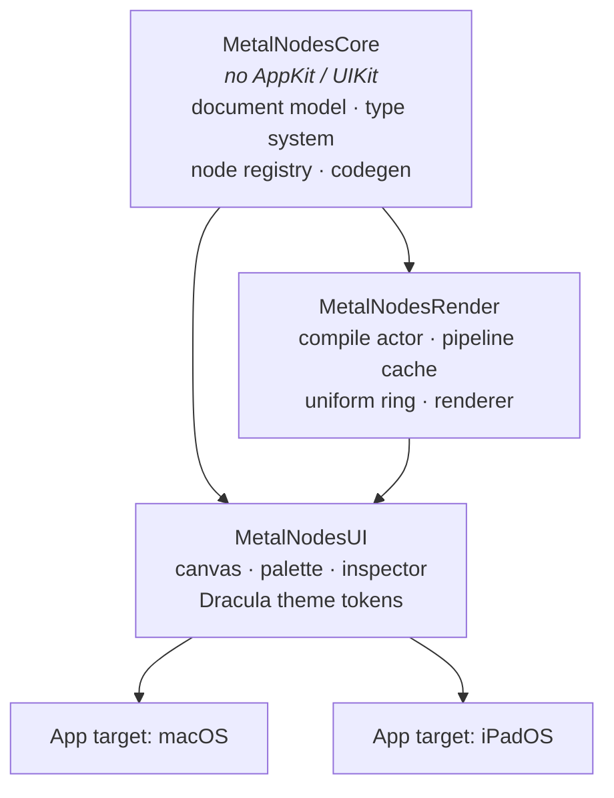
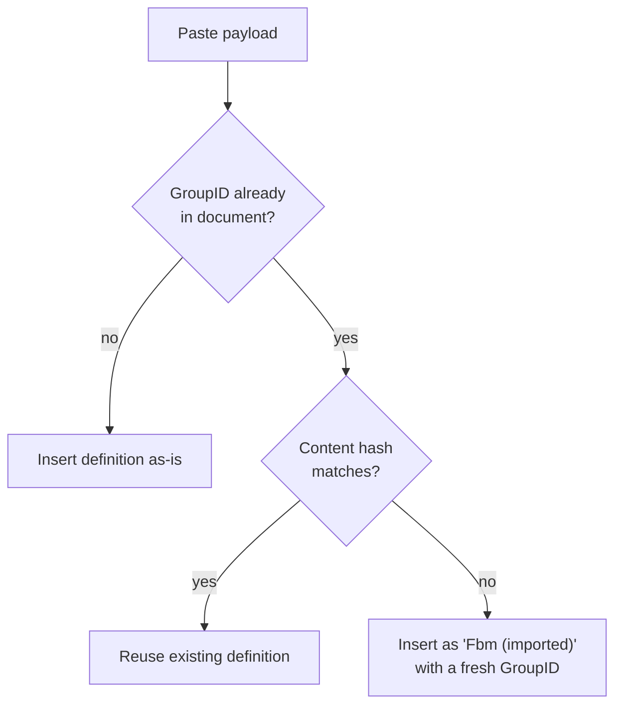
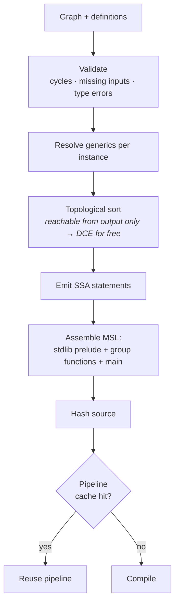
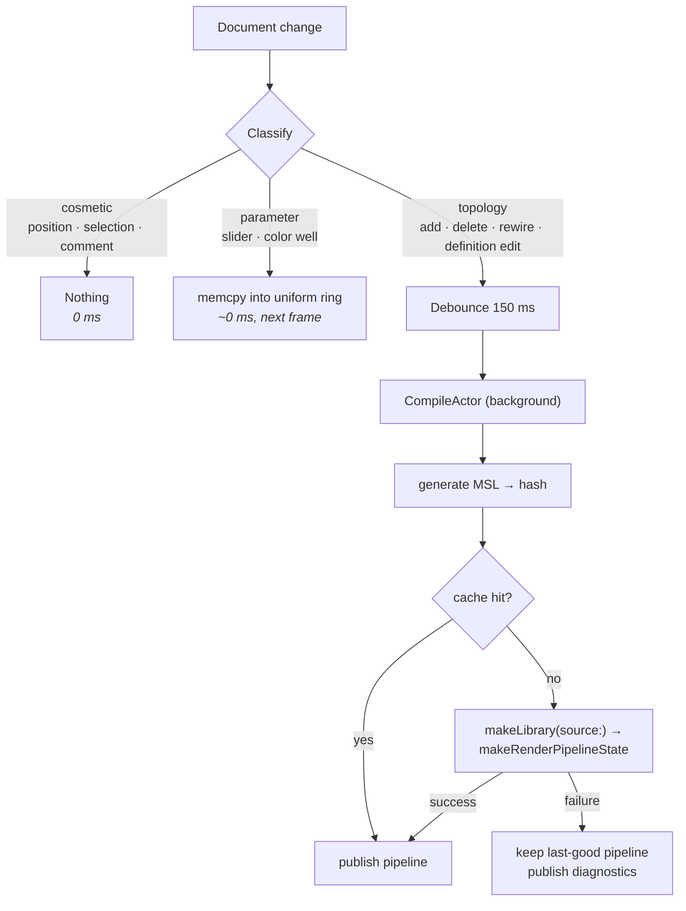

# MetalNodes — Design

**Date:** 2026-09-04
**Status:** Draft, pending review
**Target:** macOS 26 + iPadOS 27, Swift 6, SwiftUI

A node-based Metal shader editor with live preview, reusable node-group
functions, and comment frames. Reference points: Blender's shader editor and
Houdini's network view.

---

## 1. Decisions already locked

| Question | Decision |
|---|---|
| Shader kind | 2D fullscreen fragment (uv/time/resolution/mouse → color), behind an `OutputTarget` abstraction. **SwiftUI `[[stitchable]]` is a second v1 target** (§9.6); a 3D material target can be added later without a rewrite |
| Platforms | macOS + iPadOS, shared platform-agnostic core, two UI layers |
| Node groups | Definition + instances. Edit the definition, every instance updates. Compiles to one real MSL function called N times |
| Preview | One main preview panel, plus a movable viewer flag that previews *any* node |
| v1 node library | Core set — 36 node types / 58 operations — covering every category and every socket type |
| Codegen | Declarative node definitions + SSA emission (approach A) |
| Live-ness | Parameters live in a uniform buffer; only topology changes recompile |

---

## 2. Module architecture



`MetalNodesCore` is pure value types with no rendering and no UI, which is what
makes the codegen and group algebra unit-testable without a GPU or a window.

---

## 3. Document model

One value type, `Codable`, saved through `DocumentGroup` as a **package** —
a directory that macOS and iPadOS present as a single `.mnshader` file:

```
MyShader.mnshader/
├── document.json      ← ShaderDocument, human-diffable, git-friendly
├── view.json          ← EditorViewState, persisted but never undone
└── textures/
    └── 7F3A….png      ← assets referenced by AssetID, never inlined
```

Textures live beside the JSON, not inside it. That keeps `ShaderDocument`
kilobytes in size, which is what makes snapshot undo (§5) cheap.

```swift
struct ShaderDocument: Codable, Sendable {
    var formatVersion: Int
    var root: Graph                              // the shader itself
    var definitions: [GroupID: GroupDefinition]  // reusable functions
    var settings: DocumentSettings               // preview size, time mode, asset manifest
}

struct Graph: Codable, Sendable {
    var nodes: [NodeID: NodeInstance]
    var inputs: [SocketRef: SocketRef]   // to (input) → from (output)
    var stickies: [StickyID: StickyNote]
    var frames: [FrameID: CommentFrame]
}

/// Sockets are addressed by **stable name**, never by index.
struct SocketRef: Codable, Sendable, Hashable {
    var node: NodeID
    var socket: String                   // "uv", "scale", "out" …
}

struct NodeInstance: Codable, Sendable {
    let id: NodeID
    var kind: NodeKind              // .builtin("noise.fbm") | .group(GroupID)
    var position: CGPoint
    var params: [ParamID: ParamValue]
    var customTitle: String?
    var collapsed: Bool
}

struct GroupDefinition: Codable, Sendable {
    let id: GroupID
    var name: String
    var inputs:  [SocketDecl]       // typed, ordered, with defaults
    var outputs: [SocketDecl]
    var graph: Graph                // contains GroupInput / GroupOutput pseudo-nodes
    var accent: DraculaAccent
}

/// Persisted alongside the document, excluded from undo. See §5.
struct EditorViewState: Codable, Sendable {
    var cameras: [GraphPath: Camera]     // pan + zoom, per graph
    var editingStack: [NodeID]           // breadcrumb: the group *instances* dived through
    var viewer: SocketRef?               // the ◉ flag
    var selection: Set<NodeID>           // transient, but restored on reopen
}
```

### Three rules baked into the shape above

**Edges are keyed by input socket.** An input accepts exactly one wire, so the
graph stores `to → from` in a dictionary. "What feeds this socket" is a lookup,
"connect a second wire" is an overwrite, and the one-wire-per-input rule is
structural rather than enforced by UI code.

**Sockets are addressed by name, not index.** Adding a socket to a built-in
node in a later version, or reordering a group's exposed inputs, must not
silently rewire every saved document. Names are stable; indices are not.

**`GroupDefinition.inputs` / `.outputs` are the single source of truth.** The
`GroupInput` and `GroupOutput` pseudo-nodes inside the definition graph have no
socket list of their own — they mirror the declarations. There is never a
second copy to drift.

### Why definitions live beside the graph, not inside instances

Instances hold only a `GroupID`. Definitions live in one dictionary on the
document. So "edit the definition and all instances update" needs **no sync
code at all** — there is only ever one copy of the truth.

```
ShaderDocument
├── definitions
│   └── "fbm-A1B2" ──── GroupDefinition { name: "Fbm", graph: {...} }
│                              ▲          ▲
└── root.nodes                 │          │
    ├── n07  .group("fbm-A1B2")┘          │
    └── n12  .group("fbm-A1B2")───────────┘

edit the definition once → both n07 and n12 change
```

---

## 4. The five group operations

### 4.1 Group from selection (⌘G)

The only non-obvious one. Compute the **cut**: every edge crossing the selection
boundary inbound becomes a group input, **deduplicated by source socket** — one
external value feeding three selected nodes produces *one* input, not three.
Every edge crossing outbound becomes an output. External wiring survives,
rewired to the new instance.

```
BEFORE                              AFTER

[A]──┬──▶[B]──▶[D]──▶[Out]          [A]──▶┌─ MyGroup ─┐──▶[Out]
     └──▶[C]──▶─┘                         └───────────┘

selection = { B, C, D }             definition "MyGroup":
                                      (GroupInput)─┬─▶[B]──▶[D]─▶(GroupOutput)
A feeds both B and C                               └─▶[C]──▶─┘
  → ONE input, not two
```

### 4.2 Dive in (double-click)

Pushes onto an editing stack; a breadcrumb bar reads `Shader › Fbm ›
Turbulence`. The canvas view is the same view bound to a different `Graph`.

### 4.3 Make Unique

Deep-copies the definition under a fresh `GroupID` and name (`Fbm 2`), then
retargets **only the selected instance**.

### 4.4 Ungroup (⌘⇧G)

Inlines the definition's nodes into the parent graph with remapped IDs,
reconnecting whatever fed the instance's inputs to whatever `GroupInput` fed
internally. Group-then-ungroup is identity modulo IDs — this is a test.

### 4.5 Edit a definition's sockets

Removing an input orphans edges on **every** instance. Rule: those edges are
deleted inside the *same undo transaction* as the socket removal, so a single
⌘Z restores both.

### 4.6 Recursion

A definition may not transitively contain an instance of itself. The check runs
when a group is created and when one is dropped from the palette, and refuses
inline rather than failing later at codegen.

---

## 5. Undo

Snapshot the whole `ShaderDocument` into `UndoManager`, coalescing continuous
gestures (node drag, slider scrub) into one entry on gesture end.

Documents are kilobytes. Snapshotting is the only approach that stays correct
when a single edit touches a definition *plus* N instances *plus* their orphaned
edges. Command-pattern undo would need a correct inverse for every operation in
§4 — which is exactly where node editors typically start corrupting state.

**Accepted trade-off:** undo granularity is one gesture, not one keystroke.

**View state is never snapshotted.** Camera, selection, viewer flag and the
editing stack live in `EditorViewState`, a sibling of the document. ⌘Z must
never un-pan the canvas or un-select a node.

---

## 6. Copy / paste

The clipboard payload is a subgraph — nodes, internal edges, stickies and frames — **plus
every `GroupDefinition` it transitively references**. Copying a node that uses
your custom `Fbm` into another document brings `Fbm` along.

On paste, definitions dedupe by content hash:



Never silently overwrite the destination's version of a definition.

Texture assets referenced by copied nodes travel the same way: the payload
carries the image bytes keyed by `AssetID`, and paste writes them into the
destination package's `textures/` if not already present.

---

## 7. Type system

### 7.1 Socket types

| Type | MSL | Socket color | Socket shape |
|---|---|---|---|
| `float` | `float` | cyan `#8BE9FD` | circle |
| `float2` | `float2` | green `#50FA7B` | circle |
| `float3` | `float3` | purple `#BD93F9` | circle |
| `float4` | `float4` | pink `#FF79C6` | circle |
| `color` | `float4` | yellow `#F1FA8C` | diamond |
| `int` | `int` | orange `#FFB86C` | circle |
| `bool` | `bool` | comment `#6272A4` | circle |
| `texture` | `texture2d<float>` | foreground `#F8F8F2` | square |

Red is deliberately absent from this table: it is reserved for errors alone.

Type is encoded by **shape as well as color**, so the graph stays readable
without relying on color alone.

### 7.2 Implicit conversion

Inserted automatically by codegen; the wire draws a small conversion pip where
one occurs.

| From → To | Rule |
|---|---|
| `float` → `floatN` | splat |
| `float2` → `float3` | append `0` |
| `float2` → `float4` | append `0, 1` |
| `float3` → `float4` | append `1` (alpha) |
| `float4` → `float3` | drop `w` |
| `floatN` → `float` | component average |
| `color` → `float` | luminance, `dot(rgb, (0.2126, 0.7152, 0.0722))` |
| `color` ↔ `float4` | free, semantic tag only |
| `int` ↔ `float` | direct cast |
| `bool` → `float` | `0.0` / `1.0` |
| anything ↔ `texture` | **rejected** |

Rejected connections are refused *during the drag* — incompatible sockets dim
and the wire will not drop.

### 7.3 Generic nodes

`Add` should work on `float` and `float3` without four separate definitions. A
definition may declare a type variable constrained to a set:

```swift
NodeDef("math.add",
    generics: ["T": [.float, .float2, .float3, .float4]],
    inputs:  [.init("a", .generic("T")), .init("b", .generic("T"))],
    outputs: [.init("out", .generic("T"))],
    body: "{out.out} = {in.a} + {in.b};")
```

Resolution is **local**: unify the types of the connected inputs, widening to
the largest; default to `float` when nothing is connected. No whole-graph
inference, no solver.

---

## 8. Node definitions

A node type is *data*, not code.

```swift
NodeDef("noise.fbm",
    category: .noise,
    inputs:  [.init("uv", .float2, default: .uv),
              .init("scale", .float, default: 4)],
    params:  [.init("octaves", .int, range: 1...8, default: 5)],
    outputs: [.init("value", .float)],
    requires: ["fbm", "valueNoise"],          // pulls MSL stdlib functions
    body: "{out.value} = fbm({in.uv} * {in.scale}, {param.octaves});")
```

- `requires` names entries in a hand-written MSL standard library; the emitter
  includes each required function exactly once, in dependency order.
- Adding a node post-v1 is a data-entry job, not an engineering one. That is
  what makes "core 30 now, expand later" cheap.
- **Variants:** a definition may declare an enum parameter with a body template
  per case, which is how one `Math` node covers fifteen operations. The chosen
  case is a *topology-level* property, so switching it recompiles — unlike a
  numeric parameter, which does not.
- **Escape hatch:** any definition may supply a custom
  `emit(inputs:params:ctx:) -> [Statement]` closure instead of a template, for
  the few nodes needing conditional or variadic emission.

---

## 9. Code generation



### 9.1 Shape of the generated source

```metal
#include <metal_stdlib>
using namespace metal;

struct Uniforms {
    // ---- sorted by alignment: 16-byte, then 8, then 4 (see §9.6) ----
    float2 resolution;
    float2 mouse;
    float  time;
    float  p0;      // root/n07 · Fbm input "scale"   — per instance
    float  p1;      // root/n12 · Fbm input "scale"   — per instance
    int    p2;      // Fbm/n03  · "octaves"           — shared by ALL instances
};

// ---- stdlib functions pulled in by `requires` ----
float valueNoise(float2 p) { ... }
float fbm(float2 p, int octaves) { ... }

// ---- one function per group definition ----
float Fbm(constant Uniforms &u, float2 uv, float scale) {
    return fbm(uv * scale, u.p2);        // internal param, read from u
}

// ---- main ----
fragment float4 shaderMain(VertexOut in [[stage_in]],
                           constant Uniforms &u [[buffer(0)]],
                           texture2d<float> tex0 [[texture(0)]]) {
    float2 v0 = in.uv;
    float  v1 = Fbm(u, v0, u.p0);        // instance n07
    float  v2 = Fbm(u, v0 * 2.0, u.p1);  // instance n12, different scale
    float3 v3 = mix(float3(0.0), float3(1.0), v1 + v2);
    return float4(v3, 1.0);
}
```

Every generated group function takes `constant Uniforms &u` as its first
argument. That is what lets parameters on nodes *inside* a group stay
live-editable uniforms instead of forcing a recompile.

The vertex stage is **static** — a fullscreen triangle precompiled in the app's
own `.metal` file — and only the fragment function is generated. `in.uv` is
`0…1` with the origin **bottom-left**, matching ShaderToy and Blender rather
than Metal's texture convention. The `UV` node has an *aspect-corrected* option
that yields `(uv - 0.5) * (resolution / resolution.y)`, the form you want for
anything circular.

### 9.2 Parameter scoping — the rule that matters

| Parameter lives... | Uniform slot | Per-instance? |
|---|---|---|
| on a node in the root graph | one slot, keyed by `NodeID` | n/a |
| on a node **inside** a group definition | one slot shared by all instances | **no** |
| on an exposed **group input socket** | one slot per instance, keyed by instance path | **yes** |

This matches Blender exactly: group internals are shared; to vary a value per
instance you expose it as a group input. It also falls straight out of "one
definition compiles to one function".

### 9.3 Viewer variant

The viewer flag compiles a second pipeline from the same graph, terminating at
the viewed node and wrapping its value for display:

| Viewed type | Visualization |
|---|---|
| `float` | `float4(v, v, v, 1)`, remapped through a manual min/max range control |
| `float2` | `float4(v, 0, 1)` |
| `float3` | `float4(v, 1)` |
| `float4` / `color` | as-is |
| `bool` | white / black |
| `int` | normalized grayscale + numeric readout |
| `texture` | sampled at `uv` |

Both pipelines are cached, so flicking the viewer between two nodes is instant
after the first visit.

The range control is **manual** in v1. Auto-normalizing over the frame needs a
min/max reduction across the whole image — a compute kernel plus a readback —
and is not worth it before the app has users.

**Viewer inside a group definition.** Flagging a node inside `Fbm` needs *some*
instance's values for the per-instance inputs. Rule: use the instance you dived
through — the editing stack records it. If the definition was opened from the
palette with no instance, use the sockets' declared defaults.

**One terminal per graph.** The root graph has exactly one `Fragment Output`;
adding a second is refused. A definition graph's terminal is `GroupOutput`.
Codegen picks its terminal from the active `OutputTarget`, which is how the
SwiftUI and material targets slot in later.

### 9.4 Error mapping

Because *we* generate the source, we also emit a side table mapping generated
line ranges → `NodeID`. A Metal compiler error therefore highlights the
offending node in red with the message in the inspector, instead of showing a
line number in a file the user never wrote.

Validation errors (cycle, type mismatch, missing required input) are reported
on nodes *before* codegen runs, and keep the last-good pipeline alive.

### 9.5 SwiftUI `[[stitchable]]` target

The same graph, a second terminal. `OutputTarget.stitchable(kind)` generates a
function whose signature matches what SwiftUI's `Shader` API expects:

| Kind | Generated signature | SwiftUI call site |
|---|---|---|
| `colorEffect` | `[[stitchable]] half4 name(float2 position, half4 currentColor, float2 size, float time, …params)` | `.colorEffect(ShaderLibrary.name(.float2(size), .float(t), …))` |
| `distortionEffect` | `[[stitchable]] float2 name(float2 position, float2 size, float time, …params)` | `.distortionEffect(…, maxSampleOffset:)` |
| `layerEffect` | `[[stitchable]] half4 name(float2 position, SwiftUI::Layer layer, float2 size, float time, …params)` | `.layerEffect(…, maxSampleOffset:)` |

Two things differ from the fragment target, and both are handled in codegen
rather than in the node library:

- **Uniforms become function arguments.** SwiftUI passes parameters as
  `Shader.Argument`s, not a buffer. The generator emits one argument per
  uniform slot in layout order, and `uv` is derived as `position / size`.
- **`Texture Sample` maps to `layer.sample(position)`** under `layerEffect`
  and is a validation error under the other two kinds.

**Preview still works** because the generator also emits a thin fragment
`shaderMain` that calls the stitchable function with values read from
`Uniforms`. Export writes the `.metal` file *plus* a Swift snippet showing the
exact `ShaderLibrary` call with argument order, since getting that order wrong
is the usual failure.

The stitchable target lands in **M3** alongside the viewer flag, because both
are "a second terminal on the same graph" and share the plumbing.

### 9.6 Uniform buffer layout — the alignment trap

MSL aligns `float2` to 8 bytes and `float3` / `float4` to 16. **A `float3` is 16
bytes, not 12.** If the Swift side computes offsets naïvely, every slider write
after the first `float3` lands in the wrong place.

Three rules:

1. **Emit slots sorted by alignment** — 16-byte types, then 8, then 4 — so the
   struct has no interior padding and the offset arithmetic is trivial and
   identical on both sides. Reserved uniforms (`resolution`, `mouse`, `time`)
   sort with everything else.
2. **Codegen returns the layout, not just the source.** The result is
   `(msl: String, layout: [ParamPath: (offset: Int, type: SocketType)])`.
   The renderer never re-derives offsets.
3. **On every pipeline publish, rebuild the whole buffer from the document.**
   Slot numbers shift on every recompile, so incremental patching is unsafe.
   The document is the source of truth; the buffer is a projection of it.

A **generation counter** guards the hand-off: the compile actor tags each job
with the document revision that triggered it and publishes only if no newer
job has been queued. A slow compile can never overwrite a newer one.

---

## 10. Render and compile loop

Every document change is classified, and only one of the three classes is
expensive:



**Never go black on error.** A failed compile keeps rendering the last working
pipeline and surfaces diagnostics on the offending nodes.

Renderer details:

- `MTKView` wrapped in `NSViewRepresentable` / `UIViewRepresentable`.
- Triple-buffered uniform ring with a semaphore; one fullscreen triangle.
- `device.makeLibrary(source:options:)` works at runtime on **both** macOS and
  iPadOS, so runtime compilation is not a macOS-only luxury.
- `CompileActor` is a Swift `actor`; pipelines hand off to the `@MainActor`
  renderer as `Sendable` values. Strict concurrency on.

Preview panel controls: play / pause / reset time, resolution mode
(fit · 1× · fixed), aspect lock, mouse input passthrough, snapshot to PNG, and
an error badge.

---

## 11. Canvas and interaction

### 11.1 Rendering strategy

One SwiftUI `View` per node inside a transformed `ZStack`; **all wires drawn in
a single `Canvas` beneath them**. Keeps real SwiftUI controls (sliders, color
wells, pickers) inside node bodies, and hit-testing and accessibility come free.

- Culling: only instantiate node views intersecting the visible rect plus a
  margin.
- LOD: below `zoom 0.4`, nodes render as a colored title bar only — no sockets,
  no controls.
- Wires: cubic Bézier with horizontal control points proportional to `dx`,
  colored by source socket type.

### 11.2 Input map

| Action | macOS | iPadOS |
|---|---|---|
| Pan | scroll, space-drag, middle-drag | two-finger drag |
| Zoom | ⌘scroll, pinch | pinch |
| Select | click · ⇧click add · ⌘click toggle | tap · tap-add in select mode |
| Marquee | drag on empty canvas | lasso via toolbar mode |
| Context menu | right-click | long-press |
| Add node | ⇧A or double-click empty canvas | ✛ toolbar button |
| Copy / paste / cut / duplicate | ⌘C ⌘V ⌘X ⌘D | edit menu + hardware kbd |
| Group / ungroup | ⌘G / ⌘⇧G | context menu |
| Comment frame from selection | ⌘⇧C | context menu |
| Set viewer flag | ⌘⇧V, or click the ◉ badge | tap the ◉ badge |
| Delete | ⌫ | context menu |
| Nudge | arrow keys | — |
| Duplicate-drag | ⌥drag | — |
| Zoom to fit all / selection | Home / F | toolbar button |

### 11.3 Connection UX

- Dragging from a socket rubber-bands live; compatible sockets highlight,
  incompatible ones dim.
- Dropping on a node **body** auto-connects to the first compatible socket.
- Dropping on **empty canvas** opens the palette search filtered to nodes that
  accept the dragged type, and auto-wires whatever you pick. (Blender's ⇧A and
  Houdini's Tab, merged.)
- An input socket accepts one wire; connecting a second replaces the first
  (structurally, per §3). Output sockets fan out freely.

### 11.4 Palette

Left sidebar: categorized list plus fuzzy search, drag-out onto the canvas.
Custom group definitions appear under **My Functions**. The same list backs the
⇧A search popover at the cursor.

### 11.5 Comments — two kinds, as requested

**Sticky note.** A free-floating text box anywhere on the canvas. Resizable,
colored from the Dracula accents.

**Comment frame.** A titled, colored rectangle around a selection (⌘⇧C), or
drawn on empty canvas.

```
┌─ "lighting pass" ────────────────────┐
│                                       │
│   [Normal]──▶[Dot]──▶[Clamp]──┐       │
│                                ▼      │
│   [LightDir]──────────────▶[Mix]      │
│                                       │
└───────────────────────────────────────┘
   dragging the frame moves its contents
   dropping a node inside adopts it
```

Frames own their children by geometry: dragging the frame moves the nodes
inside; a node dragged into the bounds joins, dragged out leaves. Collapsible
and resizable.

**Both kinds are pure UI metadata and have zero effect on codegen.**

### 11.6 Generated-code panel

A read-only pane, toggled from the toolbar, showing the live MSL with syntax
highlighting in the Dracula palette and a **Copy** button. It updates on every
successful codegen — before compilation, so it also shows what a *failing*
graph produced. Selecting a node highlights its emitted lines using the same
side table as §9.4.

For a shader tool this is half the value: you learn Metal by watching the code
change as you wire nodes, and it costs nothing because the string already
exists.

---

## 12. Dracula theme

Dark only in v1. Colors live as **semantic tokens** in a `Theme` struct, never
as raw hex at call sites, so the official light variant (Alucard) is a later
data swap rather than a refactor.

| Token | Hex | Used for |
|---|---|---|
| `background` | `#282A36` | canvas |
| `surface` | `#44475A` | node body, sidebars, grid dots |
| `foreground` | `#F8F8F2` | text |
| `muted` | `#6272A4` | comments, disabled, default frame color, Utility category, `bool` |
| `cyan` | `#8BE9FD` | Input category, `float` |
| `green` | `#50FA7B` | Vector category, `float2`, **viewer flag** |
| `orange` | `#FFB86C` | SDF category, `int` |
| `pink` | `#FF79C6` | Noise category, `float4` |
| `purple` | `#BD93F9` | Math category, `float3` |
| `red` | `#FF5555` | **errors only** |
| `yellow` | `#F1FA8C` | Color category, `color` socket |

**Red is reserved for errors** and is assigned to no socket type or category.
The viewer flag is a green **◉ glyph** — green also colors the Vector category
and `float2` sockets, but the badge shape is unique, so it never reads as either.

Selection is deliberately *not* signalled by a hue — hues are spoken for by the
type system. A selected node gets a 2 pt `foreground` outline plus a soft glow;
a selected wire brightens and thickens. That keeps selection legible on top of
a node of any category without colliding with what its colors already mean.

Node headers are tinted by category; group instances get a purple header with a
doubled border so they read as "this is a function".

---

## 13. v1 node library

| Category | Nodes |
|---|---|
| **Input** | UV, Time, Resolution, Mouse, **Constant** (variants: float · float2 · float3 · color · int · bool), Texture Sample |
| **Math** | **Math** (enum op: add · subtract · multiply · divide · power · modulo · min · max · abs · floor · fract · sqrt · sin · cos · tan), Clamp, Mix, Smoothstep, Step, Map Range |
| **Vector** | Combine XYZW, Separate XYZW, Length, Dot, Normalize, Rotate 2D |
| **SDF** | Circle, Box, Union, Subtract |
| **Noise** | Value, Perlin, Simplex, Voronoi, Fbm |
| **Color** | Color Ramp, HSV→RGB, RGB→HSV, Invert, Mix Color |
| **Utility** | Reroute, **Compare** (variants: less · greater · equal · not-equal) → `bool`, Switch (`bool ? a : b`) |
| **Output** | Fragment Output |

**36 node types, 58 operations.** The arithmetic and trig functions collapse
into a single `Math` node with an operation picker, exactly as Blender does it —
one definition with 15 body variants instead of 15 near-identical definitions,
and one palette entry instead of fifteen.

`Compare` and the `bool` variant of `Constant` exist so that `bool` has a
producer — without them the type would be in the table but unreachable.
`Reroute` is a generic pass-through drawn as a dot; tidy graphs are impossible
without it.

The set is chosen so that every category and **every socket type** is exercised,
which is what proves the codegen and type system are right.

---

## 14. Testing

`MetalNodesCore` is pure value types, so most of this needs no GPU and no
window. Swift Testing throughout.

| Area | Test |
|---|---|
| Codegen | Golden tests: graph fixture → expected MSL (normalized whitespace) |
| Type system | Table-driven over every (from, to) conversion pair |
| Generics | Unification resolves and defaults correctly per instance |
| ⌘G | Cut correctness, especially input dedup by source socket |
| Ungroup | `group(sel)` then `ungroup` is identity modulo IDs |
| Make Unique | Editing the fork leaves the original instance untouched |
| Recursion | Self-containing group is refused at edit time |
| Undo | `op → undo` deep-equals the original document, for every op in §4 |
| Persistence | `document → package → document` round-trip, textures included |
| Uniform layout | Codegen offsets match MSL alignment for every type mix, including `float3` = 16 bytes |
| Stale compile | A slower, older compile job never overwrites a newer published pipeline |
| DCE | Nodes unreachable from the output do not appear in generated source |
| Library smoke | **Every node** in the library compiles as a one-node graph on a real `MTLDevice` |

Golden-image comparison of rendered output is deliberately **out of scope** —
it is flaky across GPU generations and would buy little over the compile smoke
test.

---

## 15. Build order

| Milestone | Contents |
|---|---|
| **M0** | Retarget project to macOS + iPadOS only, Swift 6 + strict concurrency, SPM module split, theme tokens, empty canvas that pans and zooms |
| **M1** | Graph core + codegen + uniform layout (§9.6) + preview with a minimal ~12 nodes. **First pixels.** Proves the whole pipeline before the surface area grows |
| **M2** | Full canvas: palette drag-in, connection UX, selection, copy/paste, undo, inspector |
| **M3** | Library to full v1 set, viewer flags, **SwiftUI stitchable target + export (§9.5)**, error mapping |
| **M4** | Groups: create, dive-in, make-unique, ungroup, palette integration, cross-document paste |
| **M5** | Comment frames + sticky notes, generated-code panel, minimap, `.metal` export, package persistence with textures |
| **M6** | iPadOS UI layer |

M1 deliberately folds in the "minimal 12 nodes" option as an internal step
rather than a shipped scope — the machinery gets proven early, the library
grows later.

---

## 16. Housekeeping in the existing scaffold

The current Xcode project is an untouched multiplatform template and needs:

- `SUPPORTED_PLATFORMS` narrowed from `iphoneos iphonesimulator macosx xros
  xrsimulator` to macOS + iPadOS.
- `SWIFT_VERSION` raised from `5.0` to `6.0`, strict concurrency on.
- `MACOSX_DEPLOYMENT_TARGET` normalized from `26.6.2` to `26.0`.
- `PRODUCT_BUNDLE_IDENTIFIER` changed off `devplaceholder.…`.
- `MyApp.swift` renamed to `MetalNodesApp.swift`; the `#Playground` block in
  `ContentView.swift` removed.
- A `.gitignore` for macOS/Xcode (there is a stray `.DS_Store`, and
  `xcuserdata/` is currently untracked).

---

## 17. Open questions

1. **Group input editing** — do you want drag-to-reorder and rename for exposed
   group inputs in v1, or is add/remove enough to start?
2. **Textures** — import from file only, or also procedural sources (gradient,
   checker) and pasteboard?
3. **Export** — generated `.metal` source only, or also a precompiled
   `.metallib`?
4. **Time** — wall-clock time, or a scrubable fixed-rate timeline with a frame
   counter (better for recording)?
5. ~~SwiftUI `[[stitchable]]` target~~ — **answered: in v1, at M3.** See §9.5.
