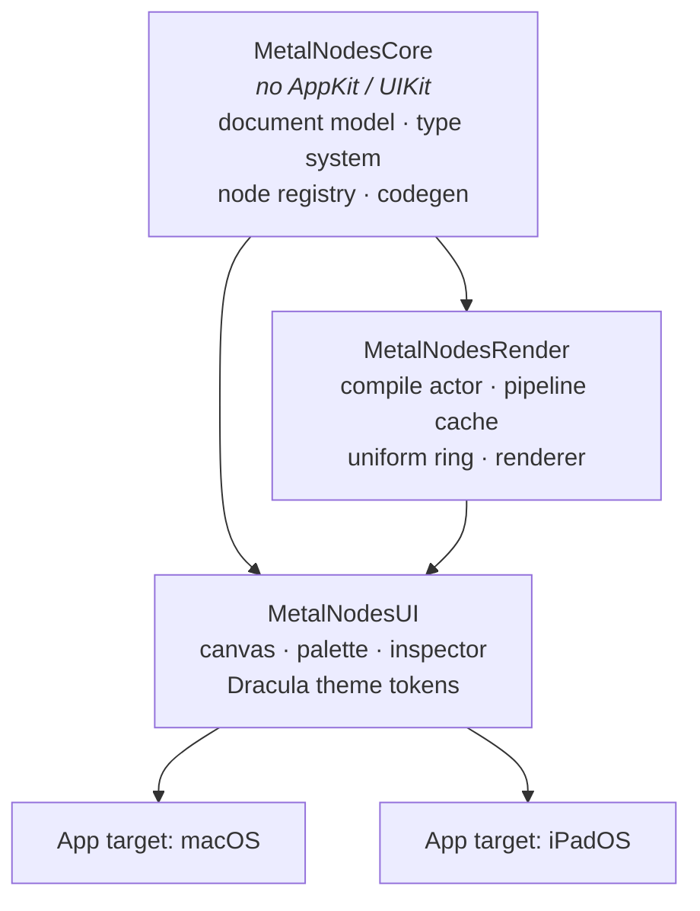
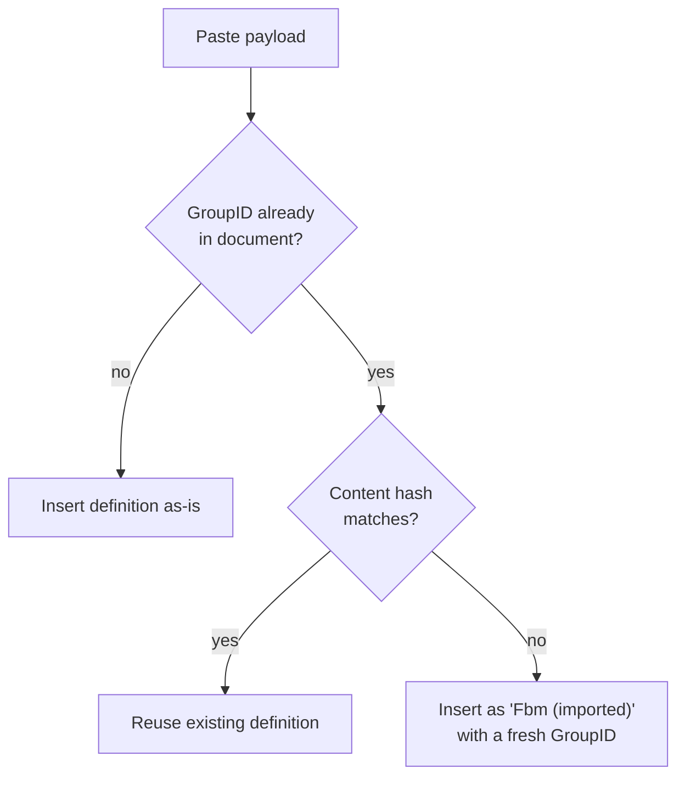
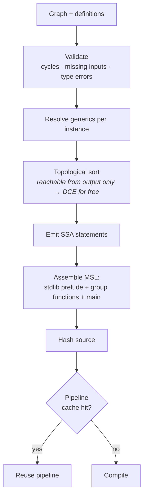
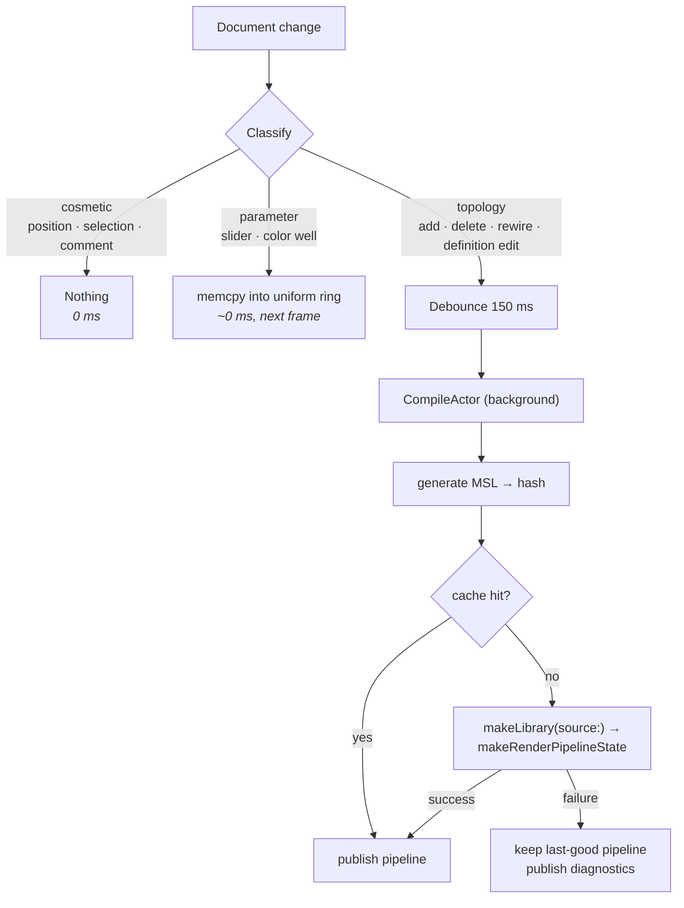

# MetalNodes — Design

**Date:** 2026-09-04
**Status:** Draft, pending review
**Target:** macOS 26 + iPadOS 27, Swift 6, SwiftUI

A node-based Metal shader editor with live preview, reusable node-group
functions, and comment frames. Reference points: Blender's shader editor and
Houdini's network view.

---

## 1. Decisions already locked

| Question | Decision |
|---|---|
| Shader kind | 2D fullscreen fragment (uv/time/resolution/mouse → color), behind an `OutputTarget` abstraction. **SwiftUI `[[stitchable]]` is a second v1 target** (§9.6); a 3D material target can be added later without a rewrite |
| Platforms | macOS + iPadOS, shared platform-agnostic core, two UI layers |
| Node groups | Definition + instances. Edit the definition, every instance updates. Compiles to one real MSL function called N times |
| Preview | One main preview panel, plus a movable viewer flag that previews *any* node |
| v1 node library | Core set — 36 node types / 58 operations — covering every category and every socket type |
| Codegen | Declarative node definitions + SSA emission (approach A) |
| Live-ness | Parameters live in a uniform buffer; only topology changes recompile |

---

## 2. Module architecture



`MetalNodesCore` is pure value types with no rendering and no UI, which is what
makes the codegen and group algebra unit-testable without a GPU or a window.

---

## 3. Document model

One value type, `Codable`, saved through `DocumentGroup` as a **package** —
a directory that macOS and iPadOS present as a single `.mnshader` file:

```
MyShader.mnshader/
├── document.json      ← ShaderDocument, human-diffable, git-friendly
├── view.json          ← EditorViewState, persisted but never undone
└── textures/
    └── 7F3A….png      ← assets referenced by AssetID, never inlined
```

Textures live beside the JSON, not inside it. That keeps `ShaderDocument`
kilobytes in size, which is what makes snapshot undo (§5) cheap.

```swift
struct ShaderDocument: Codable, Sendable {
    var formatVersion: Int
    var root: Graph                              // the shader itself
    var definitions: [GroupID: GroupDefinition]  // reusable functions
    var settings: DocumentSettings               // preview size, time mode, asset manifest
}

struct Graph: Codable, Sendable {
    var nodes: [NodeID: NodeInstance]
    var inputs: [SocketRef: SocketRef]   // to (input) → from (output)
    var stickies: [StickyID: StickyNote]
    var frames: [FrameID: CommentFrame]
}

/// Sockets are addressed by **stable name**, never by index.
struct SocketRef: Codable, Sendable, Hashable {
    var node: NodeID
    var socket: String                   // "uv", "scale", "out" …
}

struct NodeInstance: Codable, Sendable {
    let id: NodeID
    var kind: NodeKind              // .builtin("noise.fbm") | .group(GroupID)
    var position: CGPoint
    var params: [ParamID: ParamValue]
    var customTitle: String?
    var collapsed: Bool
}

struct GroupDefinition: Codable, Sendable {
    let id: GroupID
    var name: String
    var inputs:  [SocketDecl]       // typed, ordered, with defaults
    var outputs: [SocketDecl]
    var graph: Graph                // contains GroupInput / GroupOutput pseudo-nodes
    var accent: DraculaAccent
}

/// Persisted alongside the document, excluded from undo. See §5.
struct EditorViewState: Codable, Sendable {
    var cameras: [GraphPath: Camera]     // pan + zoom, per graph
    var editingStack: [NodeID]           // breadcrumb: the group *instances* dived through
    var viewer: SocketRef?               // the ◉ flag
    var selection: Set<NodeID>           // transient, but restored on reopen
}
```

### Three rules baked into the shape above

**Edges are keyed by input socket.** An input accepts exactly one wire, so the
graph stores `to → from` in a dictionary. "What feeds this socket" is a lookup,
"connect a second wire" is an overwrite, and the one-wire-per-input rule is
structural rather than enforced by UI code.

**Sockets are addressed by name, not index.** Adding a socket to a built-in
node in a later version, or reordering a group's exposed inputs, must not
silently rewire every saved document. Names are stable; indices are not.

**`GroupDefinition.inputs` / `.outputs` are the single source of truth.** The
`GroupInput` and `GroupOutput` pseudo-nodes inside the definition graph have no
socket list of their own — they mirror the declarations. There is never a
second copy to drift.

### Why definitions live beside the graph, not inside instances

Instances hold only a `GroupID`. Definitions live in one dictionary on the
document. So "edit the definition and all instances update" needs **no sync
code at all** — there is only ever one copy of the truth.

```
ShaderDocument
├── definitions
│   └── "fbm-A1B2" ──── GroupDefinition { name: "Fbm", graph: {...} }
│                              ▲          ▲
└── root.nodes                 │          │
    ├── n07  .group("fbm-A1B2")┘          │
    └── n12  .group("fbm-A1B2")───────────┘

edit the definition once → both n07 and n12 change
```

---

## 4. The five group operations

### 4.1 Group from selection (⌘G)

The only non-obvious one. Compute the **cut**: every edge crossing the selection
boundary inbound becomes a group input, **deduplicated by source socket** — one
external value feeding three selected nodes produces *one* input, not three.
Every edge crossing outbound becomes an output. External wiring survives,
rewired to the new instance.

```
BEFORE                              AFTER

[A]──┬──▶[B]──▶[D]──▶[Out]          [A]──▶┌─ MyGroup ─┐──▶[Out]
     └──▶[C]──▶─┘                         └───────────┘

selection = { B, C, D }             definition "MyGroup":
                                      (GroupInput)─┬─▶[B]──▶[D]─▶(GroupOutput)
A feeds both B and C                               └─▶[C]──▶─┘
  → ONE input, not two
```

### 4.2 Dive in (double-click)

Pushes onto an editing stack; a breadcrumb bar reads `Shader › Fbm ›
Turbulence`. The canvas view is the same view bound to a different `Graph`.

### 4.3 Make Unique

Deep-copies the definition under a fresh `GroupID` and name (`Fbm 2`), then
retargets **only the selected instance**.

### 4.4 Ungroup (⌘⇧G)

Inlines the definition's nodes into the parent graph with remapped IDs,
reconnecting whatever fed the instance's inputs to whatever `GroupInput` fed
internally. Group-then-ungroup is identity modulo IDs — this is a test.

### 4.5 Edit a definition's sockets

Removing an input orphans edges on **every** instance. Rule: those edges are
deleted inside the *same undo transaction* as the socket removal, so a single
⌘Z restores both.

### 4.6 Recursion

A definition may not transitively contain an instance of itself. The check runs
when a group is created and when one is dropped from the palette, and refuses
inline rather than failing later at codegen.

---

## 5. Undo

Snapshot the whole `ShaderDocument` into `UndoManager`, coalescing continuous
gestures (node drag, slider scrub) into one entry on gesture end.

Documents are kilobytes. Snapshotting is the only approach that stays correct
when a single edit touches a definition *plus* N instances *plus* their orphaned
edges. Command-pattern undo would need a correct inverse for every operation in
§4 — which is exactly where node editors typically start corrupting state.

**Accepted trade-off:** undo granularity is one gesture, not one keystroke.

**View state is never snapshotted.** Camera, selection, viewer flag and the
editing stack live in `EditorViewState`, a sibling of the document. ⌘Z must
never un-pan the canvas or un-select a node.

---

## 6. Copy / paste

The clipboard payload is a subgraph — nodes, internal edges, stickies and frames — **plus
every `GroupDefinition` it transitively references**. Copying a node that uses
your custom `Fbm` into another document brings `Fbm` along.

On paste, definitions dedupe by content hash:



Never silently overwrite the destination's version of a definition.

Texture assets referenced by copied nodes travel the same way: the payload
carries the image bytes keyed by `AssetID`, and paste writes them into the
destination package's `textures/` if not already present.

---

## 7. Type system

### 7.1 Socket types

| Type | MSL | Socket color | Socket shape |
|---|---|---|---|
| `float` | `float` | cyan `#8BE9FD` | circle |
| `float2` | `float2` | green `#50FA7B` | circle |
| `float3` | `float3` | purple `#BD93F9` | circle |
| `float4` | `float4` | pink `#FF79C6` | circle |
| `color` | `float4` | yellow `#F1FA8C` | diamond |
| `int` | `int` | orange `#FFB86C` | circle |
| `bool` | `bool` | comment `#6272A4` | circle |
| `texture` | `texture2d<float>` | foreground `#F8F8F2` | square |

Red is deliberately absent from this table: it is reserved for errors alone.

Type is encoded by **shape as well as color**, so the graph stays readable
without relying on color alone.

### 7.2 Implicit conversion

Inserted automatically by codegen; the wire draws a small conversion pip where
one occurs.

| From → To | Rule |
|---|---|
| `float` → `floatN` | splat |
| `float2` → `float3` | append `0` |
| `float2` → `float4` | append `0, 1` |
| `float3` → `float4` | append `1` (alpha) |
| `float4` → `float3` | drop `w` |
| `floatN` → `float` | component average |
| `color` → `float` | luminance, `dot(rgb, (0.2126, 0.7152, 0.0722))` |
| `color` ↔ `float4` | free, semantic tag only |
| `int` ↔ `float` | direct cast |
| `bool` → `float` | `0.0` / `1.0` |
| anything ↔ `texture` | **rejected** |

Rejected connections are refused *during the drag* — incompatible sockets dim
and the wire will not drop.

### 7.3 Generic nodes

`Add` should work on `float` and `float3` without four separate definitions. A
definition may declare a type variable constrained to a set:

```swift
NodeDef("math.add",
    generics: ["T": [.float, .float2, .float3, .float4]],
    inputs:  [.init("a", .generic("T")), .init("b", .generic("T"))],
    outputs: [.init("out", .generic("T"))],
    body: "{out.out} = {in.a} + {in.b};")
```

Resolution is **local**: unify the types of the connected inputs, widening to
the largest; default to `float` when nothing is connected. No whole-graph
inference, no solver.

---

## 8. Node definitions

A node type is *data*, not code.

```swift
NodeDef("noise.fbm",
    category: .noise,
    inputs:  [.init("uv", .float2, default: .uv),
              .init("scale", .float, default: 4)],
    params:  [.init("octaves", .int, range: 1...8, default: 5)],
    outputs: [.init("value", .float)],
    requires: ["fbm", "valueNoise"],          // pulls MSL stdlib functions
    body: "{out.value} = fbm({in.uv} * {in.scale}, {param.octaves});")
```

- `requires` names entries in a hand-written MSL standard library; the emitter
  includes each required function exactly once, in dependency order.
- Adding a node post-v1 is a data-entry job, not an engineering one. That is
  what makes "core 30 now, expand later" cheap.
- **Variants:** a definition may declare an enum parameter with a body template
  per case, which is how one `Math` node covers fifteen operations. The chosen
  case is a *topology-level* property, so switching it recompiles — unlike a
  numeric parameter, which does not.
- **Escape hatch:** any definition may supply a custom
  `emit(inputs:params:ctx:) -> [Statement]` closure instead of a template, for
  the few nodes needing conditional or variadic emission.

---

## 9. Code generation



### 9.1 Shape of the generated source

```metal
#include <metal_stdlib>
using namespace metal;

struct Uniforms {
    // ---- sorted by alignment: 16-byte, then 8, then 4 (see §9.6) ----
    float2 resolution;
    float2 mouse;
    float  time;
    float  p0;      // root/n07 · Fbm input "scale"   — per instance
    float  p1;      // root/n12 · Fbm input "scale"   — per instance
    int    p2;      // Fbm/n03  · "octaves"           — shared by ALL instances
};

// ---- stdlib functions pulled in by `requires` ----
float valueNoise(float2 p) { ... }
float fbm(float2 p, int octaves) { ... }

// ---- one function per group definition ----
float Fbm(constant Uniforms &u, float2 uv, float scale) {
    return fbm(uv * scale, u.p2);        // internal param, read from u
}

// ---- main ----
fragment float4 shaderMain(VertexOut in [[stage_in]],
                           constant Uniforms &u [[buffer(0)]],
                           texture2d<float> tex0 [[texture(0)]]) {
    float2 v0 = in.uv;
    float  v1 = Fbm(u, v0, u.p0);        // instance n07
    float  v2 = Fbm(u, v0 * 2.0, u.p1);  // instance n12, different scale
    float3 v3 = mix(float3(0.0), float3(1.0), v1 + v2);
    return float4(v3, 1.0);
}
```

Every generated group function takes `constant Uniforms &u` as its first
argument. That is what lets parameters on nodes *inside* a group stay
live-editable uniforms instead of forcing a recompile.

The vertex stage is **static** — a fullscreen triangle precompiled in the app's
own `.metal` file — and only the fragment function is generated. `in.uv` is
`0…1` with the origin **bottom-left**, matching ShaderToy and Blender rather
than Metal's texture convention. The `UV` node has an *aspect-corrected* option
that yields `(uv - 0.5) * (resolution / resolution.y)`, the form you want for
anything circular.

### 9.2 Parameter scoping — the rule that matters

| Parameter lives... | Uniform slot | Per-instance? |
|---|---|---|
| on a node in the root graph | one slot, keyed by `NodeID` | n/a |
| on a node **inside** a group definition | one slot shared by all instances | **no** |
| on an exposed **group input socket** | one slot per instance, keyed by instance path | **yes** |

This matches Blender exactly: group internals are shared; to vary a value per
instance you expose it as a group input. It also falls straight out of "one
definition compiles to one function".

### 9.3 Viewer variant

The viewer flag compiles a second pipeline from the same graph, terminating at
the viewed node and wrapping its value for display:

| Viewed type | Visualization |
|---|---|
| `float` | `float4(v, v, v, 1)`, remapped through a manual min/max range control |
| `float2` | `float4(v, 0, 1)` |
| `float3` | `float4(v, 1)` |
| `float4` / `color` | as-is |
| `bool` | white / black |
| `int` | normalized grayscale + numeric readout |
| `texture` | sampled at `uv` |

Both pipelines are cached, so flicking the viewer between two nodes is instant
after the first visit.

The range control is **manual** in v1. Auto-normalizing over the frame needs a
min/max reduction across the whole image — a compute kernel plus a readback —
and is not worth it before the app has users.

**Viewer inside a group definition.** Flagging a node inside `Fbm` needs *some*
instance's values for the per-instance inputs. Rule: use the instance you dived
through — the editing stack records it. If the definition was opened from the
palette with no instance, use the sockets' declared defaults.

**One terminal per graph.** The root graph has exactly one `Fragment Output`;
adding a second is refused. A definition graph's terminal is `GroupOutput`.
Codegen picks its terminal from the active `OutputTarget`, which is how the
SwiftUI and material targets slot in later.

### 9.4 Error mapping

Because *we* generate the source, we also emit a side table mapping generated
line ranges → `NodeID`. A Metal compiler error therefore highlights the
offending node in red with the message in the inspector, instead of showing a
line number in a file the user never wrote.

Validation errors (cycle, type mismatch, missing required input) are reported
on nodes *before* codegen runs, and keep the last-good pipeline alive.

### 9.5 SwiftUI `[[stitchable]]` target

The same graph, a second terminal. `OutputTarget.stitchable(kind)` generates a
function whose signature matches what SwiftUI's `Shader` API expects:

| Kind | Generated signature | SwiftUI call site |
|---|---|---|
| `colorEffect` | `[[stitchable]] half4 name(float2 position, half4 currentColor, float2 size, float time, …params)` | `.colorEffect(ShaderLibrary.name(.float2(size), .float(t), …))` |
| `distortionEffect` | `[[stitchable]] float2 name(float2 position, float2 size, float time, …params)` | `.distortionEffect(…, maxSampleOffset:)` |
| `layerEffect` | `[[stitchable]] half4 name(float2 position, SwiftUI::Layer layer, float2 size, float time, …params)` | `.layerEffect(…, maxSampleOffset:)` |

Two things differ from the fragment target, and both are handled in codegen
rather than in the node library:

- **Uniforms become function arguments.** SwiftUI passes parameters as
  `Shader.Argument`s, not a buffer. The generator emits one argument per
  uniform slot in layout order, and `uv` is derived as `position / size`.
- **`Texture Sample` maps to `layer.sample(position)`** under `layerEffect`
  and is a validation error under the other two kinds.

**Preview still works** because the generator also emits a thin fragment
`shaderMain` that calls the stitchable function with values read from
`Uniforms`. Export writes the `.metal` file *plus* a Swift snippet showing the
exact `ShaderLibrary` call with argument order, since getting that order wrong
is the usual failure.

The stitchable target lands in **M3** alongside the viewer flag, because both
are "a second terminal on the same graph" and share the plumbing.

### 9.6 Uniform buffer layout — the alignment trap

MSL aligns `float2` to 8 bytes and `float3` / `float4` to 16. **A `float3` is 16
bytes, not 12.** If the Swift side computes offsets naïvely, every slider write
after the first `float3` lands in the wrong place.

Three rules:

1. **Emit slots sorted by alignment** — 16-byte types, then 8, then 4 — so the
   struct has no interior padding and the offset arithmetic is trivial and
   identical on both sides. Reserved uniforms (`resolution`, `mouse`, `time`)
   sort with everything else.
2. **Codegen returns the layout, not just the source.** The result is
   `(msl: String, layout: [ParamPath: (offset: Int, type: SocketType)])`.
   The renderer never re-derives offsets.
3. **On every pipeline publish, rebuild the whole buffer from the document.**
   Slot numbers shift on every recompile, so incremental patching is unsafe.
   The document is the source of truth; the buffer is a projection of it.

A **generation counter** guards the hand-off: the compile actor tags each job
with the document revision that triggered it and publishes only if no newer
job has been queued. A slow compile can never overwrite a newer one.

---

## 10. Render and compile loop

Every document change is classified, and only one of the three classes is
expensive:



**Never go black on error.** A failed compile keeps rendering the last working
pipeline and surfaces diagnostics on the offending nodes.

Renderer details:

- `MTKView` wrapped in `NSViewRepresentable` / `UIViewRepresentable`.
- Triple-buffered uniform ring with a semaphore; one fullscreen triangle.
- `device.makeLibrary(source:options:)` works at runtime on **both** macOS and
  iPadOS, so runtime compilation is not a macOS-only luxury.
- `CompileActor` is a Swift `actor`; pipelines hand off to the `@MainActor`
  renderer as `Sendable` values. Strict concurrency on.

Preview panel controls: play / pause / reset time, resolution mode
(fit · 1× · fixed), aspect lock, mouse input passthrough, snapshot to PNG, and
an error badge.

---

## 11. Canvas and interaction

### 11.1 Rendering strategy

One SwiftUI `View` per node inside a transformed `ZStack`; **all wires drawn in
a single `Canvas` beneath them**. Keeps real SwiftUI controls (sliders, color
wells, pickers) inside node bodies, and hit-testing and accessibility come free.

- Culling: only instantiate node views intersecting the visible rect plus a
  margin.
- LOD: below `zoom 0.4`, nodes render as a colored title bar only — no sockets,
  no controls.
- Wires: cubic Bézier with horizontal control points proportional to `dx`,
  colored by source socket type.

### 11.2 Input map

| Action | macOS | iPadOS |
|---|---|---|
| Pan | scroll, space-drag, middle-drag | two-finger drag |
| Zoom | ⌘scroll, pinch | pinch |
| Select | click · ⇧click add · ⌘click toggle | tap · tap-add in select mode |
| Marquee | drag on empty canvas | lasso via toolbar mode |
| Context menu | right-click | long-press |
| Add node | ⇧A or double-click empty canvas | ✛ toolbar button |
| Copy / paste / cut / duplicate | ⌘C ⌘V ⌘X ⌘D | edit menu + hardware kbd |
| Group / ungroup | ⌘G / ⌘⇧G | context menu |
| Comment frame from selection | ⌘⇧C | context menu |
| Set viewer flag | ⌘⇧V, or click the ◉ badge | tap the ◉ badge |
| Delete | ⌫ | context menu |
| Nudge | arrow keys | — |
| Duplicate-drag | ⌥drag | — |
| Zoom to fit all / selection | Home / F | toolbar button |

### 11.3 Connection UX

- Dragging from a socket rubber-bands live; compatible sockets highlight,
  incompatible ones dim.
- Dropping on a node **body** auto-connects to the first compatible socket.
- Dropping on **empty canvas** opens the palette search filtered to nodes that
  accept the dragged type, and auto-wires whatever you pick. (Blender's ⇧A and
  Houdini's Tab, merged.)
- An input socket accepts one wire; connecting a second replaces the first
  (structurally, per §3). Output sockets fan out freely.

### 11.4 Palette

Left sidebar: categorized list plus fuzzy search, drag-out onto the canvas.
Custom group definitions appear under **My Functions**. The same list backs the
⇧A search popover at the cursor. (M4: the popover lists builtins only;
definitions are placed from the palette — carried over to M5.)

### 11.5 Comments — two kinds, as requested

**Sticky note.** A free-floating text box anywhere on the canvas. Resizable,
colored from the Dracula accents.

**Comment frame.** A titled, colored rectangle around a selection (⌘⇧C), or
drawn on empty canvas.

```
┌─ "lighting pass" ────────────────────┐
│                                       │
│   [Normal]──▶[Dot]──▶[Clamp]──┐       │
│                                ▼      │
│   [LightDir]──────────────▶[Mix]      │
│                                       │
└───────────────────────────────────────┘
   dragging the frame moves its contents
   dropping a node inside adopts it
```

Frames own their children by geometry: dragging the frame moves the nodes
inside; a node dragged into the bounds joins, dragged out leaves. Collapsible
and resizable.

**Both kinds are pure UI metadata and have zero effect on codegen.**

### 11.6 Generated-code panel

A read-only pane, toggled from the toolbar, showing the live MSL with syntax
highlighting in the Dracula palette and a **Copy** button. It updates on every
successful codegen — before compilation, so it also shows what a *failing*
graph produced. Selecting a node highlights its emitted lines using the same
side table as §9.4.

For a shader tool this is half the value: you learn Metal by watching the code
change as you wire nodes, and it costs nothing because the string already
exists.

---

## 12. Dracula theme

Dark only in v1. Colors live as **semantic tokens** in a `Theme` struct, never
as raw hex at call sites, so the official light variant (Alucard) is a later
data swap rather than a refactor.

| Token | Hex | Used for |
|---|---|---|
| `background` | `#282A36` | canvas |
| `surface` | `#44475A` | node body, sidebars, grid dots |
| `foreground` | `#F8F8F2` | text |
| `muted` | `#6272A4` | comments, disabled, default frame color, Utility category, `bool` |
| `cyan` | `#8BE9FD` | Input category, `float` |
| `green` | `#50FA7B` | Vector category, `float2`, **viewer flag** |
| `orange` | `#FFB86C` | SDF category, `int` |
| `pink` | `#FF79C6` | Noise category, `float4` |
| `purple` | `#BD93F9` | Math category, `float3` |
| `red` | `#FF5555` | **errors only** |
| `yellow` | `#F1FA8C` | Color category, `color` socket |

**Red is reserved for errors** and is assigned to no socket type or category.
The viewer flag is a green **◉ glyph** — green also colors the Vector category
and `float2` sockets, but the badge shape is unique, so it never reads as either.

Selection is deliberately *not* signalled by a hue — hues are spoken for by the
type system. A selected node gets a 2 pt `foreground` outline plus a soft glow;
a selected wire brightens and thickens. That keeps selection legible on top of
a node of any category without colliding with what its colors already mean.

Node headers are tinted by category; group instances get a purple header with a
doubled border so they read as "this is a function".

---

## 13. v1 node library

| Category | Nodes |
|---|---|
| **Input** | UV, Time, Resolution, Mouse, **Constant** (variants: float · float2 · float3 · color · int · bool), Texture Sample |
| **Math** | **Math** (enum op: add · subtract · multiply · divide · power · modulo · min · max · abs · floor · fract · sqrt · sin · cos · tan), Clamp, Mix, Smoothstep, Step, Map Range |
| **Vector** | Combine XYZW, Separate XYZW, Length, Dot, Normalize, Rotate 2D |
| **SDF** | Circle, Box, Union, Subtract |
| **Noise** | Value, Perlin, Simplex, Voronoi, Fbm |
| **Color** | Color Ramp, HSV→RGB, RGB→HSV, Invert, Mix Color |
| **Utility** | Reroute, **Compare** (variants: less · greater · equal · not-equal) → `bool`, Switch (`bool ? a : b`) |
| **Output** | Fragment Output |

**36 node types, 58 operations.** The arithmetic and trig functions collapse
into a single `Math` node with an operation picker, exactly as Blender does it —
one definition with 15 body variants instead of 15 near-identical definitions,
and one palette entry instead of fifteen.

`Compare` and the `bool` variant of `Constant` exist so that `bool` has a
producer — without them the type would be in the table but unreachable.
`Reroute` is a generic pass-through drawn as a dot; tidy graphs are impossible
without it.

The set is chosen so that every category and **every socket type** is exercised,
which is what proves the codegen and type system are right.

---

## 14. Testing

`MetalNodesCore` is pure value types, so most of this needs no GPU and no
window. Swift Testing throughout.

| Area | Test |
|---|---|
| Codegen | Golden tests: graph fixture → expected MSL (normalized whitespace) |
| Type system | Table-driven over every (from, to) conversion pair |
| Generics | Unification resolves and defaults correctly per instance |
| ⌘G | Cut correctness, especially input dedup by source socket |
| Ungroup | `group(sel)` then `ungroup` is identity modulo IDs |
| Make Unique | Editing the fork leaves the original instance untouched |
| Recursion | Self-containing group is refused at edit time |
| Undo | `op → undo` deep-equals the original document, for every op in §4 |
| Persistence | `document → package → document` round-trip, textures included |
| Uniform layout | Codegen offsets match MSL alignment for every type mix, including `float3` = 16 bytes |
| Stale compile | A slower, older compile job never overwrites a newer published pipeline |
| DCE | Nodes unreachable from the output do not appear in generated source |
| Library smoke | **Every node** in the library compiles as a one-node graph on a real `MTLDevice` |

Golden-image comparison of rendered output is deliberately **out of scope** —
it is flaky across GPU generations and would buy little over the compile smoke
test.

---

## 15. Build order

| Milestone | Contents |
|---|---|
| **M0** | Retarget project to macOS + iPadOS only, Swift 6 + strict concurrency, SPM module split, theme tokens, empty canvas that pans and zooms |
| **M1** | Graph core + codegen + uniform layout (§9.6) + preview with a minimal ~12 nodes. **First pixels.** Proves the whole pipeline before the surface area grows |
| **M2** | Full canvas: palette drag-in, connection UX, selection, copy/paste, undo, inspector |
| **M3** | Library to full v1 set, viewer flags, **SwiftUI stitchable target + export (§9.5)**, error mapping |
| **M4** | Groups: create, dive-in, make-unique, ungroup, palette integration, cross-document paste |
| **M5** | Comment frames + sticky notes, generated-code panel, minimap, `.metal` export, package persistence with textures |
| **M6** | iPadOS UI layer: touch input, iPad layout, platform services, hardware keyboard, plus the M5 carry-overs (layer-parameter group variants, `PreviewState.program`, `DocumentBridge`) and an XCUITest target |

M1 deliberately folds in the "minimal 12 nodes" option as an internal step
rather than a shipped scope — the machinery gets proven early, the library
grows later.

---

## 16. Housekeeping in the existing scaffold

The current Xcode project is an untouched multiplatform template and needs:

- `SUPPORTED_PLATFORMS` narrowed from `iphoneos iphonesimulator macosx xros
  xrsimulator` to macOS + iPadOS.
- `SWIFT_VERSION` raised from `5.0` to `6.0`, strict concurrency on.
- `MACOSX_DEPLOYMENT_TARGET` normalized from `26.6.2` to `26.0`.
- `PRODUCT_BUNDLE_IDENTIFIER` changed off `devplaceholder.…`.
- `MyApp.swift` renamed to `MetalNodesApp.swift`; the `#Playground` block in
  `ContentView.swift` removed.
- A `.gitignore` for macOS/Xcode (there is a stray `.DS_Store`, and
  `xcuserdata/` is currently untracked).

---

## 17. Open questions

1. **Group input editing** — do you want drag-to-reorder and rename for exposed
   group inputs in v1, or is add/remove enough to start?
2. **Textures** — import from file only, or also procedural sources (gradient,
   checker) and pasteboard?
3. **Export** — generated `.metal` source only, or also a precompiled
   `.metallib`?
4. **Time** — wall-clock time, or a scrubable fixed-rate timeline with a frame
   counter (better for recording)?
5. ~~SwiftUI `[[stitchable]]` target~~ — **answered: in v1, at M3.** See §9.5.

---

## 18. M2 addendum — canvas interaction (added 2026-09-04)

M2 implements §5, §6, §11.1–11.4 and the inspector. This section pins down
the mechanics those sections leave implicit. Nothing here changes a locked
decision.

### 18.1 Scope and order

One plan, in this order, so the branch is usable at every point:

1. **Carry-overs from the M1 review** — LRU cap on the pipeline cache;
   `.failure` results supersession-checked like `.success`; `CompileLine`
   carries severity and warnings render as warnings; `mathMode` becomes
   `DocumentSettings.fastMath` (default on) and is part of the cache key.
2. **Selection** — click, ⇧-add, ⌘-toggle, marquee, ⌘A, ⌫ delete, arrow
   nudge, selection outline + glow, wire selection by click.
3. **Wiring** — socket drag with rubber band, compatibility highlight,
   drop-on-socket / drop-on-body / drop-on-empty-canvas (search popover
   that auto-wires), input re-drag to detach.
4. **Input model** — scroll-wheel pan, ⌘-scroll zoom, space-drag pan,
   zoom-to-fit (Home / F), keyboard focus on the canvas.
5. **Palette** — left sidebar with search, drag-out, ⇧A / double-click
   popover at the cursor.
6. **Undo** — snapshot transactions (§5) with gesture coalescing; Edit menu.
7. **Copy / paste / cut / duplicate** — pasteboard payload (§6), ID
   remapping, paste at cursor; ⌥-drag duplicate.
8. **Inspector** — right sidebar.
9. **Culling and LOD** — visible-rect culling, header-only nodes below
   zoom 0.4.

Deferred to M3+: viewer flag, error mapping onto nodes (the plumbing exists;
the inspector shows diagnostics text in M2), texture sample, groups, comments.

### 18.2 Editor state model

`EditorViewState` (persisted, not undoable) gains nothing; it already holds
`selection`, `cameras`, `viewer`, `editingStack`. Transient interaction state
lives in the canvas view: `pendingWire`, `marquee`, `spaceHeld`, `dragOrigin`.

`DocumentChange` grows to cover every M2 edit. Each case still classifies as
cosmetic / parameter / topology:

| Case | Class |
|---|---|
| `moveNodes([NodeID: CGPoint])` (replaces `moveNode`) | cosmetic |
| `setParam`, `setTitle(NodeID, String?)` | parameter / cosmetic |
| `connect`, `disconnect`, `addNode`, `removeNodes(Set<NodeID>)` | topology |
| `insert(nodes:, edges:)` — paste / duplicate in one change | topology |
| `setSettings(DocumentSettings)` | topology if `fastMath` changed, else cosmetic |
| `restore(ShaderDocument)` — undo/redo only | topology |

`removeNodes` drops the nodes and every wire touching them in one change so
undo restores both.

### 18.3 Undo — transactions over snapshots

`EditorModel` owns its `UndoManager`. Every `apply` is wrapped in a
transaction; nested calls join the open one:

```
beginTransaction(name)   snapshot = document (only if none open)
  apply(change) …        mutate
endTransaction()         if document != snapshot:
                             undoManager.registerUndo { restore(snapshot) }
                             undoManager.setActionName(name)
```

Continuous gestures call `beginTransaction("Move")` on the first change and
`endTransaction()` on gesture end — one undo step per drag or slider scrub.
A single `apply` outside a transaction opens and closes its own. `restore`
sets `document`, schedules a compile, and leaves `viewState.selection`
intersected with the surviving node IDs. Redo is symmetric via the manager.

Snapshots are the whole `ShaderDocument` (§5); `Graph` is copy-on-write, so
an unchanged graph costs a pointer copy.

### 18.4 Pasteboard payload

```swift
struct GraphClipboard: Codable {
    static let formatVersion = 1
    var nodes: [NodeInstance]           // positions relative to their bounding-box origin
    var edges: [Edge]                   // internal edges only (both ends in `nodes`)
    var stickies: [StickyNote], frames: [CommentFrame]   // M5 fills these
    var definitions: [GroupDefinition]  // M4 fills this (§6 dedup rules)
}
```

Written as JSON under the UTType `com.maxburger.metalnodes.graph`
(`NSPasteboard` on macOS, `UIPasteboard` on iPad, behind a `Pasteboarding`
protocol so the model is testable with an in-memory implementation).
Paste allocates fresh `NodeID`s, rewrites edges through the ID map, positions
the bounding box at the cursor (or +24,+24 from the original when triggered
from the menu), inserts everything as one `insert(nodes:edges:)` change, and
selects the pasted nodes. Duplicate is copy + paste without touching the
system pasteboard. Cut is copy + `removeNodes`.

### 18.5 Wiring mechanics

- A drag starting on an **output** socket carries `pendingWire = (from,
  currentPoint)`; the wire layer draws it as a rubber band in the source
  type's color.
- A drag starting on a **wired input** detaches the wire (`disconnect`) and
  continues the drag from its original source — Blender's re-drag.
- Drop resolution, in order: nearest socket anchor within 14 canvas points
  that accepts the type (`ConversionRules.convert != nil`) → connect; else a
  node body under the cursor → its first compatible input; else empty canvas
  → open the palette popover filtered to nodes with a compatible input; on
  pick, add the node at the drop point and connect. Escape cancels.
- While a drag is live every socket renders compatibility: compatible sockets
  at full opacity, incompatible at 30 %.
- Wire hit-testing samples the Bézier at 24 points; a click within 6 canvas
  points selects the wire; ⌫ deletes it.

### 18.6 Input model

- **Scroll wheel** — SwiftUI has no scroll-wheel modifier, so the canvas hosts
  a transparent `NSViewRepresentable` overlay (`ScrollWheelCatcher`) that
  forwards `scrollWheel(with:)` deltas: plain → pan, ⌘ → zoom around the
  cursor, and passes every other event through. iPad (M6) uses a two-finger
  pan gesture instead; the overlay is `#if os(macOS)`.
- **Space-drag pan** — the canvas is `.focusable()`; `onKeyPress(.space,
  phases: [.down, .up])` toggles `spaceHeld`, which turns the marquee drag
  into a pan.
- **Marquee** — a plain drag on empty canvas draws a rectangle in canvas
  coordinates; nodes whose frames intersect it are selected on end (⇧ adds).
- **Keyboard** — `onKeyPress` handles ⌫, arrows (1 pt, ⇧ 10 pt), Escape.
  Menu items (Undo/Redo/Cut/Copy/Paste/Duplicate/Select All/Delete/Zoom to
  Fit) live in `EditorCommands` (a `Commands` scene) and reach the model
  through a `@FocusedValue`.
- **Zoom to fit** fits all nodes (Home) or the selection (F) with 40 pt
  padding, clamped to the zoom range.

### 18.7 Palette

Left sidebar, 220 pt: a search field and a `List` grouped by
`NodeCategory`, plus **My Functions** (empty until M4). Search is
case-insensitive substring over title and definition ID; results are ordered
by prefix match first. Rows are `.draggable` with a `NodeDefTransfer`
(`Transferable`, carrying the def ID); the canvas is a `.dropDestination`
that converts the drop point through the transform and applies `addNode`.
The same list, in a popover anchored at the cursor, serves ⇧A and
double-click on empty canvas; Return adds the highlighted row.

### 18.8 Inspector

Right sidebar, 260 pt. One node selected: header (title field bound to
`setTitle`, definition ID, category chip), then every parameter and unwired
input as a full-width `ParamControl`, wired inputs listed as "← Node.socket",
then that node's diagnostics. Nothing selected: `DocumentSettings` —
preview size, time mode, fast math. Multiple selected: "N nodes selected".
The inspector reuses `ParamControl`; the node body keeps its compact controls.

### 18.9 Culling and LOD

`GraphCanvasView` computes each node's frame from `position` and an
estimated size (`NodeView.estimatedSize(for: def)` — header + 22 pt per
row) and skips nodes whose frame misses `visibleRect(viewport:)` expanded
by 200 pt. Below zoom 0.4 `NodeView` renders in `compact` mode: header
only, sockets as anchors without controls. Wires always draw.

### 18.10 Testing

Model-level, no UI harness: transactions (`op → undo → equals original`,
gesture coalescing yields one step, redo), `removeNodes` drops both-end wires,
paste ID remapping and relative positioning, in-memory pasteboard
round-trip, `fastMath` in the cache key, LRU eviction, `CompileLine`
severity parsing, marquee/frame intersection math, zoom-to-fit math, wire
hit-testing distance, drop resolution order (pure function over anchors).
Views verified by build plus the manual checklist in the plan's last task.

---

## 19. M3 addendum — library, viewer, stitchable target, error mapping (added 2026-09-04)

Binding mechanics for milestone M3, in the same spirit as §18. Where this
section and an earlier one disagree, this section wins for M3.

### 19.1 Scope and order

1. **Codegen environment** — templates stop spelling `u.time` / `in.uv`;
   they use `{sys.uv}`, `{sys.time}`, `{sys.resolution}`, `{sys.mouse}`, and
   the emitter substitutes per target. Uniform reads go through the same
   environment (`u.p0` for the fragment target, a bare argument name for a
   stitchable function).
2. **Viewer flag** (§9.3) — a second program from the same graph, always a
   *fragment* program for the preview, terminating at the flagged output.
3. **Stitchable target** (§9.5) — `colorEffect`, `distortionEffect`,
   `layerEffect`; preview wrapper; export of `.metal` + `.swift`.
4. **Library to the v1 set** — 27 new definitions (40 total), see 19.5.
5. **Error mapping** (§9.4) — diagnostics already carry `NodeID`; nodes
   with an error get a red outline and badge.
6. **Carry-overs from M2** — paste at the cursor, selected nodes draw on top,
   no recompile when the generated source is unchanged, Undo menu titles
   carry the action name, tolerant clipboard decoding.

Decisions taken with the user for M3: constants ship as **separate nodes**
(Float, Vector 2, Vector 3, Color, Integer, Boolean — the type resolver only
infers from connected inputs); **Texture Sample is deferred to M5** with
package persistence; **Color Ramp has up to 4 stops**, edited in the
inspector; export is a **File ▸ Export Shader…** save panel writing both
files side by side, plus "Copy Swift snippet" in the inspector.

### 19.2 Emit environment

```swift
struct EmitEnvironment: Sendable {
    var uniform: @Sendable (UniformField) -> String   // how a slot is read
    var sys: [String: String]                          // uv, time, resolution, mouse
}
```

| Target | `uniform(p0: float)` | `uniform(p3: int)` | `uniform(p4: bool)` | `sys.uv` | `sys.time` | `sys.resolution` | `sys.mouse` |
|---|---|---|---|---|---|---|---|
| fragment (and viewer) | `u.p0` | `u.p3` | `bool(u.p4)` | `in.uv` | `u.time` | `u.resolution` | `u.mouse` |
| stitchable function | `p0` | `int(p3)` | `bool(p4)` | `uv` | `time` | `size` | `mouse` |

SwiftUI's `Shader.Argument` has no integer or boolean form, so int/bool
uniforms are `float` arguments cast on read. `uv` inside a stitchable
function is `float2(position.x / size.x, 1.0 - position.y / size.y)` — the
same bottom-left convention as the fragment target.

The registry rejects any `{sys.x}` whose name is not one of the four.

### 19.3 Viewer

- `generate(doc, target:, viewer: SocketRef?)`. A valid viewer (node exists,
  socket is one of its outputs) replaces the terminal: the topological order
  starts from the viewed node (DCE as usual) and the program ends with a wrap
  of that output's variable per the §9.3 table. `float` and `int` map through
  two extra reserved uniforms `viewerMin`, `viewerMax` (sorted with the
  others, present only in viewer programs):
  `return float4(float3(saturate((v - u.viewerMin) / max(u.viewerMax - u.viewerMin, 1e-6))), 1.0);`
- A viewer program is always a fragment program regardless of
  `settings.target`; export never passes a viewer.
- An invalid viewer (node or socket gone) is cleared before generation —
  `EditorModel` prunes it exactly as it prunes the selection.
- Setting the viewer is a view-state change (no undo) that schedules a
  compile. The range control (min/max) is transient preview state, written
  into the uniform image every frame, so dragging it never recompiles.
- UI: a green ◉ badge in every node header toggles the viewer on the node's
  **first** output; the inspector's output rows each carry a ◉ to pick any
  output; View ▸ Toggle Viewer (⌘⇧V) acts on the single selected node. The
  preview pane shows "Viewing *Node*.*socket*" with Clear, and Min/Max fields
  when the viewed type is `float` or `int`.

### 19.4 Stitchable target

Signatures (`NAME` = `settings.exportName` sanitised to an identifier,
default `metalNodesShader`; `…args` = `float2 mouse` followed by one argument
per user uniform slot **in layout order**, int/bool as `float`):

| Kind | Export signature | Return |
|---|---|---|
| colorEffect | `[[stitchable]] half4 NAME(float2 position, half4 currentColor, float2 size, float time, …args)` | `return half4(color);` |
| distortionEffect | `[[stitchable]] float2 NAME(float2 position, float2 size, float time, …args)` | `return float2(color.x, 1.0 - color.y) * size;` — the Fragment Output's `color.xy` is the **source uv** (a plain UV → Output graph is the identity) |
| layerEffect | `[[stitchable]] half4 NAME(float2 position, SwiftUI::Layer layer, float2 size, float time, …args)` | as colorEffect; `layer` is unused until Texture Sample lands (M5) |

`GeneratedShader.source` is the **preview** program: the same function
*without* `[[stitchable]]`-only dependencies (no `SwiftUI::Layer` parameter,
no `<SwiftUI/SwiftUI_Metal.h>`), plus a fragment `shaderMain` that computes
`position = float2(in.uv.x, 1.0 - in.uv.y) * u.resolution` and calls the
function with values read from `Uniforms`; a distortion preview returns
`float4(result / u.resolution, 0.0, 1.0)`. `GeneratedShader.exportSource`
is the file to ship (nil for the fragment target). Switching `settings.target`
is a topology change.

Export writes `NAME.metal` and `NAME.swift`; the Swift file is a `View`
extension whose parameters are named after the node title + parameter label
(camel-cased, de-duplicated), in argument order, calling
`.colorEffect(ShaderLibrary.NAME(.float2(size), .float(time), .float2(mouse), …))`
(`distortionEffect`/`layerEffect` take `maxSampleOffset: .zero`).
`Shader.Argument` has no vector-taking overload, so the Swift call spells a
vector slot by component — `.float2(v.x, v.y)`, `.float3(v.x, v.y, v.z)`,
`.float4(v.x, v.y, v.z, v.w)`. A `color` slot is a `half4` parameter (that is
what SwiftUI's `.color(_:)` passes, premultiplied), read as `float4(NAME)`
inside the function; the preview keeps it as a `float4` in `Uniforms` and
narrows explicitly at the call, since MSL has no implicit vector conversion.

### 19.5 Library additions (27)

| Category | Definitions |
|---|---|
| Input | `input.float2` Vector 2, `input.float3` Vector 3, `input.int` Integer, `input.bool` Boolean, `input.mouse` Mouse (position, from the preview's pointer, bottom-left normalised) |
| Math | `math.clamp`, `math.step`, `math.maprange` (all generic over float/float2/float3/float4, scalar edges cast with `{type.T}`) |
| Vector | `vector.dot` (→ float), `vector.normalize`, `vector.rotate2d` (uv, angle, center → `mn_rotate2d`) |
| SDF | `sdf.circle`, `sdf.box` (`mn_sdBox`), `sdf.union` (`min`), `sdf.subtract` (`max(a, -b)`) — all `float` distances in uv space |
| Noise | `noise.perlin`, `noise.simplex`, `noise.voronoi` (distance to nearest feature point), `noise.fbm` (`octaves` int param 1…8, on value noise) — all `mn_` stdlib, all remapped to 0…1 |
| Color | `color.ramp` (stops enum 2/3/4 as a variant; `col0…col3` and `pos1`, `pos2` value params hidden from the node body; endpoints fixed at 0 and 1), `color.hsv2rgb`, `color.rgb2hsv`, `color.invert`, `color.mixcolor` (mode variants mix/add/multiply/screen, alpha from `a`) |
| Utility | `utility.reroute` (generic pass-through drawn as a **dot**, `NodeStyle.dot`, 24 × 24), `utility.compare` (op variants less/greater/equal/notEqual → `bool`, equal within 1e-4), `utility.switch` (`cond ? a : b`, generic) |

Kept as XYZ (float3) rather than the table's XYZW: `vector.combine`,
`vector.separate`. Multi-statement bodies that need temporaries go through a
stdlib function rather than a template, so two instances never collide on a
local name.

Two `NodeDef` additions: `style: NodeStyle` (`.standard` / `.dot`) and
`ParamDecl.showsInBody` (default true; false hides the control from the node
body, the inspector still shows it). `NodeGeometry` counts only body-visible
params.

Generic resolution gains one rule: if every connected input of a generic is
the **same** type and that type is in the allowed set, use it exactly (so a
`color` through a Reroute stays `color`); otherwise widen as before.

### 19.6 Error mapping

`EditorModel.errorNodes` = nodes named by an error-severity diagnostic. Such a
node draws a 2 pt `red` outline (selection glow still applies) and a red
`exclamationmark.circle.fill` at the leading edge of its header; the inspector
already lists the messages. Warnings do not outline.

### 19.7 Testing (adds to §14 and §18.10)

- Golden viewer programs for every viewable socket type (one constant node
  per type, viewer on it).
- Golden stitchable export + preview for the §14 small document, all three
  kinds; the layer export contains `SwiftUI::Layer` and the preview does not.
- Swift snippet golden with an int and a bool slot (both emitted as `.float`).
- Real-device smoke: every node, every variant of every `.variants` node,
  every viewer type, every stitchable kind's preview.
- `xcrun -sdk macosx metal -c NAME.metal` on an exported file (integration
  script step; `[[stitchable]]` is not exercised by the runtime compiler).
- Model: viewer toggle/prune schedules exactly one compile; unchanged source
  skips the compile; `settings.target` change recompiles.


---

## 20. M4 addendum — groups (added 2026-09-05)

Binding mechanics for milestone M4, in the spirit of §18/§19. Where this
section and §3/§4/§9 differ in detail, this section wins for M4.

### 20.1 Scope and order

1. **Node shapes** — one description of "what a node looks like" (`NodeShape`:
   title, category/accent, inputs, outputs, params, generics, style) resolved
   from the registry for builtins and from the enclosing/target definition
   for group instances, `GroupInput` and `GroupOutput`. Every consumer that
   used `NodeDef` for layout, wiring, typing or drawing goes through it.
2. **Graph paths** — the editor binds to the active path derived from view
   state; every `DocumentChange` applies to the active graph; cameras and
   selection are per path.
3. **Codegen** — one MSL function per definition, called from wherever an
   instance appears; uniform slots follow §9.2.
4. **The five operations** (§4) as pure document transforms, plus socket
   add/remove/rename.
5. **Clipboard** — definitions travel with the payload and dedupe on paste.
6. **UI** — breadcrumb, dive-in/out, group headers, palette "My Functions",
   inspector panes for instances and definitions, recursion refusal.
7. **Viewer inside a definition** through the dived-through instance.

Decisions taken with the user: exposed sockets support **add, remove,
rename** (no reorder); **nested** groups; paste dedupe implemented and
tested **in-document** (cross-document arrives with persistence in M5);
viewer-in-definition **included**.

### 20.2 Shapes

```swift
public struct NodeShape: Sendable, Hashable {
    public var title: String
    public var category: NodeCategory          // .group for instances and pseudo-nodes
    public var accent: DraculaAccent?          // group header colour (definition.accent)
    public var inputs: [SocketDecl]
    public var outputs: [SocketDecl]
    public var params: [ParamDecl]             // empty for groups
    public var generics: [String: [SocketType]]
    public var style: NodeStyle
}
```

`ShaderDocument.shape(of node: NodeInstance, in path: GraphPath, registry:)`:
builtin → the `NodeDef`; `.group(id)` → `definitions[id]` (inputs, outputs,
title = name, accent); `.groupInput` (only valid inside a definition D) →
outputs = `D.inputs`, title "Group Input"; `.groupOutput` → inputs =
`D.outputs`, title "Group Output". `NodeCategory` gains `.group` (palette
section "My Functions", theme token purple). A group instance draws a
**doubled border** (2 pt outer + 1 pt inner ring, both `accent`).

A definition is created with its two pseudo-nodes already present
(`GroupDefinition.make(name:)`), and validation requires exactly one of each.
Pseudo-nodes cannot be deleted, copied, cut or grouped; they can be moved.

### 20.3 Graph paths

`GraphPath` stays `.root | .definition(GroupID)`. View state gains
`editingDefinition: GroupID?` (a definition opened from the palette, with no
instance) beside `editingStack: [NodeID]` (the instances dived through,
outermost first). The active path: `editingStack.last`'s definition, else
`editingDefinition`, else `.root`. `ShaderDocument.graph(at:)` /
`subscript(path)` read and mutate the right `Graph`; `ShaderDocument.node(_
id:)` finds an instance in any graph (ids are unique document-wide). Every
`DocumentChange` applies to the active path; selection is cleared on dive
in/out; cameras stay keyed by path.

### 20.4 Codegen

**One function per reachable definition**, inner-most first, then the root
(or stitchable) program. Function name `mn_g_<sanitized name>_<8 hex of id>`.

```metal
struct G_1a2b3c4d_Out { float value; float2 uv; };      // one field per output, always a struct
G_1a2b3c4d_Out mn_g_Fbm_1a2b3c4d(float2 uv, float time, float2 size, float2 mouse,
                                  float2 in_uv, float in_scale,        // exposed inputs, in order
                                  int p2, float p5) {                  // every uniform the body needs
    …                                                                   // the definition graph, SSA
    G_1a2b3c4d_Out out; out.value = v7; out.uv = v3; return out;
}
```

- The four system values are always the first four parameters; inside the
  function the environment maps `{sys.*}` to them. Exposed inputs follow, as
  `in_<socket>`. Then **every uniform slot the body reads** (its own unwired
  inputs and value params, plus those of nested instances' functions, and
  the *shared* unwired exposed inputs of nested instances), as parameters
  named by the slot. Functions are therefore target-agnostic: the **call
  site** spells the uniforms (`u.p2` under a fragment program, `p2` inside a
  stitchable function) and passes its own `{sys.*}` values through.
- **Slots (§9.2, made concrete):** an unwired exposed input of an instance in
  the **root** graph is per-instance: `ParamPath(node: instanceID, param:
  socket)`, value stored in `instance.params[socket]`, default from the
  definition's `SocketDecl.default`. Everything inside a definition —
  unwired inputs and value params of its nodes, including the unwired
  exposed inputs of a *nested* instance — is shared by all instances:
  `ParamPath(node: thatNodeID, param:)`, requested once. `instancePath`
  therefore stays length 1 in M4.
- A `GroupInput`'s output socket evaluates to its parameter; a
  `GroupOutput`'s inputs become the struct's fields. An unwired `GroupOutput`
  input is an ordinary unwired input: a shared uniform slot with the
  socket's declared default (`.required` outputs report "must be
  connected").
- Call site: `G_…_Out rN = mn_g_…(<sys>, <converted input exprs>, <uniform
  exprs>); <T> vK = rN.<socket>;` — one SSA variable per output socket as for
  any node, so downstream conversion and the line map work unchanged.
- The stdlib closure includes every `requires` of every emitted function.
- Recursion is refused at edit time (§4.6) and, defensively, by validation
  ("Definition contains itself").

### 20.5 Viewer inside a definition

`generate(doc, viewer:, viewerPath: [NodeID])`: `viewerPath` is the editing
stack. Empty and the viewed node in the root → today's behaviour. Otherwise
the viewed node lives in the definition of the last instance; codegen emits a
**view variant** of every definition on the path whose single output is the
viewed value (the inner variant's for the outer ones), calls the outermost
variant at the dived-through instance's position in the root order, and
wraps the result per §9.3. Opened from the palette with no instance
(`editingDefinition` set, `viewerPath == []`): the root program is replaced by
a synthetic call of the definition's view variant with its declared defaults
as arguments. Deleting any instance on the path clears the viewer.

### 20.6 Operations

- **Group (⌘G)** on ≥ 1 selected non-pseudo nodes in any graph. Cut: inbound
  crossing edges → inputs, deduplicated by **source socket**, named after
  the source socket (`uv`, `out`, …; de-duplicated with a numeric suffix,
  typed from the source's resolved output type); outbound crossing edges →
  outputs, one per distinct source socket inside the selection, named after
  it. The definition's graph gets the nodes with their relative positions
  preserved (offset so the bounding box starts at (220, 0)), a `GroupInput`
  at x = 0 and a `GroupOutput` right of the bounding box. The instance is
  placed at the bounding box's origin, external wires rewired to it. Name
  `Group`, `Group 2`, … Pseudo-nodes are dropped from the selection, as they
  are for copy, cut and delete; the group is refused only when nothing real
  remains, when a boundary source's type cannot be resolved, or when it would
  create recursion. `GroupOperations.group` itself still refuses a selection
  containing a pseudo-node.
- **Dive in** (double-click an instance, or the inspector button) pushes the
  instance; breadcrumb click / ⌘↑ pops to that level. "Edit" from the
  palette sets `editingDefinition` with an empty stack.
- **Make Unique** deep-copies the definition (new `GroupID`, name `X 2`;
  nested instances keep pointing at their definitions) and retargets only
  that instance. **Ungroup (⌘⇧G)** inlines with fresh ids at the instance's
  position plus the internal offsets, reconnecting inbound wires to whatever
  each `GroupInput` output fed and outbound wires from whatever fed each
  `GroupOutput` input; unwired exposed inputs become unwired internal inputs
  carrying the instance's stored value. Unused definitions are **kept**
  (still listed under "My Functions"; deletable from the inspector when no
  instance remains).
- **Sockets**: add by wiring into the pseudo-nodes' `+` socket — a
  `GroupOutput` shows a trailing `+` input that accepts any type and creates
  an output named after the wire's source socket; a `GroupInput` shows a
  trailing `+` output; dragging it onto an input creates an input named after
  that target socket, typed from it. Rename and remove in the definition
  inspector; removal deletes the orphaned wires on every instance and inside
  the definition in the same undo transaction (§4.5). Renaming rewrites the
  `SocketRef`s on every instance and inside the definition.

### 20.7 Clipboard

`GraphClipboard.extract` includes every definition transitively referenced by
the copied instances. On paste (§6): same `GroupID` present with the same
`contentHash` → reuse; present with a different hash → insert a copy under a
fresh id named `<name> (imported)` and retarget the pasted instances; absent
→ insert as-is. `GroupDefinition.contentHash` hashes name, sockets and the
graph (ids included — a definition is identical only when it is literally the
same). Pseudo-nodes never copy.

### 20.8 UI

- Breadcrumb bar above the canvas: `Shader › Fbm › Turbulence`, each segment
  a button; the last is bold. Always visible, so the layout never jumps.
- Group instance: header in the definition's accent (purple by default),
  doubled border, title = definition name (instance `customTitle` overrides),
  no params; unwired exposed inputs show `ParamControl`s bound to
  `instance.params`.
- Pseudo-nodes: header "Group Input"/"Group Output" in the definition's
  accent, a `+` socket as in 20.6, no ◉ badge, cannot be deleted.
- Inspector: instance pane (title, "Edit Group" → dive, "Make Unique",
  "Ungroup", exposed input controls); definition pane while editing (name,
  accent picker, input/output lists with rename and remove, "Delete
  definition" when unused); palette "My Functions" lists definitions with
  drag-in (`NodeDefTransfer` gains `groupID`), double-click to place, and an
  "Edit" button.
- Recursion refusal: the drop/paste/group is ignored and a notice "Fbm cannot
  contain itself" shows in the preview pane's diagnostics strip for 3 s.

### 20.9 Testing (adds to §14)

Cut correctness incl. dedup by source socket; group → ungroup identity modulo
ids (nodes, params, edges, positions); make-unique isolation; recursion
refusal (direct and transitive); socket remove deletes orphans in one undo;
rename rewrites refs; codegen goldens for a one-level and a nested group,
shared vs per-instance slots (two instances, one definition → one shared
slot, two per-instance slots); viewer through an instance and from the
palette; clipboard dedupe (same hash reuse, different hash import, absent
insert); every group program compiles on the device (fragment, stitchable,
viewer); model tests for dive-in/out (selection, active graph),
`DocumentChange` on a definition graph, `pruneViewer` on instance deletion.

## 21. M5 addendum — persistence, textures, comments, code panel, minimap (added 2026-09-06)

M5 implements §3 (package persistence), §6 (cross-document paste with textures), §11.5 (comments), §11.6 (generated-code panel), the minimap, the `.metal` export for the fragment target, Texture Sample and two procedural texture sources, and the carry-overs from M4 (⇧A definitions, shape cache, cleanups). Decisions taken with the user: **one milestone** (iPad becomes M6); textures come from **image files and two procedural nodes** (Gradient, Checker) — pasteboard images later; export is **`.metal` source only** (no `.metallib`); **File ▸ New opens a minimal starter** (UV → Fragment Output) and the demo moves to Help ▸ Open Sample Shader. §21 wins for M5 wherever it and §3/§6/§11 differ in detail.

### 21.1 Package persistence

- The document is a package `Name.mnshader` (UTType `com.maxburger.metalnodes.shader`, conforms to `com.apple.package`), containing `document.json` (`ShaderDocument`), `view.json` (`EditorViewState`) and `textures/<AssetID uuid>.<ext>` (`png`, `jpg`/`jpeg`, `heic`; bytes stored as imported, never re-encoded).
- `ShaderPackage` (Core, Foundation only) is the value read from and written to a `FileWrapper`: `document`, `viewState`, `textures: [AssetID: Data]`. Decoding is tolerant: a missing `view.json` yields defaults; an unreadable `view.json` yields defaults and does not fail the open; a missing texture file leaves the asset in the manifest and produces a validation *warning* "Texture “name” is missing" (the preview renders the placeholder). An unreadable `document.json` fails the open with the decoding error. Files not in the manifest are ignored on read and dropped on write.
- JSON is written with sorted keys and a two-space indent so packages diff in git.
- The app uses `DocumentGroup` with a `FileDocument` (`ShaderFileDocument`) holding a `ShaderPackage`. Each window's host view owns the `EditorModel`, seeds it from the file document, mirrors every `document` / `viewState` / textures change back into the file document (that is what marks the document dirty and drives autosave), and injects the window's `UndoManager` from the environment so ⌘Z / ⇧⌘Z, the Edit menu titles and the dirty indicator are the system's. `EditorModel` keeps its snapshot-undo design; only the manager is injected.
- `formatVersion` stays 1. A newer version is refused with "This shader was saved by a newer version of MetalNodes".
- Assets are never auto-pruned; unreferenced assets stay in the package until removed in the inspector (Assets list in the document settings, "Remove" enabled only when unreferenced).

### 21.2 Textures

- Manifest: `DocumentSettings.assets: [AssetID: AssetInfo]`, `AssetInfo { name: String, pixelSize: CGSize, fileExtension: String }`. `ParamValue.asset(AssetID?)` already exists; `ParamKind.asset` draws an image well with "Choose Image…" in the inspector.
- Node `texture.sample` **Texture Sample** (category `input`): param `asset` (`.asset`), input `uv` (`float2`, default `.uv`), outputs `color` (`color`) and `alpha` (`float`). Sampling uses a `constexpr sampler` (linear filter, repeat address). The sample call flips `y` (`float2(uv.x, 1.0 - uv.y)`) so `uv.y = 0` is the bottom, matching §9.1; the loader keeps the image's row order.
- Procedural sources, category `input`, plain codegen nodes with no asset: `texture.gradient` **Gradient** (params `shape` enum `linear`/`radial`, `angle` float 0…360, `colorA`, `colorB` colors; input `uv`; output `color`) and `texture.checker` **Checker** (params `scale` float 1…64, `colorA`, `colorB`; input `uv`; output `color`).
- Codegen: `GeneratedShader.textures: [TextureSlot { index: Int, asset: AssetID? }]` — one slot per distinct asset in first-use order across the root and every emitted function; a Texture Sample with no asset uses the shared `asset == nil` slot. The fragment program declares `texture2d<float> tex<i> [[texture(i)]]` after the uniform buffer; group functions take `texture2d<float>` parameters for the slots their bodies use, the way they take uniform parameters (`EmitEnvironment.texture: (TextureSlot) -> String`). Stitchable: under Color Effect and Distortion Effect a Texture Sample is a validation error "Texture Sample needs the Layer Effect target"; under Layer Effect the export samples `layer.sample(position)` (asset ignored, alpha from the layer) while the preview samples the asset as the stand-in layer.
- Render: `TextureStore` (Render) loads `MTLTexture`s with `MTKTextureLoader` from the package bytes, cached by `AssetID`, plus a 2×2 magenta/black checker placeholder; `PreviewState.textures: [Int: MTLTexture]` is rebuilt whenever the pipeline or the manifest changes; the renderer binds each slot with `setFragmentTexture`.
- Import: the inspector's image well opens an `NSOpenPanel` (PNG, JPEG, HEIC); dropping an image file on the canvas creates a Texture Sample at the drop point with the imported asset. Import copies the bytes into the package (`EditorModel.importImage(data:name:) -> AssetID`), reads the pixel size, and is one undo step together with the node or param change. Undoing an import leaves the bytes in the package (harmless; the manifest entry is what undo tracks).

### 21.3 `.metal` export for the fragment target

File ▸ Export… (⌘E) on the fragment target writes one file `<exportName>.metal`: a header comment listing the uniform layout (`offset  type  name  ← node · param`) and the texture slots, then the same source the preview compiles (`Uniforms`, `VertexOut`, stdlib, group functions, `shaderMain`). The single-file save panel from M3 is reused. The exported source must compile with `xcrun metal` when the toolchain is installed (test skips when it is not).

### 21.4 Comments

- Data: `Graph.stickies` / `Graph.frames` (already persisted and carried by the clipboard). `CommentFrame.collapsed` stays persisted but unused in M5.
- Canvas: frames draw behind wires and nodes (filled with the accent at 12 % plus a 1 pt border and a title bar 22 pt tall); stickies draw above the grid and below nodes (accent-tinted card, text in `foreground`, 8 pt padding). Both hit-test on their body, move by dragging, resize by a 12 pt corner handle, and participate in selection (frames and stickies have their own selection set in `EditorViewState.selectedComments: Set<CommentID>`, `enum CommentID { case sticky(StickyID), frame(FrameID) }`, cleared together with node selection). Delete removes selected comments together with selected nodes.
- Commands: Edit ▸ Add Sticky Note (⌘⇧N) at the viewport centre (160×100, "Note"); Edit ▸ Frame Selection (⌘⇧C) around the selection's bounding box plus 24 pt padding and the title bar (title "Frame"), disabled when nothing is selected. The inspector edits a sticky's text (multi-line) and accent, a frame's title and accent.
- Ownership by geometry (§11.5): a node belongs to a frame when the node's frame centre lies inside the comment frame. Dragging a frame moves its members by the same delta in the same transaction ("Move Frame"). Nodes dragged across a frame's edge simply change membership because membership is computed from geometry; nothing is stored.
- `DocumentChange`: `.addSticky(StickyNote)`, `.updateSticky(StickyID, text:, accent:)`, `.addFrame(CommentFrame)`, `.updateFrame(FrameID, title:, accent:)`, `.moveComments([CommentID: CGPoint])`, `.resizeComment(CommentID, CGRect)`, `.removeComments(Set<CommentID>)`; all `.cosmetic`; undo names "Add Note", "Edit Note", "Add Frame", "Edit Frame", "Move", "Resize", "Delete".

### 21.5 Generated-code panel

View ▸ Generated Code (⌘⌥C) toggles a pane below the preview (a vertical split, min 120 pt, persisted in `EditorViewState.showsCode`). It shows `EditorModel.generatedSource` — updated on every successful generation, before compilation — with Dracula syntax colouring from a small tokenizer (keywords, types, numbers, comments, preprocessor, identifiers) rendered as an `AttributedString`, a Copy button, and the selected node's lines highlighted (background `currentLine`) via `GeneratedShader.lineMap`. The line map now covers group-function bodies: `GroupFunction` carries its body owners and `ShaderGenerator` offsets them into the program's map when it adds each function.

### 21.6 Minimap

View ▸ Minimap (⌘⌥M, persisted in `EditorViewState.showsMinimap`, default on) shows a 180×120 overlay at the canvas's bottom-right: the active graph's node frames in their category colour (accent for group instances), frames as outlines, the viewport as a `foreground` rectangle; the map scale fits the graph's bounds plus the viewport. Clicking or dragging on it centres the viewport at that point. Pure geometry lives in `MinimapLayout` (a UI struct with no view dependencies, testable).

### 21.7 ⇧A definitions

`NodeSearchPopover` rows become `SearchRow { case builtin(NodeDef), definition(GroupDefinition) }`; definitions match by name and are listed after builtins under a "My Functions" caption; picking one places an instance through `addInstance(of:at:)` (recursion refusal with the notice). Closes the §11.4 carry-over.

### 21.8 Shape cache and cleanups

- `EditorModel.shapes: [NodeID: NodeShape]` is a cache over the active graph, rebuilt lazily after any `perform` and on `activePath` change; `NodeGeometry` / `DropResolver` / `WireLayer` callers pass `{ shapes[$0.id] }`. `ShaderDocument.node(_:)` keeps its sorted lookup (still used off the hot path).
- Deleted: the test-only `registry:` overloads in `NodeGeometry` / `DropResolver` (their tests move to `shapes:`), the uncalled `ShaderGenerator.diagnostics(_:)`.

### 21.9 Tests

Package round-trip with and without textures, missing `view.json`, missing texture file (warning), newer `formatVersion` (refused); texture codegen goldens for the fragment program (two samples of one asset share a slot), a group function taking a texture parameter, Layer Effect export (`layer.sample`), the Color Effect validation error; Gradient/Checker goldens; `.metal` export golden plus a toolchain compile when available; GPU compile of a textured program with the placeholder bound; comment operations, frame ownership by geometry, undo names; clipboard textures round-trip and paste into a document that lacks the asset; popover rows; line map with group-function owners; minimap layout maths; shape-cache invalidation.

---

## 22. M6 addendum — iPadOS UI layer (added 2026-09-06)

M6 delivers **full editor parity on iPadOS 27** with one `MetalNodesUI` and the existing multiplatform app target (§2). Decisions taken with the user: full parity in one milestone (not viewer-first); the three M5 carry-overs are included (layer-parameter group variants, `PreviewState.program` + `DocumentBridge`, an XCUITest target for drag-and-drop and gestures); verification is the **iPad Simulator plus XCUITest**, no physical device; **Apple Pencil is a precise finger** (same recognizers; hover highlights sockets on hover-capable Pencils through the existing `onContinuousHover`). §22 wins for M6 wherever it and §11.2 / §18.6 differ in detail. macOS behaviour is unchanged: every new platform branch lives behind `#if os(iOS)` in a `*Pad.swift` file, mirroring the `*Mac.swift` convention, and the macOS checklist subset in §22.8 guards regressions.

### 22.1 Scope and order

1. Carry-overs that shrink the host: `PreviewState.program`, `DocumentBridge`, `Validation.reachableDefinitions` (§22.6).
2. Layer-parameter group variants in Core codegen (§22.7).
3. Platform services with Pad implementations: `ImageChooser`, `Exporter`, `Pasteboarding` (§22.4).
4. `TouchIntentMapper` + `TouchInputOverlay` + `CanvasMode` (§22.2).
5. iPad layout, toolbar, context menu (§22.3).
6. Hardware keyboard and Edit menu (§22.5).
7. XCUITest target with accessibility identifiers (§22.8).
8. Integration: the iPad Simulator checklist and the macOS regression subset (§22.8).

### 22.2 Touch input model

- **Ownership.** On iOS the canvas hosts `TouchInputOverlay` (`UIViewRepresentable`, `TouchInputOverlayPad.swift`) in the slot the macOS `ScrollWheelCatcher` occupies. It covers the whole canvas viewport, above the content. Its `hitTest(_:with:)` returns `nil` for points inside any **interactive rect** — param controls, the ◉ viewer badge, the gear button, comment text fields, resize handles — so SwiftUI keeps those touches; every other touch belongs to the overlay. Interactive rects are reported by `NodeView`, `StickyView` and `FrameView` through a `InteractiveRectKey` preference in viewport coordinates, the same way socket anchors already are. The SwiftUI node/comment/socket drag gestures are compiled out on iOS (`#if os(macOS)`); the overlay reproduces them.
- **Recognizers** (all on the overlay, `cancelsTouchesInView = false`, simultaneous with one another): `UIPanGestureRecognizer` (1 finger), `UIPanGestureRecognizer` (exactly 2 fingers), `UIPinchGestureRecognizer`, `UITapGestureRecognizer` (1 tap), `UITapGestureRecognizer` (2 taps; the single tap requires it to fail), `UILongPressGestureRecognizer` (0.4 s). Pencil touches use the same recognizers (`allowedTouchTypes` = direct + pencil).
- **`TouchIntentMapper`** (`MetalNodesUI`, a value type with no UIKit import, testable on macOS): input is a `TouchEvent` (`tap(CGPoint)`, `doubleTap(CGPoint)`, `longPress(CGPoint)`, `dragBegan(CGPoint)`, `dragChanged(location:translation:)`, `dragEnded(location:translation:)`, `twoFingerPan(translation:)`, `pinch(scale:centroid:)`) plus a `TouchContext` (canvas mode, transform, hit-test closures for node / comment / socket / wire / badge at a point); output is a `CanvasIntent`:
  `select(hit: CanvasHit, mode: SelectionMode)`, `clearSelection`, `toggleViewer(SocketRef)`, `beginMove(hit)` / `move(delta)` / `endMove`, `beginWire(SocketRef, isInput:)` / `wire(point)` / `endWire(point)`, `beginMarquee(point)` / `marquee(rect)` / `endMarquee(rect, mode)`, `pan(delta)` / `endPan`, `zoom(factor, around:)` / `endZoom`, `contextMenu(at:, hit:)`, `openChooser(at:)`. `GraphCanvasView` applies each intent through the functions the mouse path already calls (`beginWire`, `endWire`, `click(at:)`, `model.select`, `model.moveSelection`, camera writes), so selection, wiring, transactions and undo names stay single-sourced.
- **Gesture → intent table** (§11.2 made concrete):

| Gesture | Pointer mode | Select mode | Lasso mode |
|---|---|---|---|
| Tap node / comment / wire | select (replace) | select (add; tapping a selected item removes it) | as pointer |
| Tap ◉ badge | toggle viewer | toggle viewer | toggle viewer |
| Tap empty canvas | clear selection | — (keeps the selection) | clear selection |
| 1-finger drag on node / comment | move the selection (an unselected item is selected first, replace) | move | move |
| 1-finger drag from a socket | wire (body auto-connect, empty canvas opens the chooser, §11.3) | wire | wire |
| 1-finger drag on empty canvas | pan | marquee (add) | marquee (replace) |
| 2-finger drag | pan | pan | pan |
| Pinch | zoom around the centroid | zoom | zoom |
| Long-press | context menu (§22.3) | context menu | context menu |
| Double-tap empty canvas | node chooser at the point | chooser | chooser |

- **`CanvasMode`** — `enum CanvasMode: String, Codable, Sendable { case pointer, select, lasso }`, stored in `EditorViewState.canvasMode` (default `.pointer`; decodes as the default when absent, like `showsCode`). It is view state: never snapshotted or undone. On macOS it exists but nothing reads it. `InputModifiers.selectionMode()` returns `.add` in select mode and `.replace` otherwise on iOS; `shiftHeld` is true in select mode; `optionHeld` is false (no ⌥-drag duplicate on iPad, per §11.2). Nudge is hardware-keyboard only.
- **Momentum and thresholds.** No pan inertia. A drag begins after 6 pt of travel; a tap is a touch that ends inside 6 pt; the long-press cancels when the finger moves more than 6 pt before it fires. Marquee on end uses the same intersection rule as macOS.
- **Chooser.** `NodeSearchPopover` on iPad is a `.popover` anchored at the tap point (regular width shows it as a popover, never a sheet); its search field gets focus and the software keyboard; Escape on a hardware keyboard and tapping outside both cancel (wire transactions are cancelled the same way as on macOS).

### 22.3 Layout, toolbar, context menu

- **`EditorView` on iPad** is a `NavigationSplitView(columnVisibility:)`: sidebar `PaletteView` (search at top; **tap a row places the node at the viewport centre**, drag-out still works through `NodeDefTransfer`; definitions under My Functions), detail = `BreadcrumbBar` over `GraphCanvasView`, and the preview + inspector column as a trailing `.inspector(isPresented:)` (380 pt, persisted in `EditorViewState.showsInspector`, default true). `showsCode` shows `CodePanel` under the preview inside the inspector column at a fixed 260 pt. The minimap keeps its bottom-trailing overlay. The palette column visibility follows the split view's own toggle.
- **Toolbar** (`.toolbar`, trailing): ✛ Add Node (opens the chooser at the viewport centre), a segmented `CanvasMode` picker (pointer / select / lasso, SF Symbols `cursorarrow`, `plus.square.dashed`, `lasso`), Zoom to Fit (all; Selection when something is selected), Undo / Redo (system `UndoManager`), Inspector toggle, Export (§22.4). Toolbar buttons carry accessibility identifiers (§22.8).
- **Context menu** (long-press; on macOS the same menu is the canvas's `.contextMenu` — added for parity): Cut, Copy, Paste, Duplicate, Delete · Group, Ungroup, Make Unique, Edit Group, Exit Group · Frame Selection, Add Sticky Note · Set Viewer / Clear Viewer (when the press hit a socket). Items enable exactly as their `EditorCommands` counterparts. Paste lands at the press point.
- **Compact width** (Slide Over, narrow Split View): the editor shows a `ContentUnavailableView` "MetalNodes needs a wider window" and no canvas; the document stays open. Regular width is the only supported layout in M6.
- **Preview interaction.** The preview's mouse uniform follows a one-finger drag on the preview (already there) — no hover on touch.

### 22.4 Platform services

Three seams in `MetalNodesUI`, each a protocol with a Mac and a Pad implementation and an in-memory test double, injected through `EditorView`'s initializer with platform defaults. The Mac implementations call their modal panels directly. The Pad implementations are `@Observable` presenters: `EditorView` attaches their `.photosPicker` / `.fileImporter` / `.fileExporter` modifiers once, and `choose()` / `export(...)` await a continuation that the modifier callbacks resume (cancel resumes with `nil` / `.cancelled`); a second call while one is pending returns `nil` / `.cancelled` immediately, the way the macOS export guard already refuses to stack panels.

- `ImageChooser` — `func choose() async -> (data: Data, name: String)?`. Mac: `NSOpenPanel` (existing, moved behind the protocol). Pad: the image well shows **Photos…** (`PhotosPicker`, PhotosUI, `.images`, returns the original bytes and the item's file name or `Photo.<ext>`) and **Files…** (`fileImporter`, PNG/JPEG/HEIC, reads bytes under `startAccessingSecurityScopedResource`). The well also accepts a drop of an image file URL (existing) or image `Data` (new; from Photos / other apps) — `Data` drops create the same asset.
- `Exporter` — `func export(files: [ExportFile], name: String) async -> ExportOutcome` (`.saved`, `.cancelled`, `.failed(String)`). Mac: `NSSavePanel` (existing). Pad: `fileExporter` with an `ExportFolderDocument` (`FileDocument` wrapping a directory `FileWrapper` named `<exportName>` holding every export file; for the fragment target the single `.metal` file is exported directly). The toolbar Export button also offers **Share** through `ShareLink` on the same files written to a temporary folder.
- `Pasteboarding` — the existing protocol; `SystemPasteboard` gains a `UIPasteboard` implementation (`setData(_:forPasteboardType:)` / `data(forPasteboardType:)` with the `com.maxburger.metalnodes.graph` identifier). Cross-window paste on iPad and Universal Clipboard work unchanged.

Documents need no new code: `DocumentGroup` + `ShaderFileDocument` already give iPad the document browser, autosave, iCloud Drive and the `.mnshader` package type through the M5 Info.plist keys. Help ▸ Open Sample Shader becomes a toolbar menu item on iPad that opens the sample through `openDocument` in the environment.

### 22.5 Hardware keyboard and Edit menu

`EditorCommands` (a `Commands` scene) already reaches iPadOS: the menu bar (iPadOS 26+) and the ⌘ HUD list every item with its shortcut. `onKeyPress` on the focused canvas handles ⌫, arrows (nudge, 1 pt / ⇧ 10 pt), Escape and ⇧A with a hardware keyboard; the canvas is `.focusable()` on both platforms. Edit ▸ Cut / Copy / Paste / Select All / Delete on iPad arrive as `UIResponderStandardEditActions`: a `UIViewRepresentable` first responder behind the canvas (`EditActionsPad.swift`) implements `cut:`, `copy:`, `paste:`, `selectAll:` and `delete:` and forwards them to the model — the responder-selector approach macOS uses in §18.6, so a focused text field still wins. Paste from the menu lands at the viewport centre.

### 22.6 Carry-overs — host and render

- `PreviewState.program: Program?` where `struct Program: Sendable { let pipeline: CompiledPipeline; let textures: [Int: MTLTexture] }` replaces the pair `pipeline` + `textures`. `EditorModel.compileNow` publishes one value after a successful compile; `rebindTextures()` rebuilds `program` with the same pipeline when bytes or the manifest change; the renderer reads `program` once per frame. `PreviewState.pipeline` remains as a computed convenience for the UI (`program?.pipeline`).
- `DocumentBridge` (`MetalNodesUI`, `@MainActor`, `@Observable`): `init(model:)`; `var package: ShaderPackage { get }` (built from the model, includes `missingTextures`); `func apply(_ package: ShaderPackage)` (no-op when equal to the model's current package, otherwise `model.reload(package:)`); `func mirror(into: inout ShaderPackage) -> Bool` writes only the fields that differ. `DocumentHostView` (shared by both platforms) calls `mirror` from `onChange` of the model's `document`, `viewState` and `texturesVersion`, and `apply` from `onChange` of the file's package. Unit-tested with an in-memory `ShaderPackage` round trip and an external-reload case, no window.
- `Validation.reachableDefinitions(_ doc: ShaderDocument) -> [GroupDefinition]` (sorted by id) is computed once per `validate(document:)` and used by both texture-target branches (the M5 final review's asymmetry).

### 22.7 Layer-parameter group variants

- A group definition whose **transitive** body (its own graph plus nested instances) contains a Texture Sample gets, under the **Layer Effect export only**, a second emitted function `mn_g_<8hex>_layer(<uniform params>, <texture params omitted>, SwiftUI::Layer layer, float2 position)` in which every Texture Sample emits `float4(layer.sample(position))` (uv ignored, as at the root) and every nested call with a sampling body calls the callee's `_layer` variant passing `layer, position`. Definitions without a sampling body keep one function. The fragment and preview programs keep the `texture2d` variants; nothing changes for them.
- The Layer Effect export's root body calls `_layer` variants; the header lists no texture slots for it.
- The validation error "Texture Sample inside a group needs the Fragment target" and its tests are deleted. The Color / Distortion refusal (one per document, root-anchored, reachable definitions only) stays.
- Golden: a Layer Effect export with a group containing a Texture Sample, and one with a nested group (outer without a sample calling inner with one) — the outer gets a `_layer` variant too, because "contains" is transitive. The export compiles with `xcrun metal` when the toolchain is installed.

### 22.8 Testing and verification

- **Unit (package):** `TouchIntentMapper` tables (every row of §22.2 in each mode, thresholds, tap-vs-drag, long-press cancel on move), `CanvasMode` → `InputModifiers` on iOS (compiled on macOS through the mapper's platform-neutral path), `EditorViewState` decoding without `canvasMode` / `showsInspector`, `DocumentBridge` round trip and external reload, `PreviewState.program` atomicity (`SwitchableCompiler`: a failed compile leaves the previous program intact), `reachableDefinitions`, layer-variant goldens, `ExportFolderDocument` wrapper contents, in-memory `ImageChooser` / `Exporter` doubles driving the inspector's actions.
- **XCUITest target `MetalNodesAppUITests`** (app target scheme, runs on macOS and the iPad Simulator; `project.pbxproj` may change to add the target and scheme, nothing else): palette drag-in (both platforms), Finder drop of an image onto the canvas (macOS), two-finger pan, pinch, lasso, long-press menu, wire drag, tap-to-place (iPad). Accessibility identifiers: `canvas`, `node.<8hex>`, `socket.<8hex>.<name>`, `badge.<8hex>.<name>`, `palette.<nodeid>`, `toolbar.add`, `toolbar.mode`, `toolbar.fit`, `toolbar.inspector`, `toolbar.export`, `minimap`. Each test launches with `-mnFixture <name>` so the app opens a deterministic document from `StarterDocuments`.
- **Integration (controller-run):** a 20-item iPad Simulator checklist enumerated in the plan (document browser new/open/save, every row of the gesture table, chooser, context menu, inspector edits, Photos/Files import, export to Files and Share, code panel, minimap, hardware-keyboard shortcuts, compact-width placeholder, Layer Effect export of a grouped sample) plus the macOS regression subset: M5 checklist items 1–5, 12 and 17 and the M4 items 8 and 17.

### 22.9 M6 amendments (from the execution record, handoff §13)

- §22.3 — no `DocumentGroupLaunchScene`; the split view's detail bar is hidden and the toolbar rides `DocumentGroup`'s own bar; the canvas-mode picker sits in the breadcrumb row; a View menu (Minimap, Generated Code) gives the two toggles a touch route.
- §22.4 — iPad's Open Sample Shader is `Sample.mnshader` installed into On My iPad › MetalNodes at launch and opened from the browser; `openDocument` is macOS-only and iPadOS 27 offers a `FileDocument` group no other supported door. The fragment target's Export to Files uses a dynamic `.metal` content type.
- §22.5 — the context menu adopts an unselected pressed node (body or socket) as the selection before an item acts.
- §22.6 — `DocumentBridge.mirror(into:)` returns what it wrote; the host mirrors with undo registration off and marks the platform document changed on every write (`PlatformDocument`); `EditorModel.undo()`/`redo()` skip unnamed groups; `PreviewProgram` is not `Sendable`.
- §22.8 — one set of platform services per window, created next to the bridge.

## 23. M7 addendum — RealityKit material target (added 2026-09-07)

M7 adds a **third output target**: a RealityKit `CustomMaterial`, authored as one graph that emits **two** `[[visible]]` Metal functions — a surface shader (per-fragment material properties) and a geometry modifier (per-vertex displacement) — plus a **3D preview** that renders the graph on a lit mesh instead of a fullscreen quad. Decisions taken with the user: **one Material Output node** carrying both stages, not two terminals; the preview is a **second, parallel render path** rather than a change to the existing one; parameters are **baked as literals** in the exported file. §23 wins for M7 wherever it and §9/§10/§19 differ in detail. The fullscreen-triangle path, the fragment target and the three stitchable targets are untouched.

The M6 debt list (handoff §13) is **not** part of M7; it moves to M8.

`CustomMaterial` is `@available(visionOS, unavailable)` — visionOS's equivalent is `ShaderGraphMaterial`, which accepts no hand-written Metal. This target is macOS 12+ / iOS 15+ / tvOS 26+ and does not change the app's own deployment targets.

### 23.1 Scope and order

1. `MaterialStage`, `NodeDef.stages`, the Material Output node, the new 3D input nodes (§23.2, §23.3).
2. Two-pass emission through a pair of `EmitEnvironment`s (§23.4).
3. Validation rules (§23.7).
4. Mesh generation and the `CameraUniforms` buffer (§23.5).
5. The generated vertex stage and the compiler's second pipeline shape (§23.5).
6. The 3D preview renderer, orbit camera and mesh picker (§23.5, §23.8).
7. Export: `.metal` + `.swift`, baked parameters, the boundsMargin note (§23.6).
8. Integration: the in-app checklist and the `xcrun metal -c` gate (§23.9).

### 23.2 The graph shape

`OutputTarget` gains `case realityKit`, title "RealityKit Material", appended to `OutputTarget.all`. Old documents decode unchanged. Forward compatibility needs one edit: `decodeIfPresent` **throws** on a target it does not recognise, which would fail the whole document, so `DocumentSettings.init(from:)` decodes `target` with `try?` and falls back to `.fragment`. A document written by a newer build therefore opens as a fragment shader instead of refusing to open.

```swift
public enum MaterialStage: String, Codable, Sendable, CaseIterable, Hashable {
    case surface, geometry
    public static let all: Set<MaterialStage> = [.surface, .geometry]
}
```

One terminal serves both stages:

```swift
NodeDef(id: "output.material", title: "Material Output", category: .output, inputs: [
    SocketDecl(name: "baseColor",       type: .concrete(.color),  default: .value(.float4(.init(0.8, 0.8, 0.8, 1)))),
    SocketDecl(name: "normal",          type: .concrete(.float3), default: .value(.float3(.init(0, 0, 1)))),
    SocketDecl(name: "roughness",       type: .concrete(.float),  default: .value(.float(0.5))),
    SocketDecl(name: "metallic",        type: .concrete(.float),  default: .value(.float(0))),
    SocketDecl(name: "emissive",        type: .concrete(.color),  default: .value(.float4(.init(0, 0, 0, 1)))),
    SocketDecl(name: "opacity",         type: .concrete(.float),  default: .value(.float(1))),
    SocketDecl(name: "occlusion",       type: .concrete(.float),  default: .value(.float(1))),
    SocketDecl(name: "specular",        type: .concrete(.float),  default: .value(.float(0.5))),
    SocketDecl(name: "positionOffset",  type: .concrete(.float3), default: .value(.float3(.init(0, 0, 0)))),
], body: .template(""))
```

The first eight are **surface** sockets; `positionOffset` is the sole **geometry** socket. The body template is never emitted: as with `output.fragment`, `ShaderGenerator` recognises the terminal by id and writes the stage's setter block itself. `GraphValidator.materialTerminalID = "output.material"`.

A socket's stage is data on the terminal, not a new `SocketDecl` field: `BuiltinNodes.materialStages: [String: MaterialStage]` maps socket name → stage, and the generator reads it. Only one node needs it.

**Setter mapping** (types verbatim from `RealityKitSurfaceShader.h`; every surface setter takes `half`/`half3` except `set_normal`, which takes a tangent-space `float3`):

| Socket | Emitted |
|---|---|
| baseColor | `s.set_base_color(half3(<expr>.rgb));` |
| normal | `s.set_normal(<expr>);` |
| roughness | `s.set_roughness(half(<expr>));` |
| metallic | `s.set_metallic(half(<expr>));` |
| emissive | `s.set_emissive_color(half3(<expr>.rgb));` |
| opacity | `s.set_opacity(half(<expr>));` |
| occlusion | `s.set_ambient_occlusion(half(<expr>));` |
| specular | `s.set_specular(half(<expr>));` |
| positionOffset | `g.set_model_position_offset(<expr>);` |

A socket left at its default still emits its setter — Apple's docs require a surface shader to call at least one supported setter, and emitting all eight keeps the generated source stable and the goldens simple. `set_clearcoat*` is not emitted in M7, so the **`.clearcoat` lighting model is not offered** either: it is `.lit` plus three setters no socket produces, and an option that changes nothing is worse than an absent one. Clearcoat arrives with its sockets or not at all.

### 23.3 New input nodes and stage legality

`NodeDef` gains `public var stages: Set<MaterialStage> = MaterialStage.all` (both, the default for every existing node — pure math, vector, SDF, noise, colour and utility nodes are stage-agnostic). `NodeRegistry` validation is unchanged; the field is consulted only under `.realityKit`.

New nodes, category `.input`, all `requires: []`:

| Node id | Title | Output | Surface | Geometry |
|---|---|---|---|---|
| `input.worldPosition` | World Position | float3 | `params.geometry().world_position()` | same |
| `input.modelPosition` | Model Position | float3 | `params.geometry().model_position()` | same |
| `input.normal3d` | Normal | float3 | `params.geometry().normal()` | `g.normal()` (model space) |
| `input.tangent` | Tangent | float3 | `params.geometry().tangent()` | — |
| `input.bitangent` | Bitangent | float3 | `params.geometry().bitangent()` | `g.bitangent()` |
| `input.viewDirection` | View Direction | float3 | `params.geometry().view_direction()` | — |
| `input.uv1` | UV1 | float2 | `params.geometry().uv1()` | `g.uv1()` |
| `input.vertexColor` | Vertex Color | color | `params.geometry().color()` | `g.color()` |
| `input.vertexID` | Vertex ID | int | — | `int(g.vertex_id())` |
| `input.screenPosition` | Screen Position | float4 | `params.geometry().screen_position()` | — |

An em dash means the node is absent from that stage's `stages` set. These nodes appear in the palette under every target (they are ordinary library nodes) but are **refused by validation outside `.realityKit`**, the way M3 refuses stitchable-only shapes — one rule, §23.7.

Existing nodes under `.realityKit`: `input.uv` maps to `params.geometry().uv0()` in both stages; `input.time` to `params.uniforms().time()` in both; `input.mouse` and `input.resolution` are **refused** (no counterpart exists). Texture Sample is legal in both stages.

`geometry().normal()` on the surface side is documented by Apple only as "the geometry normal"; its space is not stated. The spec records it as **unverified**, the preview renders whatever the target does, and the M7 execution record corrects this line once the in-app check has looked at Normal → Base Color on a sphere.

### 23.4 Emission — two passes over one graph

`ShaderGenerator.generate(_:target:viewer:registry:)` under `.realityKit` runs the existing emitter **twice** over the same document, once per stage, and concatenates. Each pass:

- takes the terminal's sockets for that stage as its roots, so `TopoSort` visits only the nodes that stage actually needs — a graph feeding only `baseColor` emits an empty geometry function, and vice versa;
- uses a stage-specific `EmitEnvironment`;
- shares one `UniformLayout`, built from the union of both passes so a parameter used in both stages occupies one field.

Two new environments:

```swift
public static let realityKitSurface = EmitEnvironment(
    uniform: { f in f.type == .bool ? "bool(u.\(f.name))" : "u.\(f.name)" },
    sys: ["uv": "params.geometry().uv0()", "time": "params.uniforms().time()"],
    textureSample: { slot, uv in "float4(\(slot.fragmentName).sample(mn_sampler, float2((\(uv)).x, 1.0 - (\(uv)).y)))" },
    textureName: { $0.fragmentName })

public static let realityKitGeometry = EmitEnvironment(
    uniform: realityKitSurface.uniform,
    sys: ["uv": "g.uv0()", "time": "params.uniforms().time()"],
    textureSample: realityKitSurface.textureSample,
    textureName: realityKitSurface.textureName)
```

`sys` maps `resolution` to `float2(1.0, 1.0)` and `mouse` to `float2(0.0, 0.0)`. Those are not features: every group function's signature begins `float2 uv, float time, float2 size, float2 mouse`, and a RealityKit material calling a group spells that argument list from these very keys, so they must resolve to something. No node can observe them as data — Resolution and Mouse are refused by §23.7. (This paragraph originally gave a second reason — the UV node's `aspect` variant reads `{sys.resolution}`, and a unit aspect ratio makes it "degenerate to centred UV rather than to nonsense". M8 reversed that: a degenerate value is a silently wrong one. The **call site** is now the only reason these keys exist, and bodies that read them, that variant included, are refused. §24.10.) Group functions are otherwise unchanged — `EmitEnvironment.groupFunction` already parameterises uniforms and textures, so a group called from either stage emits one function, and a group whose body needs a stage-illegal node is caught by validation walking reachable definitions (§22.6's `reachableDefinitions`).

`GeneratedShader` gains:

```swift
public let stageFunctionNames: [MaterialStage: String]   // empty for every other target
public let vertexFunctionName: String                    // VertexStage.functionName for 2D programs
```

The **preview** program for `.realityKit` is a different source from the **export** source, as it already is for the stitchable targets: `source` is the 3D preview program (vertex + fragment, §23.5) and `exportSource` is the two `[[visible]]` functions with `#include <RealityKit/RealityKit.h>`. The preview never includes a RealityKit header — those headers ship with Xcode, not with the OS, and the runtime compiler cannot find them (verified by probe, 2026-09-06).

### 23.5 The 3D preview

A second render path in `MetalNodesRender`. The existing fullscreen-triangle path is not modified; which path runs is decided by `shader.target`.

**Mesh.** `PreviewMesh: String, Codable, CaseIterable { case sphere, cube, plane, torus }`. `MeshBuilder.build(_ mesh: PreviewMesh) -> (vertices: [MeshVertex], indices: [UInt16])` is a pure function with no Metal types, so it is unit-testable headless.

```swift
public struct MeshVertex: Equatable, Sendable {
    public var position: SIMD3<Float>, normal: SIMD3<Float>, tangent: SIMD4<Float>, uv: SIMD2<Float>, color: SIMD4<Float>
}
```

`tangent.w` carries handedness; the bitangent is `cross(normal, tangent.xyz) * tangent.w`. UVs use the **bottom-left origin** the fragment target uses, so a graph looks the same in 2D and in the 3D preview; the exported shader's texture sample keeps the same flip, which is correct for a mesh authored that way and is the flip Apple's own examples apply to USD-loaded meshes.

**Camera.** Its own buffer, so `SocketType` never grows a matrix case and no node can reach it:

```swift
struct CameraUniforms { float4x4 modelToWorld, worldToView, viewToProjection; float3x3 normalToWorld; float3 cameraPosition; }
```

Buffer bindings: **vertex** stage 0 = the vertex array, 1 = `CameraUniforms`, 2 = `Uniforms`; **fragment** stage 0 = `Uniforms` (unchanged from the 2D path), 1 = `CameraUniforms`. Textures keep their existing indices in the fragment stage and are bound to the vertex stage as well, since the geometry stage may sample.

**Generated vertex stage.** The 3D program's vertex function is generated, not static — that is what makes a geometry modifier visible in the preview. It reads `MeshVertex` by `[[vertex_id]]` (no vertex descriptor), runs the geometry pass's statements, adds the resulting offset to `position`, and interpolates position, normal, tangent, uv and colour to the fragment stage. `ShaderCompiler` reads `shader.vertexFunctionName` from the library it just built instead of the one compiled in `init`; the static `VertexStage` function remains for every 2D program.

**Depth.** 3D pipelines set `depthAttachmentPixelFormat = .depth32Float`; the renderer keeps a depth texture sized to the drawable and an `MTLDepthStencilState` (`.less`, writes enabled). The pixel format and depth format join the pipeline cache key.

**Lighting.** The fragment stage runs the surface pass to produce base colour, normal, roughness, metallic, emissive, opacity, occlusion and specular, then shades them with a **Cook-Torrance GGX approximation** of RealityKit's `.lit` model — GGX distribution, Smith height-correlated visibility, Schlick Fresnel, Lambert diffuse — under one fixed key light plus a constant hemispheric ambient. This is an approximation, stated as such in the spec, in the generated source's header comment and in the app's inspector: the preview shows the material's shape, not RealityKit's exact output. `.unlit` renders emissive alone. Tangent-space normals are resolved against the interpolated normal/tangent/bitangent basis.

**Viewer flag.** Under `.realityKit`, viewing a socket renders that value as **unlit colour** on the mesh (the same `ViewerWrap` machinery, emitting the value into emissive and forcing the unlit path), so the viewer keeps meaning without a lighting term distorting it.

**Interaction.** Under this target the preview's one-finger / mouse drag orbits the camera instead of writing the `mouse` uniform (which no node can read here anyway); scroll and pinch dolly. Under every other target the drag keeps its existing meaning.

### 23.6 Export, parameters and textures

`ShaderExport.files(for:)` under `.realityKit` returns two files, as the stitchable targets do:

- `<name>.metal` — a header comment (target, lighting model, mesh caveats, the baked parameter table, the texture slot) then `#include <RealityKit/RealityKit.h>` and the two functions, `<name>_surface` and `<name>_geometry`. The geometry function is omitted when `positionOffset` is unwired and nothing in the geometry stage is reachable.
- `<name>.swift` — a snippet that loads the default library, builds `CustomMaterial.SurfaceShader` / `.GeometryModifier`, constructs the `CustomMaterial` with the document's lighting model, and assigns `material.custom.texture` when the graph samples a texture. When a geometry function was emitted the snippet ends with a commented `modelEntity.model?.boundsMargin = …` line and Apple's reason for it: a modifier that moves vertices outside the original bounds can get the entity culled.

**Parameters bake as literals.** `CustomMaterial` offers one `float4` (`params.uniforms().custom_parameter()`) and one texture (`params.textures().custom()`); an arbitrary uniform struct needs `withMutableUniforms` — iOS 18 / macOS 15 and a `[[stitchable]]` signature rather than `[[visible]]`. So the exported functions read no uniform buffer at all: every `UniformField` is emitted as its current value spelled as an MSL literal, and the header comment lists node · param → value so the reader knows what to edit. Mapping up to four exposed floats onto `custom_parameter()` is recorded here as the natural M8+ follow-up and is deliberately not half-built in M7. `time` is the exception: it maps natively to `params.uniforms().time()` in both stages and stays live.

**Textures.** `params.textures().custom()` is the only general-purpose sampler, so a document with **one** Texture Sample exports cleanly (`texture2d<half>`, sampled through the stdlib's program-scope `mn_sampler`) and a second is refused (§23.7). It must also sit in the **root graph**: a group function declares its texture parameters as `texture2d<float>` (§21.2) and MSL converts neither texture type to the other, so bringing a `texture2d<half>` into one would mean forking the group-function signature per target for the sake of a single slot. The same shape as M3's refusal, which M6 lifted for the Layer Effect. The preview path is unaffected — it binds real `MTLTexture`s at the existing indices and supports as many slots as the graph has.

### 23.7 Validation

`GraphValidator.validate(document:registry:target:)` gains a `.realityKit` branch, all `Diagnostic(.error, …)` unless noted:

1. **Terminal.** "A RealityKit material needs a Material Output node" when absent; "Only one Material Output node is allowed" when more than one. The existing rules for Fragment Output become target-conditional rather than absolute: `GraphValidator.terminal(in:)` grows a `target:` argument and returns the terminal that target requires, because `ShaderGenerator` force-unwraps it today and would trap on a RealityKit document that has no Fragment Output. A Fragment Output present under `.realityKit` (or a Material Output under any other target) is ignored, not refused — switching a document's target back and forth must not destroy the other terminal.
2. **Stage legality.** For each stage, every node reachable from that stage's roots — through group definitions — whose `stages` set omits the stage: "<title> is not available in the <stage> stage". Anchored to the node.
3. **Target legality.** A node reachable under `.realityKit` whose emission has no `sys` entry — Mouse, Resolution: "<title> needs the Fragment or SwiftUI target". A 3D input node reachable under any other target: "<title> needs the RealityKit Material target".
4. **Textures.** More than one Texture Sample in the root: "A RealityKit material has one texture slot — remove the extra Texture Sample", anchored to the second and later samples. A Texture Sample inside a reachable group definition: "A RealityKit material samples its texture in the root graph — move this Texture Sample out of the group" (§23.6 gives the type reason).
5. **Lighting model.** `Diagnostic(.warning, …)` when the model is `.unlit` and any surface socket other than `emissive` is wired: "Unlit materials render only Emissive". Not an error — the graph compiles and previews; the warning says what will not be visible.

### 23.8 Document and view state

- `DocumentSettings.lightingModel: MaterialLightingModel = .lit` (`enum MaterialLightingModel: String, Codable, Sendable, CaseIterable { case lit, unlit }` — `.clearcoat` is deferred with its sockets, §23.2), decoded with the existing `decodeIfPresent` default. It is a document setting — it changes what validates and what the preview shades — and is undoable like the other settings.
- `EditorViewState.previewMesh: PreviewMesh = .sphere` and `EditorViewState.orbit: OrbitCamera` (`azimuth`, `elevation`, `distance`; defaults 0.6 / 0.3 / 3.0) are **view state**: persisted with the document, never snapshotted, never undone — the §18.3 rule.
- The inspector's document section shows Output Target (now four entries), Lighting Model and Preview Mesh; the last two are hidden under the other targets.

### 23.9 Testing and verification

- **Core, no GPU:** golden source for both emitted functions across a matrix of graphs (surface only, geometry only, both, a group called from each stage, a group called from both, a viewer flag, one texture, unlit); the stage partition (a node feeding only `positionOffset` is absent from the surface function and vice versa); one shared `UniformLayout` across stages; literal baking for every `SocketType`; each of the five validation rules with a positive and a negative case; `OutputTarget` and `DocumentSettings` round-trip including an unknown-target fallback.
- **MeshBuilder, no GPU:** vertex and index counts, unit-length normals, tangents orthogonal to normals, UVs inside 0…1, and every index in range, for all four meshes.
- **Render (GPU):** the 3D preview program compiles and links for each mesh × lighting model × with/without a geometry modifier, the way §14's compile tests already cover every 2D program shape.
- **Export (gated):** the exported `.metal` compiles with `xcrun metal -c` against the SDK — the RealityKit headers ship in the SDK even though the running OS does not carry them, so this is a real gate, skipped like the existing export-compile tests when the Metal toolchain is absent.
- **Integration (controller-run):** an in-app checklist enumerated in the plan — switch a fragment document to RealityKit and see the diagnostics; wire each surface socket and watch the sphere; orbit, dolly, change mesh; a geometry modifier that visibly displaces; viewer flag under 3D; unlit warning; export both files and read them; the macOS and iPad regression subsets from §22.8.

### 23.10 M7 amendments (from the execution record, handoff §14)

Where §23 as written above and the shipped code differ, the code is right and these lines are the correction.

- **§23.2 — the Material Output node's body is `.custom { _ in [] }`, not `.template("")`.** An empty template makes `Emitter.referencedNames` report no referenced inputs, so `requestUnwiredInputs` skips every terminal socket, so an unwired socket gets no uniform slot, no baked literal and no setter — and §23.2 requires all eight surface setters always. `.custom` makes the emitter treat every input as live while still emitting no statements.
- **§23.2 — `MeshVertex` is 80 bytes, not the 64 the plan computed.** Both Swift's `SIMD3<Float>` and MSL's `float3` occupy a full 16 bytes; 16 + 16 + 16 + 8 (+8 pad) + 16 = 80 on both sides, so the two structs still agree.
- **§23.4 — `sys` supplies `resolution` as `float2(1.0, 1.0)` and `mouse` as `float2(0.0, 0.0)`.** Every group function's signature begins `(float2 uv, float time, float2 size, float2 mouse, …)` and `Emitter` spells a group call's argument list from these keys, so both must resolve. No node can observe them: Resolution and Mouse are refused under this target. *(This bullet also cited the UV node's `aspect` variant as a reason the keys must exist. It was the one sentence in this section that contradicted the next — §24.10 records the reversal, and the call site is now the sole reason.)*
- **§23.5 — the depth attachment is declared by *every* pipeline, and the depth format is not part of the pipeline cache key.** `MTKView` carries its depth attachment unconditionally because the view outlives any one program and a dived viewer under `.realityKit` yields a `.fragment` program; a pipeline that does not declare a matching attachment aborts under Metal API validation, which is on by default for Xcode's Debug Run. 2D pipelines still receive no `MTLDepthStencilState`, so the fullscreen path never writes depth. The cache key needs no depth field once the format is constant — `vertexFunctionName` already distinguishes the two program kinds inside the source.
  - This creates a project-wide invariant: **every render pass must carry a depth attachment.** It holds today (one `MTKView`, one production encoder) but is a trap for any future offscreen pass.
- **§23.5 — the preview's `uv1()` returns the same coordinates as `uv0()`.** The procedural meshes carry one UV set. A graph reading UV1 previews identically to one reading UV, and only differs once exported onto a mesh that has a second set.
- **§23.6 — a Texture Sample must sit in the root graph, and the one-slot rule counts distinct *assets*, not sample nodes.** Two samples of the same asset share slot 0 in the emitter and export cleanly; two different assets are refused. The root-only rule stands: a group function declares its texture parameters as `texture2d<float>` while `params.textures().custom()` is `texture2d<half>`, and MSL converts neither.
- **§23.7 — two rules beyond the five listed.** A 3D input node inside a group definition is refused under `.realityKit`: `EmitEnvironment.groupFunction.sys` carries no RealityKit vocabulary and cannot, since a group function is target-agnostic, so such a node emitted `/* ?sys.worldPosition */` into real source. And viewing a geometry-only node is refused: §23.5 makes a viewed value unlit colour *on the mesh*, which is the fragment stage's product, so a per-vertex value has no viewable meaning and would arrive interpolated.
- **§23.3 — `geometry().normal()`'s coordinate space remains unverified.** The preview commits to world space on the surface side and model space in the geometry shim; only running Normal → Base Color on a sphere in RealityKit settles it. `screen_position()` is likewise unverified: the preview serves framebuffer pixel coordinates.
- **The three shims are the fragile part of the design.** Nothing mechanically ties `MNGeometry`, `MNSurface` and `MNSurfaceGeometry` to `EmitEnvironment.materialSys`. A `{sys.…}` key added to one and forgotten in the other produces a comment marker in generated MSL — the failure mode of both new §23.7 rules. A shared table, or a test asserting every `materialSys` key has a matching shim accessor, would make that class of bug impossible; it is the first thing M8 should take.

## 24. M8 addendum — custom code, one legality predicate, RealityKit follow-ups (added 2026-09-07)

M8 adds **user-authored shader code** in two forms, retires the **four-way legality seam** that M7's execution record identified as the shared cause of two late defects, and completes three **RealityKit follow-ups** the M7 milestone deliberately deferred. Decisions taken with the user: both an Expression node and a Custom MSL node, not one or the other; a Custom MSL node is a *definition* with instances while an Expression node carries its formula as instance data; compile errors land on the user's own line inside the node's editor; validation is the Metal compiler plus structural guards, with runaway loops capped by codegen rather than refused — the brainstorm chose a refusal, and it was reversed on review because it would have rejected the common case of a loop bounded by a parameter (§24.4); and the milestone takes the whole scope rather than splitting the RealityKit items to M9 — flagged as roughly double M7's size and reaffirmed.

§24 wins for M8 wherever it and §8 (node definitions), §9 (codegen), §20 (groups) or §23 (RealityKit) differ in detail.

### 24.1 Scope and order

1. `ParamValue.text` / `ParamKind.text`, and the Expression node (§24.2).
2. `GroupDefinition`'s body becomes graph-or-text; Custom MSL definitions (§24.3).
3. The guards and the user-line error map (§24.4).
4. The legality predicate, replacing three static sets (§24.5).
5. Live material parameters (§24.6).
6. Clearcoat (§24.7).
7. Custom attribute (§24.8).
8. Integration: the in-app checklist, and the five M6 manual checks finally run (§24.9).

### 24.2 The Expression node

One builtin, `utility.expression`, category `.utility`. Its formula is instance data, so two Expression nodes are independent — that is the point of it, against the Custom MSL node's shared definition.

**A text parameter.** `ParamValue` gains `case text(String)` and `ParamKind` gains `case text`. `ParamValue` is `Codable`, so persistence follows; the inspector renders `.text` as a field. `ParamValues.mslLiteral` refuses `.text` — a formula is never a uniform, and its `socketType` is `nil`.

**Sockets come from the formula.** `sin(a * 6.28) * b` declares inputs `a` and `b`. The identifiers are found by the same token scan the guards use (§24.4), filtered against the MSL keyword and builtin-function lists so `sin`, `float3` and `length` are not mistaken for sockets. Order is first appearance, so the socket list is stable as the user types rather than reordering under the cursor.

Because the socket list depends on a parameter, the node's shape is **computed, not declared** — `ShaderDocument.shape(of:in:registry:)` already does exactly this for group instances with exposed sockets (§20.6), and the Expression node joins that path.

**Types.** Each input's type resolves from what is wired into it, through the existing `generics` mechanism. Each inferred input gets its **own** generic — `T0`, `T1`, … in socket order, each over `anyFloat` — not a shared `T`: wiring a `float2` into `a` and a `float` into `b` is ordinary in an expression, and one shared parameter would force them to unify and reject it. The output type is a separate `.enumeration` parameter — `float`, `float2`, `float3`, `float4`, `color`, `int`, `bool` — defaulting to `float`, because an expression's result type cannot be read off its inputs. Nothing new is added to the type system.

**Emission.** The formula becomes one SSA statement: `{out.out} = <formula with identifiers substituted>;`. Substitution reuses `Emitter.substitute`; the only difference from a builtin body is that the template came from the document rather than the library. An Expression node emits no function — it inlines, like every other builtin.

### 24.3 Custom MSL definitions

`GroupDefinition.graph: Graph` becomes `GroupDefinition.body: DefinitionBody`:

```swift
public enum DefinitionBody: Codable, Sendable, Hashable {
    case graph(Graph)
    case msl(String)
}
```

Every group feature then applies unchanged, because they are features of the *definition*, not of its body: the My Functions palette section, dive-in editing (§20.3), rename, make-unique, delete, the accent colour, instancing, and one emitted MSL function called once per instance (§20.4).

`GroupCodegen.function(for:document:registry:functions:)` already builds a signature from `inputs`/`outputs` and a result struct from the declared outputs. For a `.msl` body it emits the user's statements in place of the subgraph's, with the declared sockets in scope under their own names — `in_<name>` for inputs, as the graph path already spells them, and the outputs assigned by the user's own code before the epilogue packs them into the result struct.

A `.msl` definition declares its sockets explicitly, with types. There is no inference: a definition is reused across instances, so its signature must be stable independently of any one call site.

**Migration.** `GroupDefinition` is `Codable` and its `graph` key is written by every existing document. `init(from:)` decodes `body` when present and falls back to decoding `graph` into `.graph(...)`, so every M0–M7 document opens unchanged. This is the same shape as the `decodeIfPresent` defaults §23.2 uses for settings.

**Cost, stated plainly.** Making the body a sum type touches every site that assumes `.graph` exists — 29 references across `Sources` at the time of writing, in validation, group operations, dependency walking and the canvas. The alternative is a parallel `CustomDefinition` type duplicating naming, instancing and palette code, which is worse: two things to keep in step is the exact failure this milestone is otherwise retiring.

### 24.4 Authoring, guards, and the user-line error map

**Editors.** The Expression node's formula is a field on the node body, and also in the inspector. A Custom MSL definition reuses dive-in: ⌘↓ shows a code editor where the canvas would be, built from M5's `CodePanel` and `MSLHighlighter` (§21.5) made editable.

**Guards run before the compiler**, as a token scan — not a parser. Writing an MSL front end is not proportionate, and the compiler is the real type checker. Three families, each producing a `Diagnostic(.error, …)` anchored on the node:

1. **Scope breakers** — preprocessor directives (`#include`, `#define`, `#pragma`), unbalanced braces, and a bare `return`. Each silently reshapes the surrounding generated program, so the compiler's complaint would land on a neighbouring node rather than the culprit. Refusing them is what keeps every *other* diagnostic trustworthy.
2. **Runaway loops** — no loop form is refused. `while`, `do` and `for` are all allowed, including bounds that are parameters rather than literals, because `for (int i = 0; i < n; i++)` over an iteration-count slider is the first loop anyone writes and refusing it would leave no workaround inside the app. Instead **codegen hardens the emitted loop**: each loop the token scan finds gains a hidden counter and a `break` at `mn_loopCap` (4096). The user's own text is unchanged and is what the editor shows; only the generated MSL carries the guard. Cost is one comparison per iteration.

   The guard exists because a runaway shader is worse than a compile error — Metal's watchdog will kill it and restart the GPU, which can take the app down — but it is a seatbelt, not a gate: nothing correct is refused, and a graph that legitimately needs more than 4096 iterations is a case to revisit with evidence rather than to pre-empt.
3. **Illegal accessors** — text naming a builtin unavailable where the node sits, via the §24.5 predicate.

**Errors land on the user's line.** `LineMap.Entry` gains `userLineOffset: Int?`. When the emitter splices *N* lines of user text starting at generated-program line *P*, the entry records *P*. A compiler diagnostic at *P+k* then resolves to line *k+1* of the user's own text, and the editor underlines it. `ShaderCompiler.parseLines`, the diagnostics panel and the node outline are unchanged — this is one field and one lookup, not a new pipeline.

### 24.5 One legality predicate

> **Amended by §24.10 — read that first.** The custom-MSL paragraph below is **wrong** and shipped differently: a hand-written body is emitted inside a *group function*, so it must be checked against `EmitEnvironment.groupFunction`, never against the document's target environment. Following this section as written produces a `.metal` file that will not compile. §24.10 also records that `NodeDef.stages` resolves a `.variants` body on the type's default case while validation resolves the instance's, that the derivation found one wrong declaration, and that the fill-only `resolution`/`mouse` keys are now refused to every body — reversing §23.10.

Today "can this node be emitted here?" is answered in four places that must agree: `NodeDef.stages`, `MaterialValidation.twoDimensionalOnly`, the `material3D` set derived in `foreignNodeDiagnostics`, and — implicitly — the keys each `EmitEnvironment.sys` happens to hold. Handoff §14.6 records the seams between them as the shared cause of two M7 defects.

The fourth is the real authority. A node can be emitted in an environment exactly when every `{sys.…}` name its body reads has a spelling there. That is not a rule maintained *beside* the vocabulary; it is the vocabulary, asked a question.

**`EmitEnvironment` gains the predicate:**

```swift
public enum Legality: Equatable { case allowed, missing(String) }
public func canEmit(_ body: NodeBody, chosen: String?) -> Legality
```

Validation calls it instead of consulting the static sets, and `NodeDef.stages` stops being declared: Vertex ID is geometry-only because `vertexID` appears only in the geometry vocabulary, not because that fact was written down twice.

**Readable versus fill-only.** `materialSys` deliberately supplies `resolution` and `mouse` as neutral literals so group-function argument lists still compile (§23.4). Mere presence therefore cannot mean legal, or Mouse and Resolution would silently become available under the RealityKit target. `EmitEnvironment.sys` becomes `[String: SysValue]` where `SysValue` carries the spelling and a `readable: Bool`; the predicate asks about readable keys. Today's hand-written refusal list becomes data.

**For custom MSL** the same predicate answers §24.4's third guard, but textually: a hand-written body names `params.geometry().normal()` directly rather than through a placeholder, so the check is against the environment's accessor set — the table M7's `everyMaterialSysSpellingResolvesAgainstItsShim` test already builds. ⚠️ **This sentence is the error §24.10's first bullet corrects.** "The environment" is not the document's target environment: a `.msl` body is emitted as a group function's body, so the check is against `EmitEnvironment.groupFunction`, target-independently. Checking against the target environment accepts, under `.realityKit`, a body that exports MSL failing with `error: use of undeclared identifier 'params'`.

**Migration test.** For every builtin node, the derived stage set must equal what §23.3 declared by hand. That test is what makes this refactor safe to land rather than hopeful, and it is the same shape as the correspondence test it generalises.

### 24.6 Live material parameters

A `CustomMaterial` exposes one `float4` (§23.6), so up to four floats can animate from Swift without re-export.

`DocumentSettings` gains `liveParameters: [ParamPath]`, ordered, at most four. The inspector marks an exposed float parameter live and assigns it a component. The **export** then emits `params.uniforms().custom_parameter().x` where §23.6 bakes a literal, and the Swift snippet gains a named setter writing `material.custom.value`. Validation refuses a fifth entry and refuses a non-float type.

**The preview is deliberately unchanged** — it keeps reading the uniform buffer. §23.6's baking was always a property of the export artifact, not of the graph, and this makes that explicit rather than eroding it.

### 24.7 Clearcoat

`MaterialLightingModel` gains `.clearcoat`, reversing §23.2's deferral now that the sockets exist. Material Output gains three surface sockets: `clearcoat` (float), `clearcoatRoughness` (float), `clearcoatNormal` (float3, tangent space).

Setters, verbatim from `RealityKitSurfaceShader.h`: `set_clearcoat(half)`, `set_clearcoat_roughness(half)`, `set_clearcoat_normal(half3)`. `MaterialCodegen.liveSurfaceSockets` returns all eleven under `.clearcoat` and excludes the three under `.lit`, which is what the header's own doc comments require — those three are ignored unless the lighting model is clearcoat.

**One availability trap.** `set_clearcoat_normal` is iOS 18 / macOS 15+, unlike the rest of the surface API (§23 preamble). When that socket is wired, the exported `.metal` header carries an availability note naming the floor, and the Swift snippet's doc comment repeats it.

**The preview approximates clearcoat with a second, tighter specular lobe** over the base GGX response — crude but recognisable. The inspector's existing caption is extended to say clearcoat is the roughest part of the approximation. The alternative considered was rendering `.clearcoat` identically to `.lit` and saying so; it is more honest but makes the picker look broken, and the caption already sets the expectation that the preview shows shape rather than exact output.

### 24.8 Custom attribute

`custom_attribute` is the only channel from the geometry stage to the surface stage (§23 preamble). Material Output gains a `customAttribute` socket (float4, geometry stage), emitting `geo.set_custom_attribute(<expr>)`. A new node `input.customAttribute` (float4, surface stage only) reads `params.geometry().custom_attribute()`.

The preview needs a real addition rather than a shim accessor alone: `MaterialPreviewCodegen.interpolantsStruct` carries a `float4 customAttribute`, the generated vertex function writes it from the geometry stage's expression, and `MNSurfaceGeometry` reads it. Interpolation is Metal's default, matching RealityKit's documented behaviour.

### 24.9 Testing and verification

- **Expression (Core, no GPU):** socket inference over a table of formulas including keyword and builtin-function collisions (`sin`, `float3`, `length` are not sockets); first-appearance ordering; type resolution from wires; `ParamValue.text` round-trip; golden emission of the substituted statement; a formula naming an unwired identifier.
- **Custom MSL (Core, no GPU):** `DefinitionBody` round-trip for both cases; an M7-era document with a `graph` key still decoding; golden showing two instances calling one emitted function; rename, make-unique and delete over a `.msl` definition.
- **Guards (Core, no GPU):** a positive and a negative case for each scope breaker — `#include`, unbalanced braces, bare `return`. For loops, the assertions are about the *emitted* text rather than a refusal: a `while`, a `do` and a `for` each gain the counter and the `break` at the cap; a body with no loop gains neither; a nested pair gains one counter each, not one shared. A GPU test compiles a body whose loop would not otherwise terminate and asserts the program still returns.
- **Error mapping (Render, GPU):** a deliberately broken body compiled on a device, asserting the diagnostic carries the user's line number and not the generated program's.
- **Legality (Core, no GPU):** the derived-stages migration test above; readable-versus-fill-only, asserting Mouse and Resolution stay refused under `.realityKit` despite their keys existing; every existing validation test as the regression gate. ⚠️ **Amended by §24.10.** This bullet inherits §24.5's custom-MSL error: the accessor guard is tested against `EmitEnvironment.groupFunction` under *every* target, not against the document's target environment. The shipped suite also adds what this bullet does not ask for: a pin on `Emitter`'s `EmitContext.sys` (a fill-only name must emit `/* ?sys.… */`, not its literal), and pins on the resolved `.variants` case at each of the three `canEmit` call sites — the fail-closed rule silently deletes the UV node from `.realityKit` if any site asks with `nil`.
- **RealityKit follow-ups:** live parameters emit `custom_parameter().x` in the export while the preview's golden does *not* move; a fifth live parameter refused; clearcoat setters present under `.clearcoat` and absent under `.lit`; the availability note when `clearcoatNormal` is wired; custom attribute written in the vertex stage and read in the fragment stage. All extend the two export gates that already exist — `xcrun metal -c` against the SDK, and `swiftc -typecheck` on the snippet.
- **Integration (controller-run):** the M8 in-app checklist enumerated in the plan, plus the five M6 manual checks still owed (handoff §13, §14.4): macOS Finder→canvas drop, palette drag-in, iPad hardware-keyboard check 14, two-finger pan/pinch, and Slide Over compact width.

### 24.10 M8 amendments (from the execution record)

Where §24 as written above and the shipped code differ, the code is right and these lines are the correction. Same convention as §23.10.

- **§24.5's custom-MSL sentence is wrong, and §24.9's legality bullet inherits it.** §24.5 says: "a hand-written body names `params.geometry().normal()` directly rather than through a placeholder, so the check is against **the environment's** accessor set". There is no such environment to check against. The only body kind that carries hand-written MSL is a **Custom MSL definition** (§24.3), and `GroupCodegen` emits it as the body of a **group function**. That function's parameter list is `GroupCodegen.systemParams` and nothing else — `(float2 uv, float time, float2 size, float2 mouse, <T> in_<name>…)`, the four system parameters followed by one `in_<name>` per declared input. A `.msl` definition has no nodes, so nothing requests a uniform or a texture slot and it receives **no** uniform or texture parameters, unlike a `.graph` definition (`GroupCodegen.swift`, the `.msl` case). `params` and `geo` are not identifiers in that scope under **any** document target. Checking against the document's target environment therefore accepts, under `.realityKit`, a body that emits a `.metal` file which cannot compile — verified in review by mutating the guard to §24.5's shape, generating a real RealityKit document with a `.msl` body reading `params.geometry().normal().x`, and running `xcrun metal` on the export: `error: use of undeclared identifier 'params'`.

  The shipped guard asks `EmitEnvironment.groupFunction.canEmit(mslText:)`, which is target-independent and gives the right answer everywhere. It lives in `CustomCodeValidation` beside the scope breakers, and `CustomCodeValidation.diagnostics` therefore does **not** take a target — the brief's signature change was unnecessary.

- **Custom MSL is confined to `groupFunction`'s vocabulary, permanently, and that is a real limitation nothing else in §24 records.** A `.msl` body has four system parameters — `uv`, `time`, `size` and `mouse` — plus its own declared inputs as `in_<name>`. It may read a system parameter only under a target whose environments supply that value as readable: `uv` and `time` everywhere, `size` and `mouse` under the Fragment and SwiftUI targets but **not** under `.realityKit`, where the call site passes the fill literals from `materialSys` (`float2(1.0, 1.0)`, `float2(0.0, 0.0)`). Before the final fix wave a body reading `mouse.x` under RealityKit produced no diagnostic and computed with that constant — the silent-wrong-value class the legality predicate exists to retire, and the same read as a Mouse *node* inside a `.graph` definition was already refused. `MaterialValidation.customCodeSystemValueDiagnostics` now refuses it: the fill-only set is derived from `EmitEnvironment`'s `readable: false` entries and mapped through `GroupCodegen.systemParamName(forSysKey:)` (`resolution` is spelled `size` in a body), and the body's free identifiers are scanned with `MSLScanner.identifierLines`. Everything else must arrive through an input socket. Three cases, and only the third is a dead end:

  - **Already in scope.** `time` needs no workaround at all: it is a direct parameter of the function. (Under `.realityKit` the *caller* spells the argument `params.uniforms().time()` — `EmitEnvironment.materialSys` — but the callee simply reads `time`. So `params.uniforms()` as a family is **not** out of reach; only the specific accessor below is.)
  - **Has a node-graph workaround.** The geometry/vertex family — `worldPosition`, `modelPosition`, `normal3d`, `tangent`, `bitangent`, `viewDirection`, `uv1`, `vertexColor`, `vertexID`, `screenPosition` — is exposed by builtin nodes (§23.3). Read the value in the **root** graph and wire it into a definition input. Slightly more graph, no loss of capability.
  - **Has no workaround.** `params.surface()` appears in no `materialSys` spelling and is exposed by no builtin node, so a Custom MSL body cannot see it: reading back a surface property the graph has already set is not expressible. *(An earlier draft of this bullet predicted, before §24.6 shipped, that `params.uniforms().custom_parameter()` would sit here too, and that a live value exposed as a definition input would "arrive baked as a literal". Both halves were wrong once Tasks 14 and 18 landed. A `.msl` definition's **unwired input marked live is a uniform field like any other**, and it is the *call site* that spells the live read: the export emits `mn_g_<id>(…, params.uniforms().custom_parameter().x)` and the body reads it as `in_<name>`, live, none the wiser — pinned by `LiveCustomBodyInputTests`. So a hand-written body cannot name the accessor directly, but it does not need to: expose the value as an input and mark it live. Nothing here is a dead end except `params.surface()`.)*

  Lifting this would mean forking the group-function signature per target — the same trade §23.6 refused for `texture2d<half>` — or inlining `.msl` bodies at their call site instead of emitting a function. Neither is in M8. Recorded so the next reader does not re-derive §24.5's design and ship the uncompilable version.

- **§23.4/§23.10 contradicted themselves about the fill-only system values, and M8 resolved it against the permissive reading.** Both sections say, in one breath, that `resolution` and `mouse` resolve to neutral literals so the UV node's `aspect` variant has something to read *and* that "No node can observe them". Both cannot be true. §24.5's `readable: Bool` makes the second one binding: the material environments mark both keys `readable: false`, `canEmit` reports `.missing` for any body that reads either, and `MaterialValidation`'s target rule turns that into a diagnostic.

  The keys must still **exist**, for the reason that never depended on the UV node: `Emitter` spells a group call's argument list from `env.sys`, so a RealityKit material calling any group function would otherwise have nothing to pass for `size` and `mouse`.

  **Consequence, stated plainly:** a UV node set to `aspect` mode is now an **error** under `.realityKit`, in the root graph and inside a group definition alike. Previously it emitted `(uv - 0.5) * (float2(1.0, 1.0) / 1.0)` — centred UV, silently not the aspect-corrected UV the author asked for. An M7-era document that used aspect-mode UV under this target **fails validation on open**, which blocks preview and export — `ShaderGenerator.generate` throws `.invalid` on any error diagnostic before it emits anything — until the node is switched to `normalized` or the target is changed. No sample document, starter document or golden source is affected. This is a deliberate reversal of §23.10's documented choice, not an oversight.

- **§23.7 rule 3's two messages became one, and it keeps both halves.** The retired strings ("<title> needs the Fragment or SwiftUI target" / "<title> needs the RealityKit Material target") named the *fix*; the unified predicate naturally names the *problem*. The shipped message carries both — `"<title> reads <sys name>, which the <this target> target does not provide — this node needs the <other target(s)> target"` — and the second half is **derived**, by asking the same predicate which other targets would accept the body, rather than restored as a third hardcoded list. The three SwiftUI kinds share one `sys` vocabulary and collapse to "SwiftUI" in that phrasing. When no other target can emit the body either, the suffix is omitted rather than invented.

- **`NodeDef.stages` is a property of the node *type*, so it resolves a `.variants` body on the type's default case; validation resolves the *instance's*.** §24.5 gives `canEmit(_:chosen:)` a fail-closed rule — with no case, every case is checked and any illegal one refuses the body. That is right, and it means every call site must supply a case or the UV node vanishes from the RealityKit target. `NodeDef.defaultVariantCase` serves the type-level question and `NodeDef.variantCase(for:)` the instance-level one; `Emitter` now resolves through the same `variantCase(for:)` it used to inline, so the validator judges the text that will really be generated.

- **The migration test found one wrong declaration.** `input.mouse` and `input.resolution` declared `MaterialStage.all` — the stored property's default, never revisited — while §23.7 rule 3 refused them under `.realityKit` from a separate hand-listed set. Derived, both are `[]`, which is the truth. Nothing consulted the stale value (rule 3 caught these nodes first, and rule 2 was `stages`'s only reader), so no defect shipped from it; absent that ordering a Mouse node under `.realityKit` would have emitted `v0 = float2(0.0, 0.0);` — a plausible constant, not an error. It is exactly the seam handoff §14.6 blames for two M7 defects, found by deriving the value rather than by anyone noticing.

  Consequence: rule 2 now stands down for a node legal in **no** stage. "Mouse is not available in the surface stage" invites the reader to move it to the geometry stage, where it is just as unavailable; rule 3 names those nodes once, with the reason that is true of them.

- **`EmitContext.sys` drops fill-only spellings, and that reaches every body kind.** `Emitter` builds the context from `EmitEnvironment.readableSys`, not from `sys.mapValues(\.spelling)`. `Emitter.substitute` resolves `{sys.…}` against that dictionary for `.template` and `.variants` bodies as well as `.custom`, so a name the predicate calls `.missing` substitutes to `/* ?sys.name */` — the marker both new §23.10 rules exist to prevent — instead of compiling into a neutral literal. It is the backstop for the whole predicate: if legality and emission ever disagree, the generated source says so out loud.

- **Three static sets were retired, not two.** §24.5 names `NodeDef.stages`, `MaterialValidation.twoDimensionalOnly` and the `material3D` set derived in `foreignNodeDiagnostics`. That derived set had a **second** reader, `definitionNodeDiagnostics` (§23.10's "3D input inside a group definition" rule), which is now the same predicate asked of `EmitEnvironment.groupFunction` — the environment a node inside a definition is actually emitted in.

- **Known corners, deferred with reasons.** A user local named `geo` in a Custom MSL body false-positives the accessor gate, because the gate keys on the identifier roots `params.` and `geo.` textually; the diagnostic is wrong but points at real code, and narrowing it would need scope tracking the scanner does not do. And `NodeDef.stages` runs a regex scan per stage per access; validation already walks and type-resolves the whole document, so it is not the dominant cost, and the value is a pure function of the def — memoisable in the registry the moment profiling asks for it.

---

## 25. M9 addendum — hardening (added 2026-09-08)

M9 is a **hardening milestone**: it closes handoff §15.5 — the behaviour changes M8 shipped, the defects the 2026-09-08 in-app walk found, the duplication and cost the reviews measured, and the build floor — and adds no feature. Decisions taken with the user: M9 is hardening only, with the timeline-and-recording feature (§17 Q4) chosen as **M10**; ⌘Z inside text fields is fixed by **forwarding down the responder chain**, not by a representable text view (smart quotes stay a documented limitation); the aspect-UV refusal under RealityKit **stays**, gaining an actionable hint; the iOS deployment floor is **lowered to 26.0**. Anything below that changes what a document *means* is forbidden: the format version stays 2 and the backward-compatibility corpus's goldens do not move unless an item says so explicitly.

§25 wins for M9 wherever it and §23/§24 differ in detail.

### 25.1 Scope and order

1. Behaviour fixes (§25.2).
2. Scanner and hardener consolidation, with the per-body cache (§25.3).
3. Test-support consolidation and the deferred-item sweep (§25.4).
4. Build floor and CI (§25.5).
5. Verification, including a live re-check of the four user-visible items (§25.6).

**Out of scope, with reasons.** Everything that needs an iPad (handoff §15.3 items 26, 36, 39–41), the Finder and palette drag checks (37, 38; not drivable by automation, unchanged code), the Custom Code features M8 deferred by design (gutter, `#include`, two open definitions, smart-quote suppression), and §15.5 per-task items T2, T5 and T8 (unreachable or unspecified rather than wrong).

### 25.2 Behaviour fixes

**Aspect-mode UV under `.realityKit` (handoff §15.5 item 4).** The refusal stands (§24.10). The diagnostic `MaterialValidation` emits for a UV node in aspect mode gains the fix: the message ends with ` — switch this node's Mode to Normalized`. `FormatCorpusTests.aspectUVUnderRealityKitIsRefused` pins the new text; no other message changes.

**Unwired, edited geometry socket (item 5).** `MaterialCodegen.hasGeometryWork` currently answers true only when a non-terminal node reaches Position Offset or Custom Attribute, so an edited-but-unwired value is baked into the header and then never applied by the export, while the preview applies it. It becomes true **also** when either geometry socket's baked value differs from its `SocketDecl.default`. The preview path and the export path both read the same predicate, so they cannot disagree again. The corpus fixtures sit at the defaults; their goldens are unchanged, and a test that edits `positionOffset` without wiring it asserts the export emits the geometry stage and compiles.

**CRLF (item 6).** `MSLScanner.tokenise` normalises `\r\n` and `\r` to `\n` before it walks the source, so every `Token.line` counts the user's lines on every path. `CustomCodeValidation.normalisedForScanning` is deleted. `LoopHardening.hardened` keeps its own normalisation, because it splices by `Token.start` offsets into *its* copy of the text and the two must agree; a comment says so. Test: a body with CRLF endings reports a `Violation.line` of 3 for a breaker on its third line, through `CustomCodeValidation.diagnostics` and through `MSLScanner.scopeBreakers` directly.

**Material Output slider ranges (item 7).** `roughness`, `metallic`, `opacity`, `occlusion`, `specular` declare `range: 0...1`, as the two clearcoat sockets already do. Codegen is untouched — the preview already saturates and the export bakes what the slider allows, which is now only 0…1. Test: a correspondence test that every `.float` input of `output.material` declares a range, so the next socket cannot forget.

**Wrapping socket labels (item 8).** The node body's label column is 46 pt everywhere (`ParamControl`, three sites), which wraps "Roughness", "Ambient Occlusion" and every clearcoat label. It becomes a **per-shape value**: `NodeGeometry.labelColumnWidth(for shape:)` returns the width of the longest label among the shape's body rows under the caption font, estimated at a fixed points-per-character figure, clamped to 46…120 pt (the plan raised the ceiling from 96, which would have wrapped "Clearcoat Roughness", the very label the item exists for). Only labels that actually sit in the column count: an `.enumeration` picker and the multiline `.text` editor draw no leading label, so they do not widen a node (final review, 2026-09-08). `ParamControl` receives the width from its row and uses it for every one-line row kind; `NodeGeometry.estimatedSize` reads the same function, so the node widens rather than the rows growing taller — a row stays one row, and `socketAnchor` is untouched. Derivation, not correspondence: there is one function and two readers. Test: the width for `output.material` exceeds 46 pt and the width for `input.float` does not; the node's estimated width grows by exactly the difference.

**⌘Z inside text fields and the code editor (item 9), macOS only.** `EditorCommands`' Undo and Redo buttons are enabled whenever a model exists. Their actions decide at fire time:

```swift
if let responder = NSApp.keyWindow?.firstResponder, responder is NSText || responder is NSTextView {
    NSApp.sendAction(Selector(("undo:")), to: nil, from: nil)      // the field editor's own undo
} else if canvasFocused, model?.canUndo == true {
    model?.undo()
}
```

and the mirror for `redo:`. The menu title still names the document step while a field is focused; that is accepted. Ruling 26's data-loss path — a document undo firing mid-keystroke and reseeding the code editor's draft — cannot recur: with a text view first responder the model is never called. `EditorModel.undo()`'s transaction guard is unchanged. iPadOS keeps today's gating (`#if os(macOS)` around the forward), and the handoff records the iPad ⌘Z behaviour as unverified. Verified live, not by a unit test: SwiftUI `Commands` are not constructible in a test, and the field editor's response is AppKit's.

**Item 10 is withdrawn.** The fixture's asset manifest is empty; a Texture Sample with no asset renders black by design (§21.2), and `EditorModel.missingTextureDiagnostics` already warns when an asset *is* declared and its bytes are missing.

### 25.3 Scanner and hardener consolidation

**One loop-site finder (item 13).** `LoopHardening.loopBraceSites` and `bracedHeaderBraceIndex` re-implement `MSLScanner.loopOpeners` with offsets. The scanner's opener struct gains what the hardener needs — the keyword's `start`, the body's opening-brace token index, the matching close index, and for `do … while` the closing `while`'s indices — and `LoopHardening` consumes `MSLScanner.loopOpeners(tokens)` directly. `loopSites(in:)` keeps its signature (line numbers). Gate: the 14-shape hardening matrix and every `LoopHardeningTests` case pass byte-identically before and after, and `CustomCodeCompileTests` still compiles the matrix with `xcrun metal`.

**One comment skipper (item 14).** `stripComments` and `tokenise` share a single `commentSpan(at:in:)` routine that reports the extent of a `//` or `/* … */` comment starting at an index; each caller decides whether to blank or skip. Gate: `MSLScannerTests` unchanged and passing.

**Per-body scan cache (items 11, 12).** `MSLScanner.scopeBreakers(in:)` memoises its result in a bounded, lock-protected static cache keyed by the source string (a `Mutex`-guarded dictionary, at most 64 entries, evicting oldest). `CustomCodeValidation.diagnostics` and `GraphValidator.validate` need no change: a debounced recompile after an edit to one body re-pays only that body. Measured, not guessed: a test with fifty 200-line bodies asserts the second call completes in under a tenth of the first. The cache is process-global and content-keyed, so document reloads need no invalidation.

### 25.4 Test support and the deferred-item sweep

**One Metal compiler probe (item 15).** A `MetalCompiler` enum in `Tests/MetalNodesCoreTests/Support/` offers `static var isAvailable: Bool` (the `xcrun -sdk macosx metal --version` probe, run once) and `static func compile(_ source: String, macOSMin: String = "14.0") throws -> Result` returning stdout/stderr and the exit status. The ten files that carry their own `Process`/`Pipe` copy call it instead.

**Sweep (one task).**
- T3: the `LibraryM3Tests` one-node sweep gives the Expression registry entry a formula so it is actually wired and emitted.
- T4: `MSLScanner.swift:82-83`'s comment says "free", and a test pins `a * a` substituting both occurrences.
- T6: a test for `mslNameCollides`' `.input` branch. *(Amended 2026-09-08: the dead `layer` handling was already gone before M9, and `layer`/`position` are not reserved names in a group function — only `uv`, `time`, `size`, `mouse` are — so no such collision test exists; a test that a `.graph` definition reserves nothing was added instead.)*
- T9: `Emitter.swift:239`'s `precondition` becomes `guard … else { return .generated }`; `CustomCodeValidation` scans the trimmed formula, as codegen maps it, with a test for a formula with leading newlines.
- T10: `EmitEnvironment.swift:230` iterates pairs instead of force-unwrapping.
- T11: `ShaderGenerator.bake(_:)` carries `knownAccessors` through; a test that a baked environment still knows `params.geometry()`.
- T14: the `v0` SSA-name assertions become structural (the colour node's emitted line is found by owner, not by name). *(Amended 2026-09-08: the second half — a line-owner assertion in `MaterialCompileTests` — was not done; the Render target already compiles that program on a real device, and the assertion is carried to M10 as a nice-to-have.)*

### 25.5 Build floor and CI

**iOS 26.0 (item 16).** `Package.swift` declares `.iOS("26.0")`; the project's four `IPHONEOS_DEPLOYMENT_TARGET = 27.0` lines become `26.0`. This is the one deliberate `project.pbxproj` commit of the milestone: the diff must be exactly those four lines, checked with `git diff --stat` before staging. The iOS build under Xcode 26.6 then has zero warnings.

**`MTL_DEBUG_LAYER=1` on tests (item 3).** Added to the shared scheme's Test action as an environment variable (`MetalNodes.xcodeproj/xcshareddata/xcschemes/MetalNodes.xcscheme`, a committed file). *(Amended 2026-09-08: that action holds only `MetalNodesAppUITests`, so the variable reaches the UI-test run under `xcodebuild`; the package's GPU tests run under `swift test`, where the variable is the shell's. The mechanism was verified as `MTL_DEBUG_LAYER=1 swift test --filter MetalNodesRenderTests` printing `Metal API Validation Enabled` with the suite green, and the README records that recipe.)*

### 25.6 Verification

- Every fix ships with a test that fails against the pre-fix code, demonstrated by reverting the fix once (mutation), as handoff §15.6 requires.
- `FormatCorpusTests` passes with unchanged goldens, except the aspect-UV message, which is re-pinned deliberately in the same commit as the message change.
- `xcrun metal` compiles the loop-hardening matrix and the material exports through the shared helper.
- Live, in the built app, after the milestone: item 8 (the Material Output node's labels on one line), item 9 (⌘Z in the formula field and in the code editor undoes typing; ⌘Z on the canvas undoes the document), item 7 (sliders span 0…1), item 4 (the hint reads correctly in the strip). These four go into handoff §16's checklist as the *only* items owed.
- Four builds green under Xcode 26.6: `swift build` warning-free, `swift test`, `xcodebuild` for macOS and for `generic/platform=iOS` with zero warnings.
