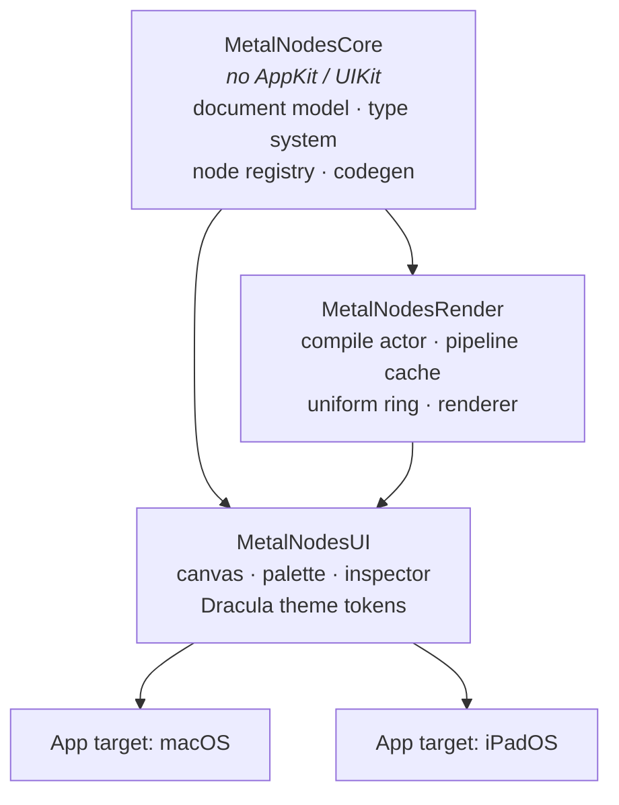
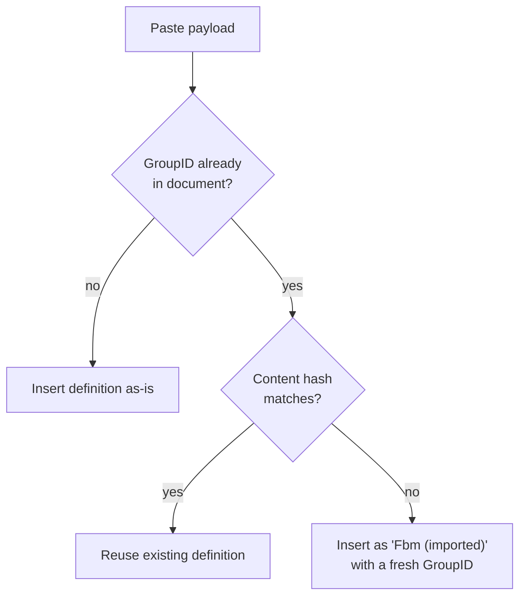
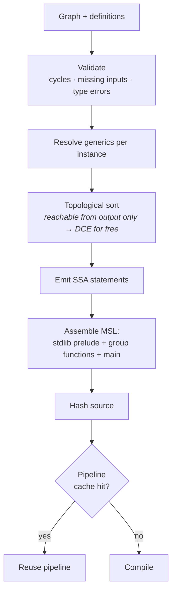
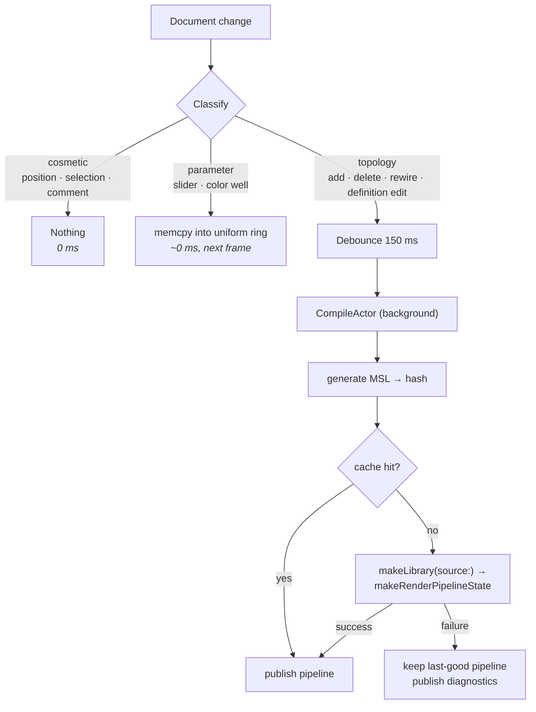

# MetalNodes — Design

**Date:** 2026-09-04
**Status:** Draft, pending review
**Target:** macOS 26 + iPadOS 27, Swift 6, SwiftUI

A node-based Metal shader editor with live preview, reusable node-group
functions, and comment frames. Reference points: Blender's shader editor and
Houdini's network view.

---

## 1. Decisions already locked

| Question | Decision |
|---|---|
| Shader kind | 2D fullscreen fragment (uv/time/resolution/mouse → color), behind an `OutputTarget` abstraction. **SwiftUI `[[stitchable]]` is a second v1 target** (§9.6); a 3D material target can be added later without a rewrite |
| Platforms | macOS + iPadOS, shared platform-agnostic core, two UI layers |
| Node groups | Definition + instances. Edit the definition, every instance updates. Compiles to one real MSL function called N times |
| Preview | One main preview panel, plus a movable viewer flag that previews *any* node |
| v1 node library | Core set — 36 node types / 58 operations — covering every category and every socket type |
| Codegen | Declarative node definitions + SSA emission (approach A) |
| Live-ness | Parameters live in a uniform buffer; only topology changes recompile |

---

## 2. Module architecture



`MetalNodesCore` is pure value types with no rendering and no UI, which is what
makes the codegen and group algebra unit-testable without a GPU or a window.

---

## 3. Document model

One value type, `Codable`, saved through `DocumentGroup` as a **package** —
a directory that macOS and iPadOS present as a single `.mnshader` file:

```
MyShader.mnshader/
├── document.json      ← ShaderDocument, human-diffable, git-friendly
├── view.json          ← EditorViewState, persisted but never undone
└── textures/
    └── 7F3A….png      ← assets referenced by AssetID, never inlined
```

Textures live beside the JSON, not inside it. That keeps `ShaderDocument`
kilobytes in size, which is what makes snapshot undo (§5) cheap.

```swift
struct ShaderDocument: Codable, Sendable {
    var formatVersion: Int
    var root: Graph                              // the shader itself
    var definitions: [GroupID: GroupDefinition]  // reusable functions
    var settings: DocumentSettings               // preview size, time mode, asset manifest
}

struct Graph: Codable, Sendable {
    var nodes: [NodeID: NodeInstance]
    var inputs: [SocketRef: SocketRef]   // to (input) → from (output)
    var stickies: [StickyID: StickyNote]
    var frames: [FrameID: CommentFrame]
}

/// Sockets are addressed by **stable name**, never by index.
struct SocketRef: Codable, Sendable, Hashable {
    var node: NodeID
    var socket: String                   // "uv", "scale", "out" …
}

struct NodeInstance: Codable, Sendable {
    let id: NodeID
    var kind: NodeKind              // .builtin("noise.fbm") | .group(GroupID)
    var position: CGPoint
    var params: [ParamID: ParamValue]
    var customTitle: String?
    var collapsed: Bool
}

struct GroupDefinition: Codable, Sendable {
    let id: GroupID
    var name: String
    var inputs:  [SocketDecl]       // typed, ordered, with defaults
    var outputs: [SocketDecl]
    var graph: Graph                // contains GroupInput / GroupOutput pseudo-nodes
    var accent: DraculaAccent
}

/// Persisted alongside the document, excluded from undo. See §5.
struct EditorViewState: Codable, Sendable {
    var cameras: [GraphPath: Camera]     // pan + zoom, per graph
    var editingStack: [NodeID]           // breadcrumb: the group *instances* dived through
    var viewer: SocketRef?               // the ◉ flag
    var selection: Set<NodeID>           // transient, but restored on reopen
}
```

### Three rules baked into the shape above

**Edges are keyed by input socket.** An input accepts exactly one wire, so the
graph stores `to → from` in a dictionary. "What feeds this socket" is a lookup,
"connect a second wire" is an overwrite, and the one-wire-per-input rule is
structural rather than enforced by UI code.

**Sockets are addressed by name, not index.** Adding a socket to a built-in
node in a later version, or reordering a group's exposed inputs, must not
silently rewire every saved document. Names are stable; indices are not.

**`GroupDefinition.inputs` / `.outputs` are the single source of truth.** The
`GroupInput` and `GroupOutput` pseudo-nodes inside the definition graph have no
socket list of their own — they mirror the declarations. There is never a
second copy to drift.

### Why definitions live beside the graph, not inside instances

Instances hold only a `GroupID`. Definitions live in one dictionary on the
document. So "edit the definition and all instances update" needs **no sync
code at all** — there is only ever one copy of the truth.

```
ShaderDocument
├── definitions
│   └── "fbm-A1B2" ──── GroupDefinition { name: "Fbm", graph: {...} }
│                              ▲          ▲
└── root.nodes                 │          │
    ├── n07  .group("fbm-A1B2")┘          │
    └── n12  .group("fbm-A1B2")───────────┘

edit the definition once → both n07 and n12 change
```

---

## 4. The five group operations

### 4.1 Group from selection (⌘G)

The only non-obvious one. Compute the **cut**: every edge crossing the selection
boundary inbound becomes a group input, **deduplicated by source socket** — one
external value feeding three selected nodes produces *one* input, not three.
Every edge crossing outbound becomes an output. External wiring survives,
rewired to the new instance.

```
BEFORE                              AFTER

[A]──┬──▶[B]──▶[D]──▶[Out]          [A]──▶┌─ MyGroup ─┐──▶[Out]
     └──▶[C]──▶─┘                         └───────────┘

selection = { B, C, D }             definition "MyGroup":
                                      (GroupInput)─┬─▶[B]──▶[D]─▶(GroupOutput)
A feeds both B and C                               └─▶[C]──▶─┘
  → ONE input, not two
```

### 4.2 Dive in (double-click)

Pushes onto an editing stack; a breadcrumb bar reads `Shader › Fbm ›
Turbulence`. The canvas view is the same view bound to a different `Graph`.

### 4.3 Make Unique

Deep-copies the definition under a fresh `GroupID` and name (`Fbm 2`), then
retargets **only the selected instance**.

### 4.4 Ungroup (⌘⇧G)

Inlines the definition's nodes into the parent graph with remapped IDs,
reconnecting whatever fed the instance's inputs to whatever `GroupInput` fed
internally. Group-then-ungroup is identity modulo IDs — this is a test.

### 4.5 Edit a definition's sockets

Removing an input orphans edges on **every** instance. Rule: those edges are
deleted inside the *same undo transaction* as the socket removal, so a single
⌘Z restores both.

### 4.6 Recursion

A definition may not transitively contain an instance of itself. The check runs
when a group is created and when one is dropped from the palette, and refuses
inline rather than failing later at codegen.

---

## 5. Undo

Snapshot the whole `ShaderDocument` into `UndoManager`, coalescing continuous
gestures (node drag, slider scrub) into one entry on gesture end.

Documents are kilobytes. Snapshotting is the only approach that stays correct
when a single edit touches a definition *plus* N instances *plus* their orphaned
edges. Command-pattern undo would need a correct inverse for every operation in
§4 — which is exactly where node editors typically start corrupting state.

**Accepted trade-off:** undo granularity is one gesture, not one keystroke.

**View state is never snapshotted.** Camera, selection, viewer flag and the
editing stack live in `EditorViewState`, a sibling of the document. ⌘Z must
never un-pan the canvas or un-select a node.

---

## 6. Copy / paste

The clipboard payload is a subgraph — nodes, internal edges, stickies and frames — **plus
every `GroupDefinition` it transitively references**. Copying a node that uses
your custom `Fbm` into another document brings `Fbm` along.

On paste, definitions dedupe by content hash:



Never silently overwrite the destination's version of a definition.

Texture assets referenced by copied nodes travel the same way: the payload
carries the image bytes keyed by `AssetID`, and paste writes them into the
destination package's `textures/` if not already present.

---

## 7. Type system

### 7.1 Socket types

| Type | MSL | Socket color | Socket shape |
|---|---|---|---|
| `float` | `float` | cyan `#8BE9FD` | circle |
| `float2` | `float2` | green `#50FA7B` | circle |
| `float3` | `float3` | purple `#BD93F9` | circle |
| `float4` | `float4` | pink `#FF79C6` | circle |
| `color` | `float4` | yellow `#F1FA8C` | diamond |
| `int` | `int` | orange `#FFB86C` | circle |
| `bool` | `bool` | comment `#6272A4` | circle |
| `texture` | `texture2d<float>` | foreground `#F8F8F2` | square |

Red is deliberately absent from this table: it is reserved for errors alone.

Type is encoded by **shape as well as color**, so the graph stays readable
without relying on color alone.

### 7.2 Implicit conversion

Inserted automatically by codegen; the wire draws a small conversion pip where
one occurs.

| From → To | Rule |
|---|---|
| `float` → `floatN` | splat |
| `float2` → `float3` | append `0` |
| `float2` → `float4` | append `0, 1` |
| `float3` → `float4` | append `1` (alpha) |
| `float4` → `float3` | drop `w` |
| `floatN` → `float` | component average |
| `color` → `float` | luminance, `dot(rgb, (0.2126, 0.7152, 0.0722))` |
| `color` ↔ `float4` | free, semantic tag only |
| `int` ↔ `float` | direct cast |
| `bool` → `float` | `0.0` / `1.0` |
| anything ↔ `texture` | **rejected** |

Rejected connections are refused *during the drag* — incompatible sockets dim
and the wire will not drop.

### 7.3 Generic nodes

`Add` should work on `float` and `float3` without four separate definitions. A
definition may declare a type variable constrained to a set:

```swift
NodeDef("math.add",
    generics: ["T": [.float, .float2, .float3, .float4]],
    inputs:  [.init("a", .generic("T")), .init("b", .generic("T"))],
    outputs: [.init("out", .generic("T"))],
    body: "{out.out} = {in.a} + {in.b};")
```

Resolution is **local**: unify the types of the connected inputs, widening to
the largest; default to `float` when nothing is connected. No whole-graph
inference, no solver.

---

## 8. Node definitions

A node type is *data*, not code.

```swift
NodeDef("noise.fbm",
    category: .noise,
    inputs:  [.init("uv", .float2, default: .uv),
              .init("scale", .float, default: 4)],
    params:  [.init("octaves", .int, range: 1...8, default: 5)],
    outputs: [.init("value", .float)],
    requires: ["fbm", "valueNoise"],          // pulls MSL stdlib functions
    body: "{out.value} = fbm({in.uv} * {in.scale}, {param.octaves});")
```

- `requires` names entries in a hand-written MSL standard library; the emitter
  includes each required function exactly once, in dependency order.
- Adding a node post-v1 is a data-entry job, not an engineering one. That is
  what makes "core 30 now, expand later" cheap.
- **Variants:** a definition may declare an enum parameter with a body template
  per case, which is how one `Math` node covers fifteen operations. The chosen
  case is a *topology-level* property, so switching it recompiles — unlike a
  numeric parameter, which does not.
- **Escape hatch:** any definition may supply a custom
  `emit(inputs:params:ctx:) -> [Statement]` closure instead of a template, for
  the few nodes needing conditional or variadic emission.

---

## 9. Code generation



### 9.1 Shape of the generated source

```metal
#include <metal_stdlib>
using namespace metal;

struct Uniforms {
    // ---- sorted by alignment: 16-byte, then 8, then 4 (see §9.6) ----
    float2 resolution;
    float2 mouse;
    float  time;
    float  p0;      // root/n07 · Fbm input "scale"   — per instance
    float  p1;      // root/n12 · Fbm input "scale"   — per instance
    int    p2;      // Fbm/n03  · "octaves"           — shared by ALL instances
};

// ---- stdlib functions pulled in by `requires` ----
float valueNoise(float2 p) { ... }
float fbm(float2 p, int octaves) { ... }

// ---- one function per group definition ----
float Fbm(constant Uniforms &u, float2 uv, float scale) {
    return fbm(uv * scale, u.p2);        // internal param, read from u
}

// ---- main ----
fragment float4 shaderMain(VertexOut in [[stage_in]],
                           constant Uniforms &u [[buffer(0)]],
                           texture2d<float> tex0 [[texture(0)]]) {
    float2 v0 = in.uv;
    float  v1 = Fbm(u, v0, u.p0);        // instance n07
    float  v2 = Fbm(u, v0 * 2.0, u.p1);  // instance n12, different scale
    float3 v3 = mix(float3(0.0), float3(1.0), v1 + v2);
    return float4(v3, 1.0);
}
```

Every generated group function takes `constant Uniforms &u` as its first
argument. That is what lets parameters on nodes *inside* a group stay
live-editable uniforms instead of forcing a recompile.

The vertex stage is **static** — a fullscreen triangle precompiled in the app's
own `.metal` file — and only the fragment function is generated. `in.uv` is
`0…1` with the origin **bottom-left**, matching ShaderToy and Blender rather
than Metal's texture convention. The `UV` node has an *aspect-corrected* option
that yields `(uv - 0.5) * (resolution / resolution.y)`, the form you want for
anything circular.

### 9.2 Parameter scoping — the rule that matters

| Parameter lives... | Uniform slot | Per-instance? |
|---|---|---|
| on a node in the root graph | one slot, keyed by `NodeID` | n/a |
| on a node **inside** a group definition | one slot shared by all instances | **no** |
| on an exposed **group input socket** | one slot per instance, keyed by instance path | **yes** |

This matches Blender exactly: group internals are shared; to vary a value per
instance you expose it as a group input. It also falls straight out of "one
definition compiles to one function".

### 9.3 Viewer variant

The viewer flag compiles a second pipeline from the same graph, terminating at
the viewed node and wrapping its value for display:

| Viewed type | Visualization |
|---|---|
| `float` | `float4(v, v, v, 1)`, remapped through a manual min/max range control |
| `float2` | `float4(v, 0, 1)` |
| `float3` | `float4(v, 1)` |
| `float4` / `color` | as-is |
| `bool` | white / black |
| `int` | normalized grayscale + numeric readout |
| `texture` | sampled at `uv` |

Both pipelines are cached, so flicking the viewer between two nodes is instant
after the first visit.

The range control is **manual** in v1. Auto-normalizing over the frame needs a
min/max reduction across the whole image — a compute kernel plus a readback —
and is not worth it before the app has users.

**Viewer inside a group definition.** Flagging a node inside `Fbm` needs *some*
instance's values for the per-instance inputs. Rule: use the instance you dived
through — the editing stack records it. If the definition was opened from the
palette with no instance, use the sockets' declared defaults.

**One terminal per graph.** The root graph has exactly one `Fragment Output`;
adding a second is refused. A definition graph's terminal is `GroupOutput`.
Codegen picks its terminal from the active `OutputTarget`, which is how the
SwiftUI and material targets slot in later.

### 9.4 Error mapping

Because *we* generate the source, we also emit a side table mapping generated
line ranges → `NodeID`. A Metal compiler error therefore highlights the
offending node in red with the message in the inspector, instead of showing a
line number in a file the user never wrote.

Validation errors (cycle, type mismatch, missing required input) are reported
on nodes *before* codegen runs, and keep the last-good pipeline alive.

### 9.5 SwiftUI `[[stitchable]]` target

The same graph, a second terminal. `OutputTarget.stitchable(kind)` generates a
function whose signature matches what SwiftUI's `Shader` API expects:

| Kind | Generated signature | SwiftUI call site |
|---|---|---|
| `colorEffect` | `[[stitchable]] half4 name(float2 position, half4 currentColor, float2 size, float time, …params)` | `.colorEffect(ShaderLibrary.name(.float2(size), .float(t), …))` |
| `distortionEffect` | `[[stitchable]] float2 name(float2 position, float2 size, float time, …params)` | `.distortionEffect(…, maxSampleOffset:)` |
| `layerEffect` | `[[stitchable]] half4 name(float2 position, SwiftUI::Layer layer, float2 size, float time, …params)` | `.layerEffect(…, maxSampleOffset:)` |

Two things differ from the fragment target, and both are handled in codegen
rather than in the node library:

- **Uniforms become function arguments.** SwiftUI passes parameters as
  `Shader.Argument`s, not a buffer. The generator emits one argument per
  uniform slot in layout order, and `uv` is derived as `position / size`.
- **`Texture Sample` maps to `layer.sample(position)`** under `layerEffect`
  and is a validation error under the other two kinds.

**Preview still works** because the generator also emits a thin fragment
`shaderMain` that calls the stitchable function with values read from
`Uniforms`. Export writes the `.metal` file *plus* a Swift snippet showing the
exact `ShaderLibrary` call with argument order, since getting that order wrong
is the usual failure.

The stitchable target lands in **M3** alongside the viewer flag, because both
are "a second terminal on the same graph" and share the plumbing.

### 9.6 Uniform buffer layout — the alignment trap

MSL aligns `float2` to 8 bytes and `float3` / `float4` to 16. **A `float3` is 16
bytes, not 12.** If the Swift side computes offsets naïvely, every slider write
after the first `float3` lands in the wrong place.

Three rules:

1. **Emit slots sorted by alignment** — 16-byte types, then 8, then 4 — so the
   struct has no interior padding and the offset arithmetic is trivial and
   identical on both sides. Reserved uniforms (`resolution`, `mouse`, `time`)
   sort with everything else.
2. **Codegen returns the layout, not just the source.** The result is
   `(msl: String, layout: [ParamPath: (offset: Int, type: SocketType)])`.
   The renderer never re-derives offsets.
3. **On every pipeline publish, rebuild the whole buffer from the document.**
   Slot numbers shift on every recompile, so incremental patching is unsafe.
   The document is the source of truth; the buffer is a projection of it.

A **generation counter** guards the hand-off: the compile actor tags each job
with the document revision that triggered it and publishes only if no newer
job has been queued. A slow compile can never overwrite a newer one.

---

## 10. Render and compile loop

Every document change is classified, and only one of the three classes is
expensive:



**Never go black on error.** A failed compile keeps rendering the last working
pipeline and surfaces diagnostics on the offending nodes.

Renderer details:

- `MTKView` wrapped in `NSViewRepresentable` / `UIViewRepresentable`.
- Triple-buffered uniform ring with a semaphore; one fullscreen triangle.
- `device.makeLibrary(source:options:)` works at runtime on **both** macOS and
  iPadOS, so runtime compilation is not a macOS-only luxury.
- `CompileActor` is a Swift `actor`; pipelines hand off to the `@MainActor`
  renderer as `Sendable` values. Strict concurrency on.

Preview panel controls: play / pause / reset time, resolution mode
(fit · 1× · fixed), aspect lock, mouse input passthrough, snapshot to PNG, and
an error badge.

---

## 11. Canvas and interaction

### 11.1 Rendering strategy

One SwiftUI `View` per node inside a transformed `ZStack`; **all wires drawn in
a single `Canvas` beneath them**. Keeps real SwiftUI controls (sliders, color
wells, pickers) inside node bodies, and hit-testing and accessibility come free.

- Culling: only instantiate node views intersecting the visible rect plus a
  margin.
- LOD: below `zoom 0.4`, nodes render as a colored title bar only — no sockets,
  no controls.
- Wires: cubic Bézier with horizontal control points proportional to `dx`,
  colored by source socket type.

### 11.2 Input map

| Action | macOS | iPadOS |
|---|---|---|
| Pan | scroll, space-drag, middle-drag | two-finger drag |
| Zoom | ⌘scroll, pinch | pinch |
| Select | click · ⇧click add · ⌘click toggle | tap · tap-add in select mode |
| Marquee | drag on empty canvas | lasso via toolbar mode |
| Context menu | right-click | long-press |
| Add node | ⇧A or double-click empty canvas | ✛ toolbar button |
| Copy / paste / cut / duplicate | ⌘C ⌘V ⌘X ⌘D | edit menu + hardware kbd |
| Group / ungroup | ⌘G / ⌘⇧G | context menu |
| Comment frame from selection | ⌘⇧C | context menu |
| Set viewer flag | ⌘⇧V, or click the ◉ badge | tap the ◉ badge |
| Delete | ⌫ | context menu |
| Nudge | arrow keys | — |
| Duplicate-drag | ⌥drag | — |
| Zoom to fit all / selection | Home / F | toolbar button |

### 11.3 Connection UX

- Dragging from a socket rubber-bands live; compatible sockets highlight,
  incompatible ones dim.
- Dropping on a node **body** auto-connects to the first compatible socket.
- Dropping on **empty canvas** opens the palette search filtered to nodes that
  accept the dragged type, and auto-wires whatever you pick. (Blender's ⇧A and
  Houdini's Tab, merged.)
- An input socket accepts one wire; connecting a second replaces the first
  (structurally, per §3). Output sockets fan out freely.

### 11.4 Palette

Left sidebar: categorized list plus fuzzy search, drag-out onto the canvas.
Custom group definitions appear under **My Functions**. The same list backs the
⇧A search popover at the cursor. (M4: the popover lists builtins only;
definitions are placed from the palette — carried over to M5.)

### 11.5 Comments — two kinds, as requested

**Sticky note.** A free-floating text box anywhere on the canvas. Resizable,
colored from the Dracula accents.

**Comment frame.** A titled, colored rectangle around a selection (⌘⇧C), or
drawn on empty canvas.

```
┌─ "lighting pass" ────────────────────┐
│                                       │
│   [Normal]──▶[Dot]──▶[Clamp]──┐       │
│                                ▼      │
│   [LightDir]──────────────▶[Mix]      │
│                                       │
└───────────────────────────────────────┘
   dragging the frame moves its contents
   dropping a node inside adopts it
```

Frames own their children by geometry: dragging the frame moves the nodes
inside; a node dragged into the bounds joins, dragged out leaves. Collapsible
and resizable.

**Both kinds are pure UI metadata and have zero effect on codegen.**

### 11.6 Generated-code panel

A read-only pane, toggled from the toolbar, showing the live MSL with syntax
highlighting in the Dracula palette and a **Copy** button. It updates on every
successful codegen — before compilation, so it also shows what a *failing*
graph produced. Selecting a node highlights its emitted lines using the same
side table as §9.4.

For a shader tool this is half the value: you learn Metal by watching the code
change as you wire nodes, and it costs nothing because the string already
exists.

---

## 12. Dracula theme

Dark only in v1. Colors live as **semantic tokens** in a `Theme` struct, never
as raw hex at call sites, so the official light variant (Alucard) is a later
data swap rather than a refactor.

| Token | Hex | Used for |
|---|---|---|
| `background` | `#282A36` | canvas |
| `surface` | `#44475A` | node body, sidebars, grid dots |
| `foreground` | `#F8F8F2` | text |
| `muted` | `#6272A4` | comments, disabled, default frame color, Utility category, `bool` |
| `cyan` | `#8BE9FD` | Input category, `float` |
| `green` | `#50FA7B` | Vector category, `float2`, **viewer flag** |
| `orange` | `#FFB86C` | SDF category, `int` |
| `pink` | `#FF79C6` | Noise category, `float4` |
| `purple` | `#BD93F9` | Math category, `float3` |
| `red` | `#FF5555` | **errors only** |
| `yellow` | `#F1FA8C` | Color category, `color` socket |

**Red is reserved for errors** and is assigned to no socket type or category.
The viewer flag is a green **◉ glyph** — green also colors the Vector category
and `float2` sockets, but the badge shape is unique, so it never reads as either.

Selection is deliberately *not* signalled by a hue — hues are spoken for by the
type system. A selected node gets a 2 pt `foreground` outline plus a soft glow;
a selected wire brightens and thickens. That keeps selection legible on top of
a node of any category without colliding with what its colors already mean.

Node headers are tinted by category; group instances get a purple header with a
doubled border so they read as "this is a function".

---

## 13. v1 node library

| Category | Nodes |
|---|---|
| **Input** | UV, Time, Resolution, Mouse, **Constant** (variants: float · float2 · float3 · color · int · bool), Texture Sample |
| **Math** | **Math** (enum op: add · subtract · multiply · divide · power · modulo · min · max · abs · floor · fract · sqrt · sin · cos · tan), Clamp, Mix, Smoothstep, Step, Map Range |
| **Vector** | Combine XYZW, Separate XYZW, Length, Dot, Normalize, Rotate 2D |
| **SDF** | Circle, Box, Union, Subtract |
| **Noise** | Value, Perlin, Simplex, Voronoi, Fbm |
| **Color** | Color Ramp, HSV→RGB, RGB→HSV, Invert, Mix Color |
| **Utility** | Reroute, **Compare** (variants: less · greater · equal · not-equal) → `bool`, Switch (`bool ? a : b`) |
| **Output** | Fragment Output |

**36 node types, 58 operations.** The arithmetic and trig functions collapse
into a single `Math` node with an operation picker, exactly as Blender does it —
one definition with 15 body variants instead of 15 near-identical definitions,
and one palette entry instead of fifteen.

`Compare` and the `bool` variant of `Constant` exist so that `bool` has a
producer — without them the type would be in the table but unreachable.
`Reroute` is a generic pass-through drawn as a dot; tidy graphs are impossible
without it.

The set is chosen so that every category and **every socket type** is exercised,
which is what proves the codegen and type system are right.

---

## 14. Testing

`MetalNodesCore` is pure value types, so most of this needs no GPU and no
window. Swift Testing throughout.

| Area | Test |
|---|---|
| Codegen | Golden tests: graph fixture → expected MSL (normalized whitespace) |
| Type system | Table-driven over every (from, to) conversion pair |
| Generics | Unification resolves and defaults correctly per instance |
| ⌘G | Cut correctness, especially input dedup by source socket |
| Ungroup | `group(sel)` then `ungroup` is identity modulo IDs |
| Make Unique | Editing the fork leaves the original instance untouched |
| Recursion | Self-containing group is refused at edit time |
| Undo | `op → undo` deep-equals the original document, for every op in §4 |
| Persistence | `document → package → document` round-trip, textures included |
| Uniform layout | Codegen offsets match MSL alignment for every type mix, including `float3` = 16 bytes |
| Stale compile | A slower, older compile job never overwrites a newer published pipeline |
| DCE | Nodes unreachable from the output do not appear in generated source |
| Library smoke | **Every node** in the library compiles as a one-node graph on a real `MTLDevice` |

Golden-image comparison of rendered output is deliberately **out of scope** —
it is flaky across GPU generations and would buy little over the compile smoke
test.

---

## 15. Build order

| Milestone | Contents |
|---|---|
| **M0** | Retarget project to macOS + iPadOS only, Swift 6 + strict concurrency, SPM module split, theme tokens, empty canvas that pans and zooms |
| **M1** | Graph core + codegen + uniform layout (§9.6) + preview with a minimal ~12 nodes. **First pixels.** Proves the whole pipeline before the surface area grows |
| **M2** | Full canvas: palette drag-in, connection UX, selection, copy/paste, undo, inspector |
| **M3** | Library to full v1 set, viewer flags, **SwiftUI stitchable target + export (§9.5)**, error mapping |
| **M4** | Groups: create, dive-in, make-unique, ungroup, palette integration, cross-document paste |
| **M5** | Comment frames + sticky notes, generated-code panel, minimap, `.metal` export, package persistence with textures |
| **M6** | iPadOS UI layer |

M1 deliberately folds in the "minimal 12 nodes" option as an internal step
rather than a shipped scope — the machinery gets proven early, the library
grows later.

---

## 16. Housekeeping in the existing scaffold

The current Xcode project is an untouched multiplatform template and needs:

- `SUPPORTED_PLATFORMS` narrowed from `iphoneos iphonesimulator macosx xros
  xrsimulator` to macOS + iPadOS.
- `SWIFT_VERSION` raised from `5.0` to `6.0`, strict concurrency on.
- `MACOSX_DEPLOYMENT_TARGET` normalized from `26.6.2` to `26.0`.
- `PRODUCT_BUNDLE_IDENTIFIER` changed off `devplaceholder.…`.
- `MyApp.swift` renamed to `MetalNodesApp.swift`; the `#Playground` block in
  `ContentView.swift` removed.
- A `.gitignore` for macOS/Xcode (there is a stray `.DS_Store`, and
  `xcuserdata/` is currently untracked).

---

## 17. Open questions

1. **Group input editing** — do you want drag-to-reorder and rename for exposed
   group inputs in v1, or is add/remove enough to start?
2. **Textures** — import from file only, or also procedural sources (gradient,
   checker) and pasteboard?
3. **Export** — generated `.metal` source only, or also a precompiled
   `.metallib`?
4. **Time** — wall-clock time, or a scrubable fixed-rate timeline with a frame
   counter (better for recording)?
5. ~~SwiftUI `[[stitchable]]` target~~ — **answered: in v1, at M3.** See §9.5.

---

## 18. M2 addendum — canvas interaction (added 2026-09-04)

M2 implements §5, §6, §11.1–11.4 and the inspector. This section pins down
the mechanics those sections leave implicit. Nothing here changes a locked
decision.

### 18.1 Scope and order

One plan, in this order, so the branch is usable at every point:

1. **Carry-overs from the M1 review** — LRU cap on the pipeline cache;
   `.failure` results supersession-checked like `.success`; `CompileLine`
   carries severity and warnings render as warnings; `mathMode` becomes
   `DocumentSettings.fastMath` (default on) and is part of the cache key.
2. **Selection** — click, ⇧-add, ⌘-toggle, marquee, ⌘A, ⌫ delete, arrow
   nudge, selection outline + glow, wire selection by click.
3. **Wiring** — socket drag with rubber band, compatibility highlight,
   drop-on-socket / drop-on-body / drop-on-empty-canvas (search popover
   that auto-wires), input re-drag to detach.
4. **Input model** — scroll-wheel pan, ⌘-scroll zoom, space-drag pan,
   zoom-to-fit (Home / F), keyboard focus on the canvas.
5. **Palette** — left sidebar with search, drag-out, ⇧A / double-click
   popover at the cursor.
6. **Undo** — snapshot transactions (§5) with gesture coalescing; Edit menu.
7. **Copy / paste / cut / duplicate** — pasteboard payload (§6), ID
   remapping, paste at cursor; ⌥-drag duplicate.
8. **Inspector** — right sidebar.
9. **Culling and LOD** — visible-rect culling, header-only nodes below
   zoom 0.4.

Deferred to M3+: viewer flag, error mapping onto nodes (the plumbing exists;
the inspector shows diagnostics text in M2), texture sample, groups, comments.

### 18.2 Editor state model

`EditorViewState` (persisted, not undoable) gains nothing; it already holds
`selection`, `cameras`, `viewer`, `editingStack`. Transient interaction state
lives in the canvas view: `pendingWire`, `marquee`, `spaceHeld`, `dragOrigin`.

`DocumentChange` grows to cover every M2 edit. Each case still classifies as
cosmetic / parameter / topology:

| Case | Class |
|---|---|
| `moveNodes([NodeID: CGPoint])` (replaces `moveNode`) | cosmetic |
| `setParam`, `setTitle(NodeID, String?)` | parameter / cosmetic |
| `connect`, `disconnect`, `addNode`, `removeNodes(Set<NodeID>)` | topology |
| `insert(nodes:, edges:)` — paste / duplicate in one change | topology |
| `setSettings(DocumentSettings)` | topology if `fastMath` changed, else cosmetic |
| `restore(ShaderDocument)` — undo/redo only | topology |

`removeNodes` drops the nodes and every wire touching them in one change so
undo restores both.

### 18.3 Undo — transactions over snapshots

`EditorModel` owns its `UndoManager`. Every `apply` is wrapped in a
transaction; nested calls join the open one:

```
beginTransaction(name)   snapshot = document (only if none open)
  apply(change) …        mutate
endTransaction()         if document != snapshot:
                             undoManager.registerUndo { restore(snapshot) }
                             undoManager.setActionName(name)
```

Continuous gestures call `beginTransaction("Move")` on the first change and
`endTransaction()` on gesture end — one undo step per drag or slider scrub.
A single `apply` outside a transaction opens and closes its own. `restore`
sets `document`, schedules a compile, and leaves `viewState.selection`
intersected with the surviving node IDs. Redo is symmetric via the manager.

Snapshots are the whole `ShaderDocument` (§5); `Graph` is copy-on-write, so
an unchanged graph costs a pointer copy.

### 18.4 Pasteboard payload

```swift
struct GraphClipboard: Codable {
    static let formatVersion = 1
    var nodes: [NodeInstance]           // positions relative to their bounding-box origin
    var edges: [Edge]                   // internal edges only (both ends in `nodes`)
    var stickies: [StickyNote], frames: [CommentFrame]   // M5 fills these
    var definitions: [GroupDefinition]  // M4 fills this (§6 dedup rules)
}
```

Written as JSON under the UTType `com.maxburger.metalnodes.graph`
(`NSPasteboard` on macOS, `UIPasteboard` on iPad, behind a `Pasteboarding`
protocol so the model is testable with an in-memory implementation).
Paste allocates fresh `NodeID`s, rewrites edges through the ID map, positions
the bounding box at the cursor (or +24,+24 from the original when triggered
from the menu), inserts everything as one `insert(nodes:edges:)` change, and
selects the pasted nodes. Duplicate is copy + paste without touching the
system pasteboard. Cut is copy + `removeNodes`.

### 18.5 Wiring mechanics

- A drag starting on an **output** socket carries `pendingWire = (from,
  currentPoint)`; the wire layer draws it as a rubber band in the source
  type's color.
- A drag starting on a **wired input** detaches the wire (`disconnect`) and
  continues the drag from its original source — Blender's re-drag.
- Drop resolution, in order: nearest socket anchor within 14 canvas points
  that accepts the type (`ConversionRules.convert != nil`) → connect; else a
  node body under the cursor → its first compatible input; else empty canvas
  → open the palette popover filtered to nodes with a compatible input; on
  pick, add the node at the drop point and connect. Escape cancels.
- While a drag is live every socket renders compatibility: compatible sockets
  at full opacity, incompatible at 30 %.
- Wire hit-testing samples the Bézier at 24 points; a click within 6 canvas
  points selects the wire; ⌫ deletes it.

### 18.6 Input model

- **Scroll wheel** — SwiftUI has no scroll-wheel modifier, so the canvas hosts
  a transparent `NSViewRepresentable` overlay (`ScrollWheelCatcher`) that
  forwards `scrollWheel(with:)` deltas: plain → pan, ⌘ → zoom around the
  cursor, and passes every other event through. iPad (M6) uses a two-finger
  pan gesture instead; the overlay is `#if os(macOS)`.
- **Space-drag pan** — the canvas is `.focusable()`; `onKeyPress(.space,
  phases: [.down, .up])` toggles `spaceHeld`, which turns the marquee drag
  into a pan.
- **Marquee** — a plain drag on empty canvas draws a rectangle in canvas
  coordinates; nodes whose frames intersect it are selected on end (⇧ adds).
- **Keyboard** — `onKeyPress` handles ⌫, arrows (1 pt, ⇧ 10 pt), Escape.
  Menu items (Undo/Redo/Cut/Copy/Paste/Duplicate/Select All/Delete/Zoom to
  Fit) live in `EditorCommands` (a `Commands` scene) and reach the model
  through a `@FocusedValue`.
- **Zoom to fit** fits all nodes (Home) or the selection (F) with 40 pt
  padding, clamped to the zoom range.

### 18.7 Palette

Left sidebar, 220 pt: a search field and a `List` grouped by
`NodeCategory`, plus **My Functions** (empty until M4). Search is
case-insensitive substring over title and definition ID; results are ordered
by prefix match first. Rows are `.draggable` with a `NodeDefTransfer`
(`Transferable`, carrying the def ID); the canvas is a `.dropDestination`
that converts the drop point through the transform and applies `addNode`.
The same list, in a popover anchored at the cursor, serves ⇧A and
double-click on empty canvas; Return adds the highlighted row.

### 18.8 Inspector

Right sidebar, 260 pt. One node selected: header (title field bound to
`setTitle`, definition ID, category chip), then every parameter and unwired
input as a full-width `ParamControl`, wired inputs listed as "← Node.socket",
then that node's diagnostics. Nothing selected: `DocumentSettings` —
preview size, time mode, fast math. Multiple selected: "N nodes selected".
The inspector reuses `ParamControl`; the node body keeps its compact controls.

### 18.9 Culling and LOD

`GraphCanvasView` computes each node's frame from `position` and an
estimated size (`NodeView.estimatedSize(for: def)` — header + 22 pt per
row) and skips nodes whose frame misses `visibleRect(viewport:)` expanded
by 200 pt. Below zoom 0.4 `NodeView` renders in `compact` mode: header
only, sockets as anchors without controls. Wires always draw.

### 18.10 Testing

Model-level, no UI harness: transactions (`op → undo → equals original`,
gesture coalescing yields one step, redo), `removeNodes` drops both-end wires,
paste ID remapping and relative positioning, in-memory pasteboard
round-trip, `fastMath` in the cache key, LRU eviction, `CompileLine`
severity parsing, marquee/frame intersection math, zoom-to-fit math, wire
hit-testing distance, drop resolution order (pure function over anchors).
Views verified by build plus the manual checklist in the plan's last task.

---

## 19. M3 addendum — library, viewer, stitchable target, error mapping (added 2026-09-04)

Binding mechanics for milestone M3, in the same spirit as §18. Where this
section and an earlier one disagree, this section wins for M3.

### 19.1 Scope and order

1. **Codegen environment** — templates stop spelling `u.time` / `in.uv`;
   they use `{sys.uv}`, `{sys.time}`, `{sys.resolution}`, `{sys.mouse}`, and
   the emitter substitutes per target. Uniform reads go through the same
   environment (`u.p0` for the fragment target, a bare argument name for a
   stitchable function).
2. **Viewer flag** (§9.3) — a second program from the same graph, always a
   *fragment* program for the preview, terminating at the flagged output.
3. **Stitchable target** (§9.5) — `colorEffect`, `distortionEffect`,
   `layerEffect`; preview wrapper; export of `.metal` + `.swift`.
4. **Library to the v1 set** — 27 new definitions (40 total), see 19.5.
5. **Error mapping** (§9.4) — diagnostics already carry `NodeID`; nodes
   with an error get a red outline and badge.
6. **Carry-overs from M2** — paste at the cursor, selected nodes draw on top,
   no recompile when the generated source is unchanged, Undo menu titles
   carry the action name, tolerant clipboard decoding.

Decisions taken with the user for M3: constants ship as **separate nodes**
(Float, Vector 2, Vector 3, Color, Integer, Boolean — the type resolver only
infers from connected inputs); **Texture Sample is deferred to M5** with
package persistence; **Color Ramp has up to 4 stops**, edited in the
inspector; export is a **File ▸ Export Shader…** save panel writing both
files side by side, plus "Copy Swift snippet" in the inspector.

### 19.2 Emit environment

```swift
struct EmitEnvironment: Sendable {
    var uniform: @Sendable (UniformField) -> String   // how a slot is read
    var sys: [String: String]                          // uv, time, resolution, mouse
}
```

| Target | `uniform(p0: float)` | `uniform(p3: int)` | `uniform(p4: bool)` | `sys.uv` | `sys.time` | `sys.resolution` | `sys.mouse` |
|---|---|---|---|---|---|---|---|
| fragment (and viewer) | `u.p0` | `u.p3` | `bool(u.p4)` | `in.uv` | `u.time` | `u.resolution` | `u.mouse` |
| stitchable function | `p0` | `int(p3)` | `bool(p4)` | `uv` | `time` | `size` | `mouse` |

SwiftUI's `Shader.Argument` has no integer or boolean form, so int/bool
uniforms are `float` arguments cast on read. `uv` inside a stitchable
function is `float2(position.x / size.x, 1.0 - position.y / size.y)` — the
same bottom-left convention as the fragment target.

The registry rejects any `{sys.x}` whose name is not one of the four.

### 19.3 Viewer

- `generate(doc, target:, viewer: SocketRef?)`. A valid viewer (node exists,
  socket is one of its outputs) replaces the terminal: the topological order
  starts from the viewed node (DCE as usual) and the program ends with a wrap
  of that output's variable per the §9.3 table. `float` and `int` map through
  two extra reserved uniforms `viewerMin`, `viewerMax` (sorted with the
  others, present only in viewer programs):
  `return float4(float3(saturate((v - u.viewerMin) / max(u.viewerMax - u.viewerMin, 1e-6))), 1.0);`
- A viewer program is always a fragment program regardless of
  `settings.target`; export never passes a viewer.
- An invalid viewer (node or socket gone) is cleared before generation —
  `EditorModel` prunes it exactly as it prunes the selection.
- Setting the viewer is a view-state change (no undo) that schedules a
  compile. The range control (min/max) is transient preview state, written
  into the uniform image every frame, so dragging it never recompiles.
- UI: a green ◉ badge in every node header toggles the viewer on the node's
  **first** output; the inspector's output rows each carry a ◉ to pick any
  output; View ▸ Toggle Viewer (⌘⇧V) acts on the single selected node. The
  preview pane shows "Viewing *Node*.*socket*" with Clear, and Min/Max fields
  when the viewed type is `float` or `int`.

### 19.4 Stitchable target

Signatures (`NAME` = `settings.exportName` sanitised to an identifier,
default `metalNodesShader`; `…args` = `float2 mouse` followed by one argument
per user uniform slot **in layout order**, int/bool as `float`):

| Kind | Export signature | Return |
|---|---|---|
| colorEffect | `[[stitchable]] half4 NAME(float2 position, half4 currentColor, float2 size, float time, …args)` | `return half4(color);` |
| distortionEffect | `[[stitchable]] float2 NAME(float2 position, float2 size, float time, …args)` | `return float2(color.x, 1.0 - color.y) * size;` — the Fragment Output's `color.xy` is the **source uv** (a plain UV → Output graph is the identity) |
| layerEffect | `[[stitchable]] half4 NAME(float2 position, SwiftUI::Layer layer, float2 size, float time, …args)` | as colorEffect; `layer` is unused until Texture Sample lands (M5) |

`GeneratedShader.source` is the **preview** program: the same function
*without* `[[stitchable]]`-only dependencies (no `SwiftUI::Layer` parameter,
no `<SwiftUI/SwiftUI_Metal.h>`), plus a fragment `shaderMain` that computes
`position = float2(in.uv.x, 1.0 - in.uv.y) * u.resolution` and calls the
function with values read from `Uniforms`; a distortion preview returns
`float4(result / u.resolution, 0.0, 1.0)`. `GeneratedShader.exportSource`
is the file to ship (nil for the fragment target). Switching `settings.target`
is a topology change.

Export writes `NAME.metal` and `NAME.swift`; the Swift file is a `View`
extension whose parameters are named after the node title + parameter label
(camel-cased, de-duplicated), in argument order, calling
`.colorEffect(ShaderLibrary.NAME(.float2(size), .float(time), .float2(mouse), …))`
(`distortionEffect`/`layerEffect` take `maxSampleOffset: .zero`).
`Shader.Argument` has no vector-taking overload, so the Swift call spells a
vector slot by component — `.float2(v.x, v.y)`, `.float3(v.x, v.y, v.z)`,
`.float4(v.x, v.y, v.z, v.w)`. A `color` slot is a `half4` parameter (that is
what SwiftUI's `.color(_:)` passes, premultiplied), read as `float4(NAME)`
inside the function; the preview keeps it as a `float4` in `Uniforms` and
narrows explicitly at the call, since MSL has no implicit vector conversion.

### 19.5 Library additions (27)

| Category | Definitions |
|---|---|
| Input | `input.float2` Vector 2, `input.float3` Vector 3, `input.int` Integer, `input.bool` Boolean, `input.mouse` Mouse (position, from the preview's pointer, bottom-left normalised) |
| Math | `math.clamp`, `math.step`, `math.maprange` (all generic over float/float2/float3/float4, scalar edges cast with `{type.T}`) |
| Vector | `vector.dot` (→ float), `vector.normalize`, `vector.rotate2d` (uv, angle, center → `mn_rotate2d`) |
| SDF | `sdf.circle`, `sdf.box` (`mn_sdBox`), `sdf.union` (`min`), `sdf.subtract` (`max(a, -b)`) — all `float` distances in uv space |
| Noise | `noise.perlin`, `noise.simplex`, `noise.voronoi` (distance to nearest feature point), `noise.fbm` (`octaves` int param 1…8, on value noise) — all `mn_` stdlib, all remapped to 0…1 |
| Color | `color.ramp` (stops enum 2/3/4 as a variant; `col0…col3` and `pos1`, `pos2` value params hidden from the node body; endpoints fixed at 0 and 1), `color.hsv2rgb`, `color.rgb2hsv`, `color.invert`, `color.mixcolor` (mode variants mix/add/multiply/screen, alpha from `a`) |
| Utility | `utility.reroute` (generic pass-through drawn as a **dot**, `NodeStyle.dot`, 24 × 24), `utility.compare` (op variants less/greater/equal/notEqual → `bool`, equal within 1e-4), `utility.switch` (`cond ? a : b`, generic) |

Kept as XYZ (float3) rather than the table's XYZW: `vector.combine`,
`vector.separate`. Multi-statement bodies that need temporaries go through a
stdlib function rather than a template, so two instances never collide on a
local name.

Two `NodeDef` additions: `style: NodeStyle` (`.standard` / `.dot`) and
`ParamDecl.showsInBody` (default true; false hides the control from the node
body, the inspector still shows it). `NodeGeometry` counts only body-visible
params.

Generic resolution gains one rule: if every connected input of a generic is
the **same** type and that type is in the allowed set, use it exactly (so a
`color` through a Reroute stays `color`); otherwise widen as before.

### 19.6 Error mapping

`EditorModel.errorNodes` = nodes named by an error-severity diagnostic. Such a
node draws a 2 pt `red` outline (selection glow still applies) and a red
`exclamationmark.circle.fill` at the leading edge of its header; the inspector
already lists the messages. Warnings do not outline.

### 19.7 Testing (adds to §14 and §18.10)

- Golden viewer programs for every viewable socket type (one constant node
  per type, viewer on it).
- Golden stitchable export + preview for the §14 small document, all three
  kinds; the layer export contains `SwiftUI::Layer` and the preview does not.
- Swift snippet golden with an int and a bool slot (both emitted as `.float`).
- Real-device smoke: every node, every variant of every `.variants` node,
  every viewer type, every stitchable kind's preview.
- `xcrun -sdk macosx metal -c NAME.metal` on an exported file (integration
  script step; `[[stitchable]]` is not exercised by the runtime compiler).
- Model: viewer toggle/prune schedules exactly one compile; unchanged source
  skips the compile; `settings.target` change recompiles.


---

## 20. M4 addendum — groups (added 2026-09-05)

Binding mechanics for milestone M4, in the spirit of §18/§19. Where this
section and §3/§4/§9 differ in detail, this section wins for M4.

### 20.1 Scope and order

1. **Node shapes** — one description of "what a node looks like" (`NodeShape`:
   title, category/accent, inputs, outputs, params, generics, style) resolved
   from the registry for builtins and from the enclosing/target definition
   for group instances, `GroupInput` and `GroupOutput`. Every consumer that
   used `NodeDef` for layout, wiring, typing or drawing goes through it.
2. **Graph paths** — the editor binds to the active path derived from view
   state; every `DocumentChange` applies to the active graph; cameras and
   selection are per path.
3. **Codegen** — one MSL function per definition, called from wherever an
   instance appears; uniform slots follow §9.2.
4. **The five operations** (§4) as pure document transforms, plus socket
   add/remove/rename.
5. **Clipboard** — definitions travel with the payload and dedupe on paste.
6. **UI** — breadcrumb, dive-in/out, group headers, palette "My Functions",
   inspector panes for instances and definitions, recursion refusal.
7. **Viewer inside a definition** through the dived-through instance.

Decisions taken with the user: exposed sockets support **add, remove,
rename** (no reorder); **nested** groups; paste dedupe implemented and
tested **in-document** (cross-document arrives with persistence in M5);
viewer-in-definition **included**.

### 20.2 Shapes

```swift
public struct NodeShape: Sendable, Hashable {
    public var title: String
    public var category: NodeCategory          // .group for instances and pseudo-nodes
    public var accent: DraculaAccent?          // group header colour (definition.accent)
    public var inputs: [SocketDecl]
    public var outputs: [SocketDecl]
    public var params: [ParamDecl]             // empty for groups
    public var generics: [String: [SocketType]]
    public var style: NodeStyle
}
```

`ShaderDocument.shape(of node: NodeInstance, in path: GraphPath, registry:)`:
builtin → the `NodeDef`; `.group(id)` → `definitions[id]` (inputs, outputs,
title = name, accent); `.groupInput` (only valid inside a definition D) →
outputs = `D.inputs`, title "Group Input"; `.groupOutput` → inputs =
`D.outputs`, title "Group Output". `NodeCategory` gains `.group` (palette
section "My Functions", theme token purple). A group instance draws a
**doubled border** (2 pt outer + 1 pt inner ring, both `accent`).

A definition is created with its two pseudo-nodes already present
(`GroupDefinition.make(name:)`), and validation requires exactly one of each.
Pseudo-nodes cannot be deleted, copied, cut or grouped; they can be moved.

### 20.3 Graph paths

`GraphPath` stays `.root | .definition(GroupID)`. View state gains
`editingDefinition: GroupID?` (a definition opened from the palette, with no
instance) beside `editingStack: [NodeID]` (the instances dived through,
outermost first). The active path: `editingStack.last`'s definition, else
`editingDefinition`, else `.root`. `ShaderDocument.graph(at:)` /
`subscript(path)` read and mutate the right `Graph`; `ShaderDocument.node(_
id:)` finds an instance in any graph (ids are unique document-wide). Every
`DocumentChange` applies to the active path; selection is cleared on dive
in/out; cameras stay keyed by path.

### 20.4 Codegen

**One function per reachable definition**, inner-most first, then the root
(or stitchable) program. Function name `mn_g_<sanitized name>_<8 hex of id>`.

```metal
struct G_1a2b3c4d_Out { float value; float2 uv; };      // one field per output, always a struct
G_1a2b3c4d_Out mn_g_Fbm_1a2b3c4d(float2 uv, float time, float2 size, float2 mouse,
                                  float2 in_uv, float in_scale,        // exposed inputs, in order
                                  int p2, float p5) {                  // every uniform the body needs
    …                                                                   // the definition graph, SSA
    G_1a2b3c4d_Out out; out.value = v7; out.uv = v3; return out;
}
```

- The four system values are always the first four parameters; inside the
  function the environment maps `{sys.*}` to them. Exposed inputs follow, as
  `in_<socket>`. Then **every uniform slot the body reads** (its own unwired
  inputs and value params, plus those of nested instances' functions, and
  the *shared* unwired exposed inputs of nested instances), as parameters
  named by the slot. Functions are therefore target-agnostic: the **call
  site** spells the uniforms (`u.p2` under a fragment program, `p2` inside a
  stitchable function) and passes its own `{sys.*}` values through.
- **Slots (§9.2, made concrete):** an unwired exposed input of an instance in
  the **root** graph is per-instance: `ParamPath(node: instanceID, param:
  socket)`, value stored in `instance.params[socket]`, default from the
  definition's `SocketDecl.default`. Everything inside a definition —
  unwired inputs and value params of its nodes, including the unwired
  exposed inputs of a *nested* instance — is shared by all instances:
  `ParamPath(node: thatNodeID, param:)`, requested once. `instancePath`
  therefore stays length 1 in M4.
- A `GroupInput`'s output socket evaluates to its parameter; a
  `GroupOutput`'s inputs become the struct's fields. An unwired `GroupOutput`
  input is an ordinary unwired input: a shared uniform slot with the
  socket's declared default (`.required` outputs report "must be
  connected").
- Call site: `G_…_Out rN = mn_g_…(<sys>, <converted input exprs>, <uniform
  exprs>); <T> vK = rN.<socket>;` — one SSA variable per output socket as for
  any node, so downstream conversion and the line map work unchanged.
- The stdlib closure includes every `requires` of every emitted function.
- Recursion is refused at edit time (§4.6) and, defensively, by validation
  ("Definition contains itself").

### 20.5 Viewer inside a definition

`generate(doc, viewer:, viewerPath: [NodeID])`: `viewerPath` is the editing
stack. Empty and the viewed node in the root → today's behaviour. Otherwise
the viewed node lives in the definition of the last instance; codegen emits a
**view variant** of every definition on the path whose single output is the
viewed value (the inner variant's for the outer ones), calls the outermost
variant at the dived-through instance's position in the root order, and
wraps the result per §9.3. Opened from the palette with no instance
(`editingDefinition` set, `viewerPath == []`): the root program is replaced by
a synthetic call of the definition's view variant with its declared defaults
as arguments. Deleting any instance on the path clears the viewer.

### 20.6 Operations

- **Group (⌘G)** on ≥ 1 selected non-pseudo nodes in any graph. Cut: inbound
  crossing edges → inputs, deduplicated by **source socket**, named after
  the source socket (`uv`, `out`, …; de-duplicated with a numeric suffix,
  typed from the source's resolved output type); outbound crossing edges →
  outputs, one per distinct source socket inside the selection, named after
  it. The definition's graph gets the nodes with their relative positions
  preserved (offset so the bounding box starts at (220, 0)), a `GroupInput`
  at x = 0 and a `GroupOutput` right of the bounding box. The instance is
  placed at the bounding box's origin, external wires rewired to it. Name
  `Group`, `Group 2`, … Pseudo-nodes are dropped from the selection, as they
  are for copy, cut and delete; the group is refused only when nothing real
  remains, when a boundary source's type cannot be resolved, or when it would
  create recursion. `GroupOperations.group` itself still refuses a selection
  containing a pseudo-node.
- **Dive in** (double-click an instance, or the inspector button) pushes the
  instance; breadcrumb click / ⌘↑ pops to that level. "Edit" from the
  palette sets `editingDefinition` with an empty stack.
- **Make Unique** deep-copies the definition (new `GroupID`, name `X 2`;
  nested instances keep pointing at their definitions) and retargets only
  that instance. **Ungroup (⌘⇧G)** inlines with fresh ids at the instance's
  position plus the internal offsets, reconnecting inbound wires to whatever
  each `GroupInput` output fed and outbound wires from whatever fed each
  `GroupOutput` input; unwired exposed inputs become unwired internal inputs
  carrying the instance's stored value. Unused definitions are **kept**
  (still listed under "My Functions"; deletable from the inspector when no
  instance remains).
- **Sockets**: add by wiring into the pseudo-nodes' `+` socket — a
  `GroupOutput` shows a trailing `+` input that accepts any type and creates
  an output named after the wire's source socket; a `GroupInput` shows a
  trailing `+` output; dragging it onto an input creates an input named after
  that target socket, typed from it. Rename and remove in the definition
  inspector; removal deletes the orphaned wires on every instance and inside
  the definition in the same undo transaction (§4.5). Renaming rewrites the
  `SocketRef`s on every instance and inside the definition.

### 20.7 Clipboard

`GraphClipboard.extract` includes every definition transitively referenced by
the copied instances. On paste (§6): same `GroupID` present with the same
`contentHash` → reuse; present with a different hash → insert a copy under a
fresh id named `<name> (imported)` and retarget the pasted instances; absent
→ insert as-is. `GroupDefinition.contentHash` hashes name, sockets and the
graph (ids included — a definition is identical only when it is literally the
same). Pseudo-nodes never copy.

### 20.8 UI

- Breadcrumb bar above the canvas: `Shader › Fbm › Turbulence`, each segment
  a button; the last is bold. Always visible, so the layout never jumps.
- Group instance: header in the definition's accent (purple by default),
  doubled border, title = definition name (instance `customTitle` overrides),
  no params; unwired exposed inputs show `ParamControl`s bound to
  `instance.params`.
- Pseudo-nodes: header "Group Input"/"Group Output" in the definition's
  accent, a `+` socket as in 20.6, no ◉ badge, cannot be deleted.
- Inspector: instance pane (title, "Edit Group" → dive, "Make Unique",
  "Ungroup", exposed input controls); definition pane while editing (name,
  accent picker, input/output lists with rename and remove, "Delete
  definition" when unused); palette "My Functions" lists definitions with
  drag-in (`NodeDefTransfer` gains `groupID`), double-click to place, and an
  "Edit" button.
- Recursion refusal: the drop/paste/group is ignored and a notice "Fbm cannot
  contain itself" shows in the preview pane's diagnostics strip for 3 s.

### 20.9 Testing (adds to §14)

Cut correctness incl. dedup by source socket; group → ungroup identity modulo
ids (nodes, params, edges, positions); make-unique isolation; recursion
refusal (direct and transitive); socket remove deletes orphans in one undo;
rename rewrites refs; codegen goldens for a one-level and a nested group,
shared vs per-instance slots (two instances, one definition → one shared
slot, two per-instance slots); viewer through an instance and from the
palette; clipboard dedupe (same hash reuse, different hash import, absent
insert); every group program compiles on the device (fragment, stitchable,
viewer); model tests for dive-in/out (selection, active graph),
`DocumentChange` on a definition graph, `pruneViewer` on instance deletion.

## 21. M5 addendum — persistence, textures, comments, code panel, minimap (added 2026-09-06)

M5 implements §3 (package persistence), §6 (cross-document paste with textures), §11.5 (comments), §11.6 (generated-code panel), the minimap, the `.metal` export for the fragment target, Texture Sample and two procedural texture sources, and the carry-overs from M4 (⇧A definitions, shape cache, cleanups). Decisions taken with the user: **one milestone** (iPad becomes M6); textures come from **image files and two procedural nodes** (Gradient, Checker) — pasteboard images later; export is **`.metal` source only** (no `.metallib`); **File ▸ New opens a minimal starter** (UV → Fragment Output) and the demo moves to Help ▸ Open Sample Shader. §21 wins for M5 wherever it and §3/§6/§11 differ in detail.

### 21.1 Package persistence

- The document is a package `Name.mnshader` (UTType `com.maxburger.metalnodes.shader`, conforms to `com.apple.package`), containing `document.json` (`ShaderDocument`), `view.json` (`EditorViewState`) and `textures/<AssetID uuid>.<ext>` (`png`, `jpg`/`jpeg`, `heic`; bytes stored as imported, never re-encoded).
- `ShaderPackage` (Core, Foundation only) is the value read from and written to a `FileWrapper`: `document`, `viewState`, `textures: [AssetID: Data]`. Decoding is tolerant: a missing `view.json` yields defaults; an unreadable `view.json` yields defaults and does not fail the open; a missing texture file leaves the asset in the manifest and produces a validation *warning* "Texture “name” is missing" (the preview renders the placeholder). An unreadable `document.json` fails the open with the decoding error. Files not in the manifest are ignored on read and dropped on write.
- JSON is written with sorted keys and a two-space indent so packages diff in git.
- The app uses `DocumentGroup` with a `FileDocument` (`ShaderFileDocument`) holding a `ShaderPackage`. Each window's host view owns the `EditorModel`, seeds it from the file document, mirrors every `document` / `viewState` / textures change back into the file document (that is what marks the document dirty and drives autosave), and injects the window's `UndoManager` from the environment so ⌘Z / ⇧⌘Z, the Edit menu titles and the dirty indicator are the system's. `EditorModel` keeps its snapshot-undo design; only the manager is injected.
- `formatVersion` stays 1. A newer version is refused with "This shader was saved by a newer version of MetalNodes".
- Assets are never auto-pruned; unreferenced assets stay in the package until removed in the inspector (Assets list in the document settings, "Remove" enabled only when unreferenced).

### 21.2 Textures

- Manifest: `DocumentSettings.assets: [AssetID: AssetInfo]`, `AssetInfo { name: String, pixelSize: CGSize, fileExtension: String }`. `ParamValue.asset(AssetID?)` already exists; `ParamKind.asset` draws an image well with "Choose Image…" in the inspector.
- Node `texture.sample` **Texture Sample** (category `input`): param `asset` (`.asset`), input `uv` (`float2`, default `.uv`), outputs `color` (`color`) and `alpha` (`float`). Sampling uses a `constexpr sampler` (linear filter, repeat address). The sample call flips `y` (`float2(uv.x, 1.0 - uv.y)`) so `uv.y = 0` is the bottom, matching §9.1; the loader keeps the image's row order.
- Procedural sources, category `input`, plain codegen nodes with no asset: `texture.gradient` **Gradient** (params `shape` enum `linear`/`radial`, `angle` float 0…360, `colorA`, `colorB` colors; input `uv`; output `color`) and `texture.checker` **Checker** (params `scale` float 1…64, `colorA`, `colorB`; input `uv`; output `color`).
- Codegen: `GeneratedShader.textures: [TextureSlot { index: Int, asset: AssetID? }]` — one slot per distinct asset in first-use order across the root and every emitted function; a Texture Sample with no asset uses the shared `asset == nil` slot. The fragment program declares `texture2d<float> tex<i> [[texture(i)]]` after the uniform buffer; group functions take `texture2d<float>` parameters for the slots their bodies use, the way they take uniform parameters (`EmitEnvironment.texture: (TextureSlot) -> String`). Stitchable: under Color Effect and Distortion Effect a Texture Sample is a validation error "Texture Sample needs the Layer Effect target"; under Layer Effect the export samples `layer.sample(position)` (asset ignored, alpha from the layer) while the preview samples the asset as the stand-in layer.
- Render: `TextureStore` (Render) loads `MTLTexture`s with `MTKTextureLoader` from the package bytes, cached by `AssetID`, plus a 2×2 magenta/black checker placeholder; `PreviewState.textures: [Int: MTLTexture]` is rebuilt whenever the pipeline or the manifest changes; the renderer binds each slot with `setFragmentTexture`.
- Import: the inspector's image well opens an `NSOpenPanel` (PNG, JPEG, HEIC); dropping an image file on the canvas creates a Texture Sample at the drop point with the imported asset. Import copies the bytes into the package (`EditorModel.importImage(data:name:) -> AssetID`), reads the pixel size, and is one undo step together with the node or param change. Undoing an import leaves the bytes in the package (harmless; the manifest entry is what undo tracks).

### 21.3 `.metal` export for the fragment target

File ▸ Export… (⌘E) on the fragment target writes one file `<exportName>.metal`: a header comment listing the uniform layout (`offset  type  name  ← node · param`) and the texture slots, then the same source the preview compiles (`Uniforms`, `VertexOut`, stdlib, group functions, `shaderMain`). The single-file save panel from M3 is reused. The exported source must compile with `xcrun metal` when the toolchain is installed (test skips when it is not).

### 21.4 Comments

- Data: `Graph.stickies` / `Graph.frames` (already persisted and carried by the clipboard). `CommentFrame.collapsed` stays persisted but unused in M5.
- Canvas: frames draw behind wires and nodes (filled with the accent at 12 % plus a 1 pt border and a title bar 22 pt tall); stickies draw above the grid and below nodes (accent-tinted card, text in `foreground`, 8 pt padding). Both hit-test on their body, move by dragging, resize by a 12 pt corner handle, and participate in selection (frames and stickies have their own selection set in `EditorViewState.selectedComments: Set<CommentID>`, `enum CommentID { case sticky(StickyID), frame(FrameID) }`, cleared together with node selection). Delete removes selected comments together with selected nodes.
- Commands: Edit ▸ Add Sticky Note (⌘⇧N) at the viewport centre (160×100, "Note"); Edit ▸ Frame Selection (⌘⇧C) around the selection's bounding box plus 24 pt padding and the title bar (title "Frame"), disabled when nothing is selected. The inspector edits a sticky's text (multi-line) and accent, a frame's title and accent.
- Ownership by geometry (§11.5): a node belongs to a frame when the node's frame centre lies inside the comment frame. Dragging a frame moves its members by the same delta in the same transaction ("Move Frame"). Nodes dragged across a frame's edge simply change membership because membership is computed from geometry; nothing is stored.
- `DocumentChange`: `.addSticky(StickyNote)`, `.updateSticky(StickyID, text:, accent:)`, `.addFrame(CommentFrame)`, `.updateFrame(FrameID, title:, accent:)`, `.moveComments([CommentID: CGPoint])`, `.resizeComment(CommentID, CGRect)`, `.removeComments(Set<CommentID>)`; all `.cosmetic`; undo names "Add Note", "Edit Note", "Add Frame", "Edit Frame", "Move", "Resize", "Delete".

### 21.5 Generated-code panel

View ▸ Generated Code (⌘⌥C) toggles a pane below the preview (a vertical split, min 120 pt, persisted in `EditorViewState.showsCode`). It shows `EditorModel.generatedSource` — updated on every successful generation, before compilation — with Dracula syntax colouring from a small tokenizer (keywords, types, numbers, comments, preprocessor, identifiers) rendered as an `AttributedString`, a Copy button, and the selected node's lines highlighted (background `currentLine`) via `GeneratedShader.lineMap`. The line map now covers group-function bodies: `GroupFunction` carries its body owners and `ShaderGenerator` offsets them into the program's map when it adds each function.

### 21.6 Minimap

View ▸ Minimap (⌘⌥M, persisted in `EditorViewState.showsMinimap`, default on) shows a 180×120 overlay at the canvas's bottom-right: the active graph's node frames in their category colour (accent for group instances), frames as outlines, the viewport as a `foreground` rectangle; the map scale fits the graph's bounds plus the viewport. Clicking or dragging on it centres the viewport at that point. Pure geometry lives in `MinimapLayout` (a UI struct with no view dependencies, testable).

### 21.7 ⇧A definitions

`NodeSearchPopover` rows become `SearchRow { case builtin(NodeDef), definition(GroupDefinition) }`; definitions match by name and are listed after builtins under a "My Functions" caption; picking one places an instance through `addInstance(of:at:)` (recursion refusal with the notice). Closes the §11.4 carry-over.

### 21.8 Shape cache and cleanups

- `EditorModel.shapes: [NodeID: NodeShape]` is a cache over the active graph, rebuilt lazily after any `perform` and on `activePath` change; `NodeGeometry` / `DropResolver` / `WireLayer` callers pass `{ shapes[$0.id] }`. `ShaderDocument.node(_:)` keeps its sorted lookup (still used off the hot path).
- Deleted: the test-only `registry:` overloads in `NodeGeometry` / `DropResolver` (their tests move to `shapes:`), the uncalled `ShaderGenerator.diagnostics(_:)`.

### 21.9 Tests

Package round-trip with and without textures, missing `view.json`, missing texture file (warning), newer `formatVersion` (refused); texture codegen goldens for the fragment program (two samples of one asset share a slot), a group function taking a texture parameter, Layer Effect export (`layer.sample`), the Color Effect validation error; Gradient/Checker goldens; `.metal` export golden plus a toolchain compile when available; GPU compile of a textured program with the placeholder bound; comment operations, frame ownership by geometry, undo names; clipboard textures round-trip and paste into a document that lacks the asset; popover rows; line map with group-function owners; minimap layout maths; shape-cache invalidation.
